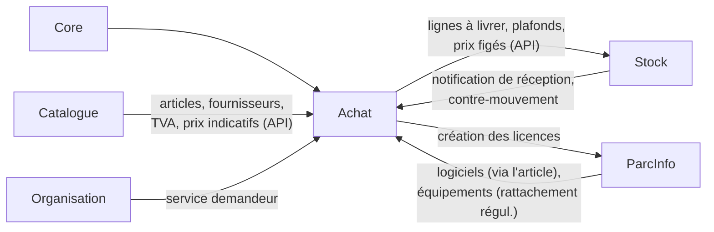
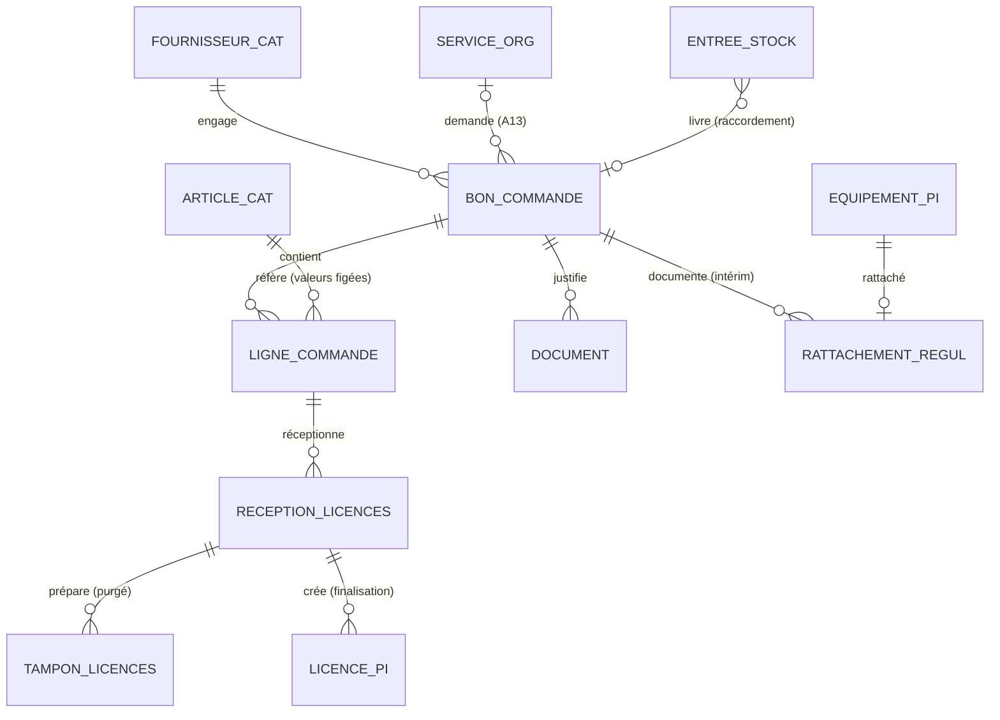

# Module Achat — Spécification Fonctionnelle Détaillée (SFD)

> **Date** : 08/08/2026 · **Version** : **1.0 — à faire valider** · **Branche cible** : `feature/achat-rebuild`
> **Nature** : spécification de **construction** du nouveau module Achat, intégré aux modules Catalogue, Stock, ParcInfo et Core. Ce document est le pendant du `SFD_Stock.md` v3.0 pour le module Achat ; il en adopte la structure et les conventions.
> **Documents liés** : `CDC_Achat_v2.md` (exigences contractuelles — les amendements issus des sessions UX y sont **intégrés ici** et à reporter au CDC : statut `soumis`, service demandeur, extinction de la régularisation, pierre tombale documentaire) · `RACCORDEMENT_Achat_Stock.md` (PRQ-05, contrats détaillés) · `SPEC_UX_Achat.md` v1.1 (**annexe normative** : écrans, modales, textes, responsive, accessibilité) · `BRAINSTORMING_UX_Achat*` (sessions 1–4, genèse des choix) · `SFD_Catalogue.md`, `SFD_Stock.md` v3.0, analyses des modules existants.

---

## 1. Vue d'ensemble et cadrage

### 1.1 Contexte

Les modules Achat et Stock v1 ont été supprimés le 27/07/2026. La reconstruction se fait en trois modules chaînés : **Catalogue** (référentiel, livré), **Stock** (magasins, mouvements, sérialisation — livré, v3.0), et **Achat** (le présent document) : la **chaîne d'engagement fournisseur**. Prérequis d'installation : `module.json` avec `requires: ["Core", "Catalogue", "Stock", "ParcInfo", "Organisation"]` (Organisation : service demandeur).

### 1.2 Objectifs

1. **Engagement maîtrisé** : tout achat naît d'un bon de commande adossé au Catalogue, validé par un tiers habilité, numéroté sans trou, immuable après visa — le PDF signé est l'objet juridique (le logiciel produit le papier).
2. **Traçabilité de bout en bout** : de la fiche équipement ParcInfo, remonter mouvement → bon d'entrée → **ligne de BC** (prix payé, fournisseur, dates) ; du BC, descendre vers les unités sérialisées et licences créées.
3. **Reliquats justes en permanence** : Achat est la source de vérité du reste à livrer, alimentée transactionnellement par les réceptions Stock.
4. **Intégrité par la visibilité** (doctrine D3 étendue — session 4) : on ne bloque presque rien, on rend la déviance coûteuse et visible (signaux au visa, rapport Signaux, références de prix non manipulables).
5. **Résorption de l'intérim** : régularisation encadrée, bornée et à extinction automatique.

### 1.3 Périmètre par nature d'article (Catalogue)

| Nature | Commande | Réception | Effets |
|---|---|---|---|
| `equipement` | Achat (BC) | **Stock** — bon d'entrée lié (raccordement) | Sérialisation D10, fiches valorisées au prix figé |
| `consommable` / `piece` | Achat (BC) | **Stock** — bon d'entrée lié | Mouvements + niveaux |
| `licence` | Achat (BC) | **Achat** — wizard dématérialisé | Licences ParcInfo rattachées au logiciel de l'article (C11), sans magasin (C10) |
| `prestation` *(si PRQ-02 livré)* | Achat (BC) | **Achat** — constat de service fait | Aucun objet ; ligne marquée réalisée |

Hors périmètre v1 : demande d'achat et circuit d'approbation (D3 reconduite et signée — un seul visa), factures/mandatement (système comptable), marchés, retours fournisseurs, seuils de double visa (backlog v2).

### 1.4 Le cycle de vie du bon de commande — colonne vertébrale du module

```
BROUILLON ──Soumettre──▶ SOUMIS ──Valider──▶ VALIDÉ ──réceptions──▶ PARTIEL ──▶ LIVRÉ
    ▲                      │                    │                      │
    └──────Renvoyer────────┘                 Annuler               Clôturer
           (motivé)                        (si 0 réception)        (motivé)
                                              ▼                      ▼
                                           ANNULÉ                CLÔTURÉ
```

| Statut | Numéro | Modifiable | Supprimable | Sens |
|---|---|---|---|---|
| `BROUILLON` | « Brouillon #id » | ✔ | ✔ (réelle, cascade) | Bac à sable, non engageant |
| `SOUMIS` | — | ✖ (verrouillé) | ✖ | En attente de visa ; retour possible (renvoi motivé, ou reprise par l'auteur) |
| `VALIDE` | **attribué sous verrou** | ✖ | ✖ | Engageant, immuable, réceptions ouvertes |
| `PARTIEL` / `LIVRE` | idem | ✖ | ✖ | Piloté par les notifications Stock et réceptions licences |
| `CLOTURE` | idem | ✖ | ✖ | Reliquat abandonné (motif), réceptions conservées |
| `ANNULE` | — (jamais attribué) | ✖ | ✖ | Sans effet ; possible uniquement avant toute réception |

Sémantique projet : le **jaune** (`SOUMIS`) = « verrouillé, en cours d'officialisation », comme `RÉFÉRENCEMENT`/`POINTAGE` de Stock (⚠ DESIGN.md).

### 1.5 Acteurs

**Acheteur** (saisit, soumet, réceptionne les licences, constate le service fait, régularise, joint les pièces) · **Validateur Achat** (valide, renvoie, annule, clôture) · **Consultation Achat** (lecture + rapports) · les rôles **Stock** reçoivent `achat.api.view` (raccordement) · **Contrôle de gestion / audit** : `achat.rapports.signaux`. La séparation commande/visa est garantie par permissions dédiées (RGC-11) ; l'auto-validation n'est pas bloquée en v1 mais **marquée** (badge + rapport Signaux).

### 1.6 Décisions consolidées (référence unique)

A1–A10 : reprises du `CDC_Achat_v2.md` §3.1 (réception physique = Stock ; reliquat tenu par Achat ; licences dématérialisées côté Achat ; prix/TVA/désignation **figés à la ligne** ; prestation au Catalogue [PRQ-02] ; compte comptable au Catalogue [PRQ-03] ; fournisseurs = Catalogue ; permissions dédiées ; journal Core ; valorisation de la sérialisation au prix figé).

| # | Décision (issue des sessions UX, intégrée au présent SFD) |
|---|---|
| **A11** | Statut **`SOUMIS`** + renvoi en brouillon motivé (UX-10/UX2-07) ; permission `soumettre` |
| **A12** | Interface **dérivée de Stock à l'écran près** : stepper, modales, pilules, compteurs, triptyque visuel (sessions 2–3, `SPEC_UX_Achat.md` normative) |
| **A13** | Champ facultatif **service demandeur** (Organisation) + réf. demande papier, imprimé et filtrable (UX3-04) — prépare le circuit de demande v2 sans le préempter |
| **A14** | **Références de prix non manipulables** : pilules et signaux comparent au **dernier prix payé** (BC validés), pas seulement au prix indicatif ; mention des modifications récentes du prix indicatif (UX4-02) |
| **A15** | **Régularisation encadrée** : visa obligatoire, dates bornées à l'intérim, **extinction automatique à dette zéro**, réactivation = acte d'admin journalisé (UX4-05) |
| **A16** | **Pierre tombale documentaire** : la suppression d'une pièce après validation laisse une trace motivée visible (UX4-08) ; rapport **Signaux** sous permission dédiée (UX4-09) |

### 1.7 Contraintes techniques

Socle Laravel 12 + nwidart, Spatie (`config/permissions.php` + `cores:sync-permissions achat`), `LogsActivityWithModule` (`module='achat'`), dompdf, fast-excel, Ziggy. Patterns UI du projet (Bootstrap Table serveur, modales, SweetAlert2, Select2, JS `public/js/modules/achat/`, badges de nature du `formatters.js` Catalogue). Exigences fermes : permissions **serveur** sur toutes les routes (`.data`, cascades, PDF, API inclus), `LIKE` portable (suites SQLite **et** PostgreSQL), générations et validations transactionnelles et idempotentes, montants calculés **une seule fois côté serveur**. Le préambule des 15 conventions de `PROMPTS_Dev_Catalogue.md` s'applique intégralement. Intégration **synchrone transactionnelle** assumée : aucun événement déclaré non dispatché, aucun listener vide (leçon AN-08).

---

## 2. Points d'intégration

### 2.1 Vue d'ensemble



### 2.2 Catalogue

`catalogue_articles` : FK `article_id` des lignes ; à la saisie, **copie figée** de `designation`, `nature`, `taux_tva` (défaut 18 %), et pré-remplissage du prix depuis `prix_indicatif` ; contrôle `logiciel_id` non nul pour les licences (à la saisie **et** à l'ouverture du wizard). `catalogue_fournisseurs` : FK des BC (libellé dénormalisé à la validation). Modale de sélection = composant Catalogue en mode multi (M-01). Journal Catalogue lu pour la mention « réf. modifiée le … » (A14). Gardes croisées : article/fournisseur désactivé → bandeau, jamais de destruction de brouillon ; suppression refusée côté Catalogue si référencé (C8).

### 2.3 Stock (raccordement — détail : `RACCORDEMENT_Achat_Stock.md`)

- **Achat → Stock** : `lignes à livrer` (article, reste, **prix figé**, TVA), liste des BC livrables (modale M-02 côté Stock, + scan QR) ;
- **Stock → Achat** : **notification transactionnelle** à la validation d'un bon d'entrée lié (`entree_id`, lignes/quantités) → re-contrôle du reste **sous verrou**, incréments `quantite_livree`, statut `PARTIEL`/`LIVRE`, chronologie ; **idempotente** (rejeu sans double effet). Contre-mouvement sur mouvement lié → décrément symétrique + chronologie ;
- La sérialisation D10 valorise les fiches au `cout_unitaire` pré-rempli du prix figé (A10) ;
- Lecture Stock par Achat : bons d'entrée liés **non validés** (section « En cours côté magasin », informative, dégradation partielle si l'API ne répond pas).
- **Côté Stock (amendements portés par le module Stock)** : `stock_entrees.bon_commande_id` FK nullable `restrict`, mode « Livraison sur commande », plafonds, fournisseur imposé.

### 2.4 ParcInfo

Création des `parc_info_licences` à la finalisation du wizard (logiciel = celui de l'article — jamais de création de logiciel ; fournisseur, coût = prix figé, référence du BC). Lecture des équipements « sans commande d'origine » pour le rattachement de régularisation (M-09) ; ⚠ répercussion ParcInfo : lien « Voir la commande d'origine » sur la fiche équipement (via la chaîne mouvement → entrée → BC).

### 2.5 Organisation et Core

Service demandeur : FK `set null` + libellé dénormalisé (A13). Core : `User`/`created_by` partout, permissions `achat.*` synchronisées, activity log, navigation, layout, gate super-admin, seeders idempotents ; recherche « tous formats de numéros » de A-02 (la recherche globale topbar est un backlog **Core**).

### 2.6 Ce qu'Achat expose (contrat détaillé : `API_Inter_Modules.md`)

`GET /achat/api/bons-commande/a-livrer` · `GET /achat/api/bons-commande/{id}/lignes-a-livrer` · `POST /achat/api/receptions` (service interne transactionnel, idempotent) · `POST /achat/api/receptions/contre` · `GET /achat/api/articles/{id}/historique-prix` (dernier payé + moyenne 3 BC — A14) · `GET /achat/api/fournisseurs/{id}/cumul-mois` (Swal de visa). Engagements : permission `achat.api.view`, `LIKE` portable, réponses bornées, jamais d'exception brute.

### 2.7 Dépendances de suppression

Article/fournisseur référencés par des lignes/BC → refus côté Catalogue (C8) · service demandeur → `set null` + libellé · BC référencé par une entrée Stock → `restrict` (côté Stock) · équipement rattaché (régularisation) → rattachement en `cascade` (le lien meurt avec la fiche, la chronologie garde la trace).

---

## 3. Pages et écrans

**8 pages** sous `/achat`, **9 modales**, **6 confirmations SweetAlert**, **3 popovers normés** — spécification exhaustive (zones, boutons, états vides, textes définitifs, responsive, accessibilité) dans **`SPEC_UX_Achat.md` v1.1, annexe normative du présent SFD**. Rappel de la carte :

| # | Page | Route | Gabarit (dérivé de Stock) |
|---|---|---|---|
| A-01 | Tableau de bord | `/achat` | Dashboard à KPI cliquables (6 cartes dont « À valider » 🔴 et « Dette d'intérim ») |
| A-02 | Bons de commande — liste | `/achat/bons-commande` | Bootstrap Table serveur, recherche « tous formats de numéros », grille actions × statut |
| A-03 | BC — création/édition | `…/create`, `/{id}/edit` | **Page à stepper 2 étapes** (① Lignes & montants ② Récapitulatif & soumission) |
| A-04 | BC — fiche | `/achat/bons-commande/{id}` | Bandeau + 5 onglets (Lignes / Réceptions / Licences / Documents / Chronologie) + barre d'actions contextuelle |
| A-05 | Réception de licences | `…/{id}/licences/{ligne}` | **Wizard de référencement Stock paramétré en colonnes** (clé / activation « appliquer à toutes » / expiration), collage/CSV, tampon |
| A-06 | Reliquats | `/achat/reliquats` | Liste lecture seule à badges d'âge, total « engagé non livré » |
| A-07 | Rapports | `/achat/rapports` | Cartes + exports, dont carte grisée « Imputation (PRQ-03) » et carte **Signaux** 🔒 |
| A-08 | Administration | `/achat/administration` | Cartes de paramètres (dont interrupteur régularisation à extinction automatique) |

Modales : M-01 sélection d'articles (multi) · M-02 sélection de commande (côté Stock) · M-03 clôture · M-04 service fait · M-05 dépôt de pièce (caméra sur mobile) · M-06 renvoi motivé · M-07 annulation · M-08 suppression de pièce post-validation (pierre tombale) · M-09 rattachement de régularisation.

Doctrines d'interface (normatives, `SPEC_UX` §0) : action sans droit **absente** / action bloquée par l'état **grisée + infobulle-diagnostic** ; Swal chiffré avant tout irréversible ; compteurs en pied de tout écran de saisie ; montants toujours qualifiés HT/TTC ; 403 nominatives ; 409 explicites ; états vides pédagogiques ; encart d'accueil au premier lancement.

---

## 4. Spécifications UX

Intégralement portées par `SPEC_UX_Achat.md` v1.1 : §0 conventions, §A-01→A-08 écrans, §15 textes définitifs, §16 responsive (le visa mobile est le parcours de première classe), §17 gabarit PDF (QR code, filigranes, montant en toutes lettres), §18 accessibilité (clavier complet, `Entrée` = suivante au wizard, jamais de validation par `Entrée` seule sur SW-02/SW-03), §19 chargements et cibles, §20 wireframes.

---

## 5. Permissions et rôles

`Modules/Achat/config/permissions.php`, synchronisées par `cores:sync-permissions achat` ; `HasMiddleware` sur **toutes** les routes (`.data`, cascades, PDF, wizard, API, exports inclus). **Toute permission déclarée correspond à une fonctionnalité effective et est seedée** (leçon AN-01).

| Permission | Effet |
|---|---|
| `achat.dashboard.view` | Accès module + tableau de bord |
| `achat.bons_commande.index` | Listes, fiches, PDF (lecture) |
| `achat.bons_commande.store` / `update` / `destroy` | Création, édition, suppression — **brouillon uniquement** (409 sinon) |
| `achat.bons_commande.soumettre` | Soumission au visa (verrouillage) |
| `achat.bons_commande.valider` | Validation **et** renvoi motivé (M-06) |
| `achat.bons_commande.annuler` / `cloturer` | Annulation (0 réception) / clôture de reliquat |
| `achat.bons_commande.regulariser` | BC de régularisation + rattachements (M-09) |
| `achat.licences.receptionner` | Wizard A-05 + service fait (M-04) |
| `achat.documents.view` / `store` / `delete` | Pièces : consultation/téléchargement, dépôt, suppression (pierre tombale post-validation) |
| `achat.reliquats.index` | Vue A-06 |
| `achat.rapports.view` / `export` | Rapports et exports |
| `achat.rapports.signaux` | Carte Signaux (contrôle de gestion, audit, DSI) |
| `achat.administration.manage` | Paramètres A-08 |
| `achat.api.view` | Endpoints §2.6 (accordée aux rôles Stock) |

Aucune permission de modification des documents validés — l'absence documente l'immutabilité (convention Stock). Rôles seedés : **Acheteur** (`index store update destroy soumettre licences.receptionner regulariser documents.view/store reliquats rapports.view dashboard`), **Validateur Achat** (Acheteur en lecture + `valider annuler cloturer documents.delete export`), **Consultation Achat** (`index reliquats rapports.view/export dashboard`). Les rôles Achat reçoivent `catalogue.api.view` et `stock.api.view` ; les rôles Stock reçoivent `achat.api.view`.

---

## 6. Modèle de données

### 6.1 Principes

PostgreSQL, préfixe `achat_`, migrations dans le module. Numérotation `BC-{année}-{séquence}` attribuée **à la validation**, sous verrou, par table (aucun trou — convention Stock §6.1). Montants dénormalisés calculés une seule fois côté serveur à chaque enregistrement (source : les lignes). Valeurs **figées** à la ligne (désignation, nature, prix, TVA) = photographie contractuelle, pas une duplication de référentiel (EXI-INT-00). Suppression réelle des brouillons (cascade) ; documents validés immuables. `created_by` + activity log partout.

### 6.2 Tables

**`achat_bons_commande`** : `id` · `numero` nullable unique (validation) · `statut` enum(`BROUILLON`,`SOUMIS`,`VALIDE`,`PARTIEL`,`LIVRE`,`CLOTURE`,`ANNULE`) · `fournisseur_id` FK `catalogue_fournisseurs` `restrict` + `fournisseur_libelle` (dénormalisé à la validation) · `date_document` · `est_regularisation` bool (défaut false) · `service_demandeur_id` FK Organisation nullable `set null` + `service_demandeur_libelle` + `reference_demande` string nullable (A13) · `observation_type` enum config (`urgent`,`renouvellement`,`sur_demande`,`autre`) nullable + `observation_texte` · `montant_ht`, `montant_tva`, `montant_ttc` decimal · `soumis_par`/`soumis_le` nullables · `valide_par`/`valide_le` nullables · `motif_cloture`, `motif_annulation` nullables · `created_by` · timestamps. `CHECK` : `est_regularisation = false OR date_document BETWEEN bornes d'intérim` (bornes en paramètres).

**`achat_lignes_commande`** : `bon_commande_id` FK `cascade` (le contrôleur refuse toute écriture hors `BROUILLON`) · `article_id` FK `catalogue_articles` `restrict` · **figés** : `designation`, `nature`, `prix_unitaire_ht` decimal, `taux_tva` decimal · `quantite` decimal > 0 · `quantite_livree` decimal défaut 0, `CHECK quantite_livree <= quantite` **et** `>= 0` · `montant_ht` decimal · `service_fait_le` datetime nullable + `service_fait_par` nullable + `service_fait_commentaire` (prestations) · timestamps. Index (`bon_commande_id`), (`article_id`).

**`achat_receptions_licences`** : `id` · `ligne_commande_id` FK `restrict` · `quantite` > 0 · `statut` enum(`EN_COURS`,`FINALISEE`,`ABANDONNEE`) · `finalisee_le` nullable · `created_by` · timestamps. *(En-tête de session du wizard ; `FINALISEE` = les licences existent ; `ABANDONNEE` = retour en arrière tracé.)*

**`achat_tampon_licences`** : `reception_id` FK `cascade` · `cle` string — unique par réception (contrainte) + contrôle applicatif contre `parc_info_licences` à la saisie **et** à la finalisation · `date_activation` · `date_expiration` nullable · timestamps. **Purgée à la finalisation** (les données vivent alors dans ParcInfo) et vidée à l'abandon.

**`achat_documents`** : `bon_commande_id` FK `cascade` (brouillon) — le contrôleur bascule en protection applicative après validation · `type` enum(`bc_signe`,`bordereau_fournisseur`,`facture_proforma`,`autre`) · `chemin` (stockage hors racine web, nom neutre) · `nom_original`, `mime`, `taille` · **pierre tombale** : `est_supprime` bool, `supprime_par`, `supprime_le`, `motif_suppression` (le fichier physique est effacé, la ligne reste — A16) · `created_by` · timestamps.

**`achat_regularisation_rattachements`** : `bon_commande_id` FK `restrict` (BC de régularisation uniquement — garde applicative) · `equipement_id` FK `parc_info_equipements` `cascade`, **unique** (un équipement, une commande d'origine) · `created_by` · timestamps.

**`achat_parametres`** : `cle` unique · `valeur` · `updated_by` · timestamps — clés v1 : `prefixe_numerotation` (`BC`), `delai_alerte_reliquat_jours`, `seuil_ecart_prix_pct` (20), `taille_max_piece_mo`, `regularisation_active` (bool, extinction automatique), `intermede_debut`/`intermede_fin` (bornes de régularisation), `motifs_observation` (json). Écran A-08 obligatoire (leçon AN-13/14) ; `config/` réservé aux constantes techniques.

*(Côté Stock, porté par le module Stock : `stock_entrees.bon_commande_id` FK nullable `restrict` — raccordement.)*

### 6.3 Diagramme



### 6.4 Index et `onDelete`

Index : bons (`statut`,`date_document`), (`fournisseur_id`), (`numero`) ; lignes (`bon_commande_id`), (`article_id`) ; documents (`bon_commande_id`,`est_supprime`) ; rattachements (`equipement_id` unique). Règles : lignes/documents → BC `cascade` tant que brouillon (protection applicative ensuite) ; article/fournisseur `restrict` ; service demandeur `set null` + libellé ; réceptions licences `restrict` (trace) ; tampon `cascade`.

---

## 7. Workflows métier

### 7.0 Conventions transverses

Cycle §1.4 · validations et notifications **transactionnelles, idempotentes, sous verrou** · montants serveur uniquement, arrondis définis et testés · numéros à la validation, par séquence sous verrou · journal Core = source unique des chronologies (jamais reconstruites) · gardes transverses : article actif à la saisie, licence ⇒ logiciel rattaché, régularisation ⇒ bornes de dates + module actif.

### 7.1 Saisie et soumission

**Brouillon** : en-tête + lignes (M-01, valeurs figées copiées à l'ajout ; PO-01 interroge `historique-prix`). Modifications illimitées ; verrou optimiste (409 explicite). **Soumission** (SW-01) : contrôles (≥ 1 ligne, prix > 0, licences avec logiciel) → `SOUMIS`, `soumis_par/le`, verrouillage, journal. **Renvoi** (M-06) ou **reprise** : retour `BROUILLON`, motif journalisé + encart jaune.

### 7.2 Validation

SW-02 (récapitulatif + cumul fournisseur + signaux A14/UX4-03 — informatifs) → transaction : re-contrôles (statut `SOUMIS`, article/fournisseur actifs — sinon 422 explicite), **numéro sous verrou**, dénormalisations (`fournisseur_libelle`, montants), `valide_par/le`, journal → `VALIDE`. Idempotente (jeton anti-double-clic).

### 7.3 Réceptions physiques (notification Stock)

Traitement dans la transaction de validation du bon d'entrée (raccordement §3) : vérif. statut BC ∈ {`VALIDE`,`PARTIEL`} → re-contrôle `quantite + livree ≤ commandee` **ligne à ligne sous verrou** (422 sinon, rien n'est écrit nulle part) → incréments → statut recalculé (`PARTIEL` si ∃ reste, `LIVRE` si tout soldé, lignes prestation/licence comprises) → chronologie « Réception ENT-… (6/10) intégrée ». **Idempotence** par `entree_id`. **Contre-mouvement** : décrément symétrique, plancher 0, statut recalculé (un BC `LIVRE` peut redevenir `PARTIEL`), chronologie.

### 7.4 Réception des licences (A-05)

Ouverture : garde logiciel rattaché → création `achat_receptions_licences` (`EN_COURS`, quantité ≤ reste). Saisie : tampon ligne à ligne (sauvegarde à chaque `Entrée`), unicité tampon + ParcInfo, collage/CSV avec rapport. **Finalisation** (SW-03) : re-contrôles (complétude, unicité revérifiée, reste toujours suffisant sous verrou) → transaction : N licences ParcInfo (logiciel de l'article, fournisseur du BC, coût = prix figé, référence BC) + incrément `quantite_livree` + statut BC + purge du tampon + `FINALISEE` + journal. Échec ⇒ rollback intégral, **jamais de succès affiché**. **Retour en arrière** (SW-05) : `ABANDONNEE`, tampon vidé, journalisé. **Service fait** (M-04, prestations) : `service_fait_*` + `quantite_livree = quantite` + statut + journal.

### 7.5 Clôture et annulation

**Clôture** (M-03, Validateur) : BC `PARTIEL` → motif, lignes à reste listées → `CLOTURE`, `motif_cloture`, journal ; réceptions et licences conservées ; alimente le rapport « clôturés non livrés ». **Annulation** (M-07) : `VALIDE` sans aucune réception (physique ou licence) → `ANNULE`, motif, journal ; sinon bouton absent.

### 7.6 Régularisation (A15)

Création : permission `regulariser` + `regularisation_active` + date dans bornes → BC marqué, **suit le circuit `SOUMIS` → `VALIDE`** (visa obligatoire), sans réceptions ; exclu des statistiques par défaut. **Rattachement** (M-09) : équipements ParcInfo sans commande d'origine → liens + décrément du KPI de dette. **Extinction** : au passage de la dette à zéro, `regularisation_active` bascule à false automatiquement (journalisé) ; réactivation = SW-06.

### 7.7 Signaux (UX4-09 — calculés à la volée, aucune table dédiée)

Écart au dernier prix payé (requête sur lignes de BC `VALIDE+`) · prix indicatif modifié < 30 j avant un BC (journal Catalogue) · fournisseur créé < 30 j au premier BC · BC rapprochés (même fournisseur, < N jours) · cumul clôturé non livré par fournisseur/auteur · auto-validations (`created_by = valide_par`) · délai médian soumission → visa par validateur · pierres tombales. Restitués : dans SW-02 (instantanés) et carte Signaux (cumuls, permission dédiée).

**9e signal — écarts de livraison déclarés par fournisseur** *(BR-04)* : part des livraisons où le magasin a constaté un écart entre le bordereau annoncé et le compté reçu (`stock_entrees.ecarts_bl`). C'est un **taux**, pas un total : trois écarts sur trois cents livraisons est une broutille, trois sur quatre est un problème — le dénominateur figure donc à côté. Le fournisseur qui annonce 10 et livre 8 se lit sur une ligne. Lecture défensive du module Stock : absent, le signal rend une liste vide sans empêcher les huit autres.

La doctrine vaut pour les neuf : ils **signalent, ils n'accusent pas**. Aucun ne bloque quoi que ce soit — un écart de prix peut être justifié, une auto-validation peut être la seule option un jour de congés, un fournisseur peut avoir subi une avarie de transport. Ils donnent à un responsable de quoi **poser une question**, ce qui est tout autre chose. C'est aussi pourquoi un fournisseur sans écart n'apparaît pas sur la liste.

---

## 8. Routes et endpoints

Préfixe `/achat`, noms `achat.*`, `auth` + permission sur toutes les routes, littérales avant `/{id}`.

| Groupe | Routes | Permission |
|---|---|---|
| Dashboard | `GET /achat` (+`/data`) | `dashboard.view` |
| Bons de commande | index/data/create/store/show/edit ; `PUT`/`DELETE /{id}` (409 hors brouillon) ; `POST /{id}/soumettre` · `POST /{id}/reprendre` · `POST /{id}/valider` · `POST /{id}/renvoyer` · `POST /{id}/annuler` · `POST /{id}/cloturer` · `GET /{id}/pdf` | `bons_commande.*` (grille §5) |
| Licences | `POST /bons-commande/{id}/lignes/{ligne}/receptions` · `GET|PUT /receptions-licences/{id}/wizard` · `POST /receptions-licences/{id}/import` · `POST /receptions-licences/{id}/abandonner` · `POST /receptions-licences/{id}/finaliser` · `POST …/service-fait` | `licences.receptionner` |
| Documents | `POST /bons-commande/{id}/documents` · `GET /documents/{id}/telecharger` · `DELETE /documents/{id}` | `documents.*` |
| Documents de réception *(BR-03)* | `GET /bons-commande/{id}/receptions/{entree}/bordereau` · `GET /bons-commande/{id}/receptions/{entree}/documents/{doc}` — routes **proxy** vers les pièces de Stock, rattachement vérifié (IA-16) | `bons_commande.index` + `documents.view` |
| Régularisation | `POST /bons-commande/{id}/rattachements` · `DELETE /rattachements/{id}` · `GET /regularisation/equipements-candidats` | `regulariser` |
| Reliquats | `GET /achat/reliquats` (+`/data`, export) | `reliquats.index` |
| Rapports | `GET /achat/rapports` + cartes (aperçu + `export?format=csv\|xlsx\|pdf`) · `GET /achat/rapports/signaux` | `rapports.view/export` · `rapports.signaux` |
| Administration | `GET /achat/administration` · `PATCH /achat/parametres/{cle}` · `POST /achat/regularisation/reactiver` | `administration.manage` |
| API | les 6 endpoints §2.6 | `achat.api.view` |

---

## 9. Points d'attention, mise en service, tests

### 9.1 Chantier amont et répercussions

Amendements **Catalogue** : nature `prestation` (PRQ-02), `compte_comptable` (PRQ-03) · amendements **Stock** : raccordement (`bon_commande_id`, mode commande, M-02, plafonds — `RACCORDEMENT` §6) + carte « réceptions vs ajustements » (UX4-06) + consignation de l'`etat` au tampon (écart D10 constaté) · **ParcInfo** : lien « commande d'origine » sur la fiche équipement · **CDC v2.0** : reporter A11–A16 · **DESIGN.md** : jaune, alertes, compteurs, 403 nominatives · **PATTERNS.md** : composants partagés (modale de sélection paramétrable, wizard à colonnes, récapitulatif de document).

### 9.2 Plan de mise en service (UX3-07)

1. Prérequis : Catalogue et Stock installés/recettés, PRQ-02/03/05 livrés, `API_Inter_Modules.md` validé ;
2. Installation Achat : migrations, permissions, seeders (rôles, paramètres avec bornes d'intérim), attribution des rôles ;
3. **Semaine 0** : saisie des BC de régularisation par l'acheteuse AVANT ouverture générale — le module ouvre avec la dette réelle affichée ;
4. Jour 1 : encart d'accueil + guide A5 « le circuit en une phrase » (même objet que le guide magasinier) ;
5. Semaines 1–2 : règle « plus aucun équipement saisi directement dans ParcInfo » — contournements **détectés** (état de contrôle), pas bloqués ; revue des 403 fréquentes pour ajuster les rôles ;
6. **Jalon J+30** : dette de régularisation restante · délai médian soumission → visa · **% de réceptions liées à un BC** (cible 100 %) ;
7. Documentation : `README.md`, guide utilisateur, `ANALYSE_Achat.md` en fin de chantier.

### 9.3 Risques et parades

| Risque | Parade |
|---|---|
| Deux bons d'entrée concurrents sur le même reste | Re-contrôle sous verrou au traitement de la notification, 422 ligne à ligne (IA-4) |
| Double notification / double validation | Idempotence par `entree_id` / jeton (IA-5) |
| Collision de numéros | Attribution à la validation sous verrou, par table (IA-3) |
| Montants divergents écran/PDF/export | Calcul serveur unique + dénormalisation + recette de cohérence (IA-1) |
| TVA/prix altérés rétroactivement par le Catalogue | Valeurs figées à la ligne (IA-2) |
| Wizard interrompu (réseau) | Tampon sauvegardé clé par clé, reprise (IA-8) |
| Porte dérobée de régularisation | Visa + bornes + extinction automatique (IA-11) |
| Manipulation du prix indicatif | Référence « dernier prix payé » non éditable + mention de modification récente (IA-12) |
| Pièce gênante supprimée | Pierre tombale motivée (IA-13) |
| API Stock indisponible | Dégradation partielle de l'onglet Réceptions, réceptions intégrées toujours exactes |
| Portabilité SGBD | `LIKE` uniquement, suites SQLite + PostgreSQL |

### 9.4 Exigences de tests (à consolider dans `TESTS_Achat.md`)

Invariants **IA-1 → IA-15** : cohérence des montants (écran = PDF = export, arrondis) · immutabilité des valeurs figées · numérotation sans trou ni collision (concurrence) · plafond de réception concurrent · idempotence (validation, notification, finalisation) · statuts recalculés justes (y compris contre-mouvement `LIVRE`→`PARTIEL`) · atomicité des licences (rollback intégral) · tampon persistant et purgé · garde logiciel rattaché · séparation des rôles (matrice 403 exhaustive, `.data`/PDF/API compris) · régularisation (bornes, visa, extinction, unicité de rattachement) · référence de prix (calcul dernier payé) · pierre tombale · chronologie = journal (aucun événement reconstruit) · 409 sur documents validés. Plus : snapshots des 6 endpoints API, tests des exports (qualification HT/TTC dans les titres), suites SQLite **et** PostgreSQL, recette conjointe Achat+Stock (scénarios ⇄ du CDC §12).

### 9.5 Limites assumées de la v1 (backlog v2 consolidé)

Circuit de demande + portail du service demandeur (préparé par A13) · seuil de double visa paramétrable · notifications mail/SMS (visa, renvoi, réception) · duplication de BC / commandes récurrentes · « Commander » depuis l'alerte de seuil Stock · relance fournisseur tracée · interdiction d'auto-validation · rapprochement BC ↔ factures · scoring des signaux · recherche globale topbar (Core) · imputation comptable (dès PRQ-03).

---

*Fin du SFD Achat v1.0 — 08/08/2026. Annexe normative : `SPEC_UX_Achat.md` v1.1. À valider par la MOA, puis : amendements amont (§9.1), `TESTS_Achat.md`, maquettes (ordre : A-03, M-01, A-04, A-06, A-01), `PLAN_Dev_Achat.md`.*
