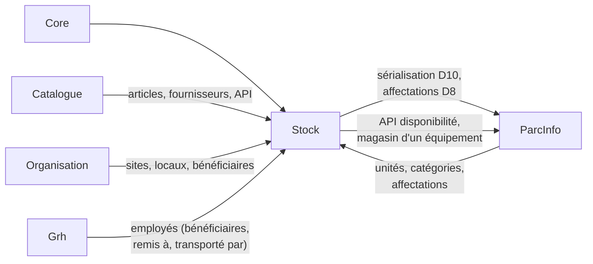
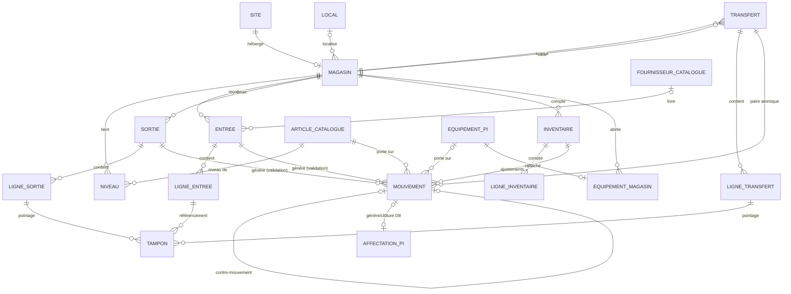

# Module Stock — Cahier des charges fonctionnel détaillé

> **Date** : 03/08/2026 · **Branche** : `refactor/stock-rebuild` · **Statut** : **version 3.0 — document consolidé**, à faire valider
> **Ce document remplace** les SFD v1.0 → v2.3 : toutes les décisions (D1–D17), les révisions successives et les **meilleures options des trois sessions de brainstorming** (Entrées, Sorties, Transferts) y sont intégrées in extenso, sans bloc d'amendement.
> **Documents liés** : `SFD_Catalogue.md` v1.0-c (prérequis), `CADRAGE_Catalogue.md` (C1–C11), `BRAINSTORMING_{Entrees,Sorties,Transferts}_Stock.md` (genèse des choix), `TESTS_Stock.md`, `API_Stock.md`, `PLAN_Dev_Stock.md`, analyses des modules existants.
> **Amendements liés (chantier Achat, 2026)** : `RACCORDEMENT_Achat_Stock.md` (PRQ-05 — le mode « Livraison sur commande », la transaction étendue et sa notification) et `API_Inter_Modules.md` (les contrats consommés et exposés). Le lot BR y a ajouté les pièces jointes typées, le bordereau de réception et les écarts BL, décrits au §6.2 ci-dessous. `DESIGN.md` porte désormais les conventions d'interface nées de ce chantier.

---

## 1. Vue d'ensemble et cadrage

### 1.1 Contexte

Les modules Achat et Stock ont été supprimés le 27/07/2026 : plus aucune traçabilité de qui a reçu quoi ni des quantités restantes (point n°9 d'`ANALYSE_ParcInfo.md`), acquisition par saisie manuelle, reliquats dans le code (`Site::magasins()`, `ApprovisionnerConsommableRequest`). La reconstruction se fait en trois modules chaînés : **Catalogue** (référentiel des articles), **Stock** (le présent document : magasins, quantités, mouvements, documents), puis **Achat** (commandes, à cadrer). Prérequis d'installation : `module.json` avec `requires: ["Core", "Catalogue", "Organisation", "ParcInfo", "Grh"]`.

### 1.2 Objectifs

1. **Traçabilité totale et opposable** : chaque entrée, sortie, transfert et ajustement est enregistré définitivement — avec son auteur, son bénéficiaire, **le porteur physique** et un **document PDF imprimable et signable** (le contexte d'audit du CHU est encore papier : le logiciel produit le papier).
2. **Quantités justes en permanence** : niveaux par magasin, alertes de seuil, et visibilité sur **l'entre-deux** (ce qui est physiquement arrivé mais pas encore validé).
3. **Équipements maîtrisés de bout en bout** : sérialisation à la réception (les fiches ParcInfo naissent du bon d'entrée), localisation par magasin, affectation en un seul geste à la sortie.
4. **Rapports exportables** (CSV/Excel/PDF) dont l'état par bénéficiaire, imprimable par période.
5. **Terrain préparé pour Achat** : les bons d'entrée accueilleront les livraisons des commandes.

### 1.3 Périmètre — ce que Stock gère par nature d'article (Catalogue)

| Nature | Logique Stock | Détail |
|---|---|---|
| `consommable` / `piece` | **Quantitative** | Niveaux par magasin, mouvements en quantités |
| `equipement` | **Sérialisée** | L'article Catalogue est un *modèle* ; Stock gère les **unités** (`parc_info_equipements`) : sérialisation à l'entrée (D10), rattachement magasin, pointage à la sortie et au transfert |
| `licence` | **Hors périmètre** | `est_stockable = false` (C10) : circuit Achat → ParcInfo, sans magasin. Toute tentative de mouvement → 422 (garde transverse) |

**Séparation catalogue/stock (D7)** : créer un article (fiche, module Catalogue) et le faire entrer en stock (Stock) sont deux gestes distincts. Pas de quick-add depuis les saisies ; l'écran affiche un lien « Créer l'article dans le Catalogue » qui s'ouvre **dans un nouvel onglet** (le brouillon attend sans rien perdre). Réponse organisationnelle au cas « article absent un jour de camion » : le **Superviseur stock cumule le rôle Gestionnaire catalogue** (règle d'attribution, consignée au CDC et au guide — pas dans le code).

### 1.4 Organisation physique

Un magasin par site (`organisation_sites` — D2), rattachement optionnel à un local `type_local='magasin'`, responsable optionnel (employé Grh). La relation reliquat `Site::magasins()` est réactivée vers `Modules\Stock\Models\Magasin`.

### 1.5 Le cycle de vie des documents — colonne vertébrale du module (D12/D13/D14/D16/D17)

Tous les bons (entrée, sortie, transfert) suivent le **même modèle mental en trois temps** — « les quantités, puis les références, puis l'officialisation » :

| Étape | Entrée | Sortie | Transfert | Règles |
|---|---|---|---|---|
| 1 | `BROUILLON` | `BROUILLON` | `BROUILLON` | En-tête + lignes **en quantités** (articles quantitatifs, et équipements en « modèle × N »). Modifiable et supprimable à volonté. **Aucun effet** : ni mouvement, ni niveau, ni fiche ParcInfo, ni numéro définitif |
| 2 *(si équipements)* | **`RÉFÉRENCEMENT`** — saisie des n° de série des unités qui **naissent** | **`POINTAGE`** — désignation des unités existantes qui **partent** | **`POINTAGE`** — idem, unités de la source | Le passage en étape 2 **verrouille lignes et quantités** (D16, PUT → 409). Reprise libre. Seul déverrouillage : « **Revenir au brouillon** » (confirmation « les N références seront perdues », tampon purgé, action journalisée) |
| 3 | `VALIDÉ` | `VALIDÉ` | `VALIDÉ` | Transaction unique et idempotente : re-contrôles bloquants, mouvements, niveaux, effets ParcInfo, dénormalisations, **numéro définitif**, PDF disponible. Document désormais **immuable** — toute correction passe par contre-mouvement |

Sans équipements, l'étape 2 n'existe pas : `BROUILLON` → `VALIDÉ`. Statut `ANNULE` disponible sur les non-validés (alternative à la suppression quand on veut garder la trace).

**Raccourci « scan express » (D17, généralisé aux sorties et transferts)** : au brouillon, scanner un n° de série dans le champ dédié crée automatiquement la ligne « modèle × 1 » correspondante **et pré-pointe l'unité**. Un bon dont toutes les lignes sont pré-pointées se valide sans passage visible par l'écran de pointage — le petit geste du quotidien (« un portable pour le site 2 ») reste un scan + Valider.

**Règle métier cardinale** (guide + formation) : **la remise ou le chargement physique se fait après validation, jamais sur brouillon.** Les garde-fous applicatifs de l'entre-deux : indicateur « en attente de validation » (§3.1), avertissement croisé avec les inventaires (§7.7), disponible affichant les quantités réservées par d'autres brouillons (§3.5).

### 1.6 Flux gérés (v1)

Entrées (livraison, retour de bénéficiaire, sérialisation, rattachement d'unités existantes) · Sorties directes vers un bénéficiaire unique · Transferts entre magasins (paire atomique, sans état « en transit ») · Inventaires avec ajustements validés · Alertes de seuil (cascade locale → article) · Rapports exportables · Contre-mouvements. **Hors v1** : circuit de demande/approbation (D3), commandes fournisseurs (Achat), mouvements de licences, retour fournisseur (v2), confirmation de réception par le magasin cible (v2).

### 1.7 Bénéficiaires et personnes physiques

- **Bénéficiaire organisationnel unique par sortie (D5)** : Direction, Service, Unité, Poste de travail, Employé, ou Équipement (consommable installé, pièce montée). Obligatoire — aucune sortie sans imputation.
- **« Remis à » (porteur physique)** — session Sorties : distinct du bénéficiaire, il protège le magasinier et fait preuve en audit. `remis_a_nom` (texte) + `remis_a_employe_id` (FK Grh optionnelle). **Obligatoire pour toute sortie comportant des équipements, optionnel sinon** (le technicien qui prend lui-même son toner n'a pas de porteur tiers).
- **« Transporté par »** — session Transferts : optionnel (les transferts intra-site n'ont pas de chauffeur), imprimé sur le PDF quand renseigné.

### 1.8 Acteurs

**Magasinier** (saisies, wizard, pointages, comptages) · **Superviseur stock** (ajustements, seuils, contre-mouvements, tous magasins ; cumule Gestionnaire catalogue — §1.3) · **Consultation**. Détail §5.

### 1.9 Décisions consolidées (référence unique)

| # | Décision |
|---|---|
| D1 | Périmètre : consommables + pièces + équipements ; licences hors Stock (C10) |
| D2 | Un magasin par site |
| D3 | **Sortie directe sans circuit d'approbation** — réaffirmée en session (pas de visa même au-dessus d'un seuil de valeur, la traçabilité EST le contrôle) ; position à faire **signer au CDC** car elle engage la responsabilité de contrôle |
| D4 | Catalogue des articles = module Catalogue dédié (C1–C11) |
| D5 | Bénéficiaire organisationnel unique par sortie, 6 types |
| D6 | Fonctionnalités v1 : transferts, inventaires+ajustements, seuils, rapports |
| D7 | Création d'articles uniquement au Catalogue ; nouvel onglet ; cumul de rôles du superviseur |
| D8 | La sortie Stock déclenche l'affectation ParcInfo et le statut « en service » — **dès la validation de la sortie** (cas « installé plus tard » : l'emplacement se corrige ensuite sur la fiche ParcInfo ; statut intermédiaire « sorti non installé » = backlog v2) |
| D9 | Niveaux maintenus sous verrou ; journal = source de vérité ; état de contrôle de cohérence |
| D10 | Sérialisation : la validation d'une entrée crée les fiches `parc_info_equipements` (catégorie/marque/modèle hérités de l'article, « en stock », état « Neuf », n° d'inventaire vide — complétables dans ParcInfo) |
| D11 | Module Achat ensuite ; `reference_externe` accueille le n° de commande |
| D12 | Cycle de vie en brouillon généralisé (§1.5) ; validation = seul acte qui écrit |
| D13 | Référencement (entrées) : wizard au **n° de série seul**, table tampon, reprise libre, complétude exigée à la validation |
| D14 | Sortie en deux phases : quantités (`BROUILLON`) puis références (`POINTAGE`) |
| D15 | Tables séparées par type de document ; **journal `stock_mouvements` unique** |
| D16 | Verrouillage des lignes/quantités dès la phase de références ; déverrouillage = retour au brouillon tracé, tampon purgé |
| D17 | Transfert aligné sur le workflow symétrique + **scan express** (étendu aux sorties) |

### 1.10 Contraintes techniques

Socle Laravel 12 + nwidart, Spatie (`config/permissions.php` + `cores:sync-permissions stock`), `LogsActivityWithModule`, dompdf, fast-excel, Ziggy. Patterns UI du projet (Bootstrap Table serveur, modales duales, SweetAlert2, Select2, JS `public/js/modules/stock/`). Exigences fermes : permissions **serveur** sur toutes les routes, gardes de suppression, `LIKE` portable, générations transactionnelles. Le **préambule des 15 conventions** de `PROMPTS_Dev_Catalogue.md` s'applique intégralement.

---

## 2. Points d'intégration

### 2.1 Vue d'ensemble

### 2.2 Catalogue

`catalogue_articles` : FK `article_id` des niveaux, lignes et mouvements ; `unite_stock` (affichage), `seuil_defaut` (repli de seuil), `prix_indicatif` (coût par défaut en entrée, **alerte informative si le coût saisi s'écarte de ±20 %** — seuil en config du module), `est_stockable` (garde transverse), `categorie_equipement_id`/`marque_id`/`reference_constructeur` (héritage à la sérialisation). `catalogue_fournisseurs` : FK des entrées. API `/catalogue/api/articles` pour les sélecteurs (actifs, stockables, filtrés par nature). Règles croisées : article désactivé → plus d'entrée, visible en historique ; suppression d'un article référencé → refusée côté Catalogue (garde C8).

### 2.3 ParcInfo

`parc_info_equipements` : unités — **créées par Stock à la sérialisation** (D10), rattachées/détachées, statuts pilotés par D8 ; FK `equipement_id` des mouvements/tampon. `parc_info_affectations_equipements` : créées à la validation d'une sortie (cible = bénéficiaire du bon, `date_debut` = date de validation), clôturées au retour. `parc_info_affectations_consommables` : alimentées par les sorties vers un équipement (saisie directe ParcInfo retirée). **Gabarit « pièce montée »** : bouton sur la fiche équipement ParcInfo ouvrant une sortie pré-remplie (bénéficiaire = cet équipement). Le wizard ParcInfo reste le point de création *manuelle* d'unités hors commande ; Stock les rattache (mode rattachement). L'affectation directe côté ParcInfo est tolérée mais **détectée** (état de contrôle, résolution à l'inventaire).

### 2.4 Organisation et Grh

Sites (FK `restrict`), locaux (`set null`), bénéficiaires Direction/Service/Unité/Poste (FK `set null` + libellé dénormalisé à la validation), employés Grh (bénéficiaire, responsable magasin, « remis à », « transporté par » — tous `set null` + libellés). Sélecteurs via les API internes existantes ; Stock ne s'y fie pas pour le contrôle d'accès et ne reproduit pas leurs défauts (pagination, `ilike`, permissions).

### 2.5 Core

`User`/`created_by` partout ; permissions `stock.*` synchronisées ; activity log (`module='stock'`) ; navigation ; layout ; gate super-admin ; seeders idempotents.

### 2.6 Ce que Stock expose (contrat détaillé : `API_Stock.md` v2)

`GET /stock/api/disponibilite/article/{id}` (niveaux, seuil effectif + origine, statut ; 422 sur natures `equipement`/`licence` avec messages dédiés) · `GET /stock/api/equipements/{id}/magasin` · `GET /stock/api/magasins`. Engagements : permission `stock.api.view`, `LIKE` portable, réponses bornées, jamais d'exception brute.

### 2.7 Dépendances de suppression

Article/fournisseur référencés → refus côté Catalogue (C8) · site portant un magasin → refus (`restrict`) · local/responsable → `set null` · bénéficiaires et personnes physiques → `set null` + libellés dénormalisés · équipement référencé par des mouvements → refus (`restrict`).

---

## 3. Pages et écrans

9 pages sous `/stock`, layout et patterns du projet, badges de nature importés du `formatters.js` du Catalogue.

### 3.1 Tableau de bord — `/stock`

KPI : Magasins actifs · Références en stock · **Sous seuil** (orange, liseré) · **Ruptures** (rouge) · Équipements en stock · Valeur estimée. **Indicateur « En attente de validation »** par magasin (session Entrées) : compteur cliquable (« +14 équipements, +35 articles en cours de réception ; 2 sorties en pointage ») menant à la liste filtrée statut ≠ VALIDÉ — il matérialise l'entre-deux sans toucher aux niveaux. **Indicateur « non validés > N jours »** (brouillons, référencements, pointages vieillissants — N en config, superviseur). Tableau des alertes de seuil (article, magasin, niveau, seuil effectif + origine, lien entrée pré-remplie), 10 derniers mouvements, actions rapides.

### 3.2 Magasins — `/stock/magasins`

Liste + modale duale (site sans magasin, local type magasin, responsable Grh) + fiche à onglets (État des stocks / Équipements présents / Derniers mouvements) ; gardes (désactivation refusée si niveaux > 0).

### 3.3 État des stocks — `/stock/niveaux`

Lecture seule ; filtres magasin / nature (C/P) / catégorie Catalogue / statut d'alerte / recherche. Colonnes : Article, Code, Magasin, Quantité, Unité, **Seuil effectif** (badge d'origine `local`/`article`/aucun), Statut OK/SOUS_SEUIL/RUPTURE, Valeur. Actions : « Ajuster le seuil local » (superviseur — la pose d'un seuil sur un article sans niveau **crée la ligne à 0**), « Voir mouvements », Exporter.

### 3.4 Entrées — `/stock/entrees`

**Liste** : Numéro (« Brouillon #58 » avant validation), Date, Magasin, Fournisseur, Réf. externe, Lignes, **Statut** (`BROUILLON` gris · `RÉFÉRENCEMENT` jaune « 12/15 réf. » · `VALIDÉ` vert · `ANNULÉ`), Créé par. Modifier/Supprimer actifs sur non-validés seulement (Swal explicite sinon : « Bon validé — utilisez un contre-mouvement »).

**Étape 1 — `BROUILLON`** : en-tête — magasin*, **date de livraison*** (`date_document`), fournisseur Catalogue, réf. externe (n° BL / commande Achat), **observation à motifs types** (« Livraison conforme » · « Écart BL — réclamation » · « Refus à la livraison » · autre + texte, imprimée sur le bon) ; onglets **Articles** (Select2 Catalogue, quantité*, coût réel modifiable pré-rempli du prix indicatif, alerte ±20 %) et **Équipements** (lignes « modèle × N » ; rattachement d'unités existantes non rattachées). Boutons : Enregistrer le brouillon · Supprimer · **« Saisir les numéros de série »** (si modèle × N) ou Valider.

**Étape 2 — `RÉFÉRENCEMENT`** — `/stock/entrees/{id}/wizard` : lignes/quantités **verrouillées** (en-tête textuel éditable) ; bandeau « 12/15 références » ; un volet par ligne modèle × N, **un champ par unité : le n° de série*** — clavier ou douchette, Entrée = suivante ; unicité en direct (tampon + `parc_info_equipements`, message orientant vers le rattachement si déjà connu) ; **import CSV / collage** (un n° par ligne, rapport acceptés/doublons/déjà connus) ; « Enregistrer et continuer plus tard ». Boutons : Reprendre · **Revenir au brouillon** (confirmation, tampon purgé) · Valider (grisé, tooltip « 3 références manquantes »).

**Étape 3 — Validation** : Swal récapitulatif (« 2 articles · 15 fiches Parc Info seront créées · 1 unité rattachée — le bon ne sera plus modifiable ») → transaction (§7.1) → fiche en lecture seule avec **« Imprimer le bon »** (PDF : lignes, n° de série, observation, **date de livraison ET date/heure de validation**, cadre signature du livreur).

**Cas du refus à la livraison (DOA)** : l'unité morte n'entre pas — ligne réduite (14 au lieu de 15), observation typée « Refus à la livraison ». Le retour fournisseur post-validation est au backlog v2.

### 3.5 Sorties — `/stock/sorties`

**Liste** : statuts `BROUILLON` · `POINTAGE` (« 3/5 unités ») · `VALIDÉ` · `ANNULÉ`.

**Étape 1 — `BROUILLON`** : en-tête — magasin*, date*, **motif obligatoire à choix rapide** (« Dotation périodique » · « Remplacement » · « Réparation » · « **Urgence hors ouverture** » — qui déplie un champ **date/heure réelle de remise** distinct de la date de saisie · « Autre » + texte requis ; liste en config v1) ; **bénéficiaire*** (6 cartes + sélecteurs modaux partagés) ; **« Remis à »** (nom + employé Grh optionnel — requis si des équipements sont présents) ; lignes en quantités — articles quantitatifs (disponible temps réel **avec réservations** : « 8 (dont 3 dans d'autres brouillons) », information non bloquante) et équipements en « modèle × N » ; **champ scan express** (un scan = ligne modèle × 1 créée et pré-pointée). Boutons : Enregistrer · Supprimer · **« Pointer les numéros de série »** ou Valider (si tout est pré-pointé ou sans équipements).

**Étape 2 — `POINTAGE`** — `/stock/sorties/{id}/pointage` : quantités verrouillées ; par ligne modèle × N, liste des unités du modèle au magasin, pointage par scan/recherche/coche, compteurs par ligne et global ; emplacement d'affectation optionnel par ligne ; Reprendre · Revenir au brouillon · Valider (grisé si incomplet). Carte bénéficiaire « Équipement » masquée pour les lignes modèle × N.

**Étape 3 — Validation** : re-contrôles (disponible sous verrou, présence des unités) → transaction D8 (§7.2) → **« Imprimer le bon »** (PDF : lignes, n° de série sortis, bénéficiaire, motif, magasinier, **« Remis à »**, cadre signature du porteur).

### 3.6 Transferts — `/stock/transferts` (D17)

Même triptyque : **`BROUILLON`** (source*, cible* ≠ source, date, observation, **« Transporté par »** optionnel ; lignes quantités + modèle × N ; scan express ; disponible source avec réservations) → **`POINTAGE`** (unités de la source) → **`VALIDÉ`** (paire atomique). **Filtre « À destination de mon magasin »** sur la liste (v1 minimal de la notification cible — Salamata voit ce qui lui arrive). PDF à **double cadre de signature** (départ / arrivée) avec les références.

### 3.7 Historique des mouvements — `/stock/mouvements`

Lecture seule ; filtres magasin/type/nature/catégorie/article/période/utilisateur ; motifs en infobulle ; **contre-mouvement** (superviseur, motif obligatoire, mouvement inverse référençant l'original — l'original reste visible) ; export.

### 3.8 Inventaires — `/stock/inventaires`

Liste (progression, statuts `EN_COURS`/`VALIDÉ`/`ANNULÉ`, trace de l'inventaire d'ouverture) ; ouverture (magasin*, périmètre complet/sélection, **avertissement si des bons non validés existent sur le magasin** — « Validez-les ou tenez-en compte » ; avertissement de blocage des mouvements) ; fiche : feuille figée, comptage éditable (théorique/physique/écart coloré), pointage unitaire Présent/Absent/Trouvé avec conséquences annoncées, validation superviseur générant les `AJUSTEMENT` motivés, annulation. L'inventaire d'ouverture (théoriques à 0) est le mécanisme de stock initial.

### 3.9 Rapports — `/stock/rapports`

État des stocks · Valorisation · Journal des mouvements · **Consommation par bénéficiaire, imprimable par période et par bénéficiaire** (fait office d'état mensuel remis aux services — compromis session Sorties) · **Contrôle de cohérence** (superviseur : niveaux vs Σ mouvements, incohérences équipements). Exports CSV/Excel (fast-excel)/PDF (dompdf).

---

## 4. Spécifications UX

- Navigation : entrée « Gestion des stocks » (Core), sidebar module : Tableau de bord / État des stocks / Entrées / Sorties / Transferts / Inventaires / Mouvements / Rapports / Référentiels (Magasins).
- **Le triptyque partout** : trois écrans-types réutilisés (page brouillon à onglets, écran de références plein écran avec progression, fiche validée en lecture seule + PDF). Les libellés de statuts parlent le geste : *Référencement* (les unités naissent), *Pointage* (les unités partent).
- **Verrouillage visible** : en phase 2, les quantités s'affichent avec un cadenas et l'infobulle « Verrouillé pendant la saisie des références — “Revenir au brouillon” pour modifier » ; le bouton retour est toujours accessible, sa confirmation chiffre ce qui sera perdu.
- **Douchette au centre** : champ scan autofocus dans le wizard, le pointage et le scan express ; Entrée = suivant ; doublon = champ rouge immédiat + message. (Mode plein écran avec bip : v2.)
- Motifs types = boutons-pilules cliquables (un clic dans 90 % des cas), « Autre » déplie le texte requis.
- Feedback : Swal succès 2 s ; récapitulatifs de validation chiffrés avec l'avertissement d'immutabilité ; 422 mappées champ par champ y compris lignes dynamiques et bascule vers l'onglet fautif ; anti-double-soumission (validation idempotente).
- États vides pédagogiques (magasin neuf → « réception ou inventaire d'ouverture ») ; bandeaux jaunes de blocage (inventaire en cours) propagés jusque dans les Select2 (article grisé « en cours d'inventaire »).
- Responsive : les trois écrans-types sont utilisables au téléphone (saisie au comptoir), barre de validation collante.

---

## 5. Permissions et rôles

`Modules/Stock/config/permissions.php`, synchronisées par `cores:sync-permissions stock` ; `HasMiddleware` sur **toutes** les routes (`.data`, cascades, wizard, pointage, toggles inclus).

| Permission | Effet |
|---|---|
| `stock.dashboard.view` | Accès module + tableau de bord |
| `stock.magasins.index/store/update/destroy/toggle-status` | Magasins |
| `stock.niveaux.index` / `stock.niveaux.seuil` | État des stocks / seuils locaux (superviseur) |
| `stock.entrees.index/store/update/destroy` | Entrées — `store` couvre création, référencement, validation, PDF ; `update`/`destroy` refusés (409) sur `VALIDÉ` |
| `stock.sorties.index/store/update/destroy` | Sorties (idem ; effets D8 à la validation) |
| `stock.transferts.index/store/update/destroy` | Transferts (idem) |
| `stock.mouvements.index` / `stock.mouvements.contre` | Historique / contre-mouvement (superviseur) |
| `stock.inventaires.index/store/saisie/valider/annuler` | Inventaires (validation superviseur) |
| `stock.rapports.view` / `export` | Rapports / exports |
| `stock.api.view` | Endpoints §2.6 |

Aucune permission de modification des documents validés — l'absence documente l'immutabilité. Rôles seedés : **Magasinier** (saisies, wizard/pointage, comptages), **Superviseur stock** (tout + contre-mouvements, seuils, validation d'inventaire — et rôle Gestionnaire catalogue par attribution), **Consultation stock**. Les rôles Stock reçoivent `catalogue.api.view`.

---

## 6. Modèle de données

### 6.1 Principes

PostgreSQL, préfixe `stock_`, migrations dans le module. **Journal `stock_mouvements` unique et en insertion seule** — source de vérité ; niveaux maintenus sous `lockForUpdate` (D9) + commande de contrôle de cohérence. Articles : FK `article_id` → `catalogue_articles` (quantitatif) XOR `equipement_id` → `parc_info_equipements` (unitaire), en `CHECK`. **Tables par type de document (D15)**, numérotation par table (`ENT-`/`SOR-`/`TRF-`/`INV-` × année — préfixe `ENT` retenu en v3.0 pour coller au vocabulaire « bon d'entrée » ; alternative `REC` acceptée, à figer au développement), attribuée **à la validation** sous verrou (aucun trou de séquence).

### 6.2 Tables

**Socle commun des en-têtes** : `id` ; `numero` nullable unique par table (validation) ; `date_document` ; `statut` ; `observation` ; `created_by` ; `valide_par`, `valide_le` nullables ; timestamps. `VALIDÉ` = immuable ; non validé = modifiable/supprimable (cascade lignes + tampon).

**`stock_magasins`** : `code` unique `MAG-{CODE_SITE}` transactionnel, `libelle`, `site_id` FK unique `restrict`, `local_id` `set null`, `responsable_id` (Grh) `set null`, `est_actif`, `created_by`, timestamps.

**`stock_niveaux`** : `magasin_id` + `article_id` (unique composé, `restrict`), `quantite` decimal `CHECK >= 0`, `seuil` nullable (cascade : local → `catalogue_articles.seuil_defaut` → aucun), timestamps.

**`stock_entrees`** : socle + `statut` enum(`BROUILLON`,`REFERENCEMENT`,`VALIDE`,`ANNULE`) ; `magasin_id` `restrict` ; `nature` enum(`livraison`,`retour`) ; `fournisseur_id` → `catalogue_fournisseurs` nullable `restrict` ; `reference_externe` ; `observation_type` (motifs types §3.4) ; `bon_commande_id` nullable `restrict` (raccordement Achat, PRQ-05) ; **`ecarts_bl`** JSON nullable (BR-04) ; bénéficiaire d'origine optionnel pour les retours (6 FK `set null` + type + libellé).

**`stock_documents`** *(pièces jointes des bons — BR-01)* : `documentable_type` + `documentable_id` (morph : entrée, sortie, transfert) ; **`type`** enum(`bl_fournisseur`,`photo_livraison`,`autre`), défaut `autre` ; `nom_original` ; `chemin` **nullable** (disque privé, hors racine web) ; `mime`, `taille` nullables ; `created_by` ; **pierre tombale** : `est_supprime`, `motif_suppression`, `supprime_par`, `supprime_le` — `CHECK` PostgreSQL : supprimé ⇔ motif ET date renseignés.

Deux règles portent tout le reste :

- le **typage** distingue le BL papier du livreur d'une photo de colis. C'est LA pièce entrante de la réception, celle qu'on cherche six mois plus tard quand le fournisseur conteste ; le paramètre `bl_obligatoire_si_commande` peut en faire une condition de validation pour les entrées liées à une commande (422 nommant la pièce) ;
- après validation du bon, une suppression **efface le fichier mais conserve la ligne**, motivée et signée (même doctrine qu'Achat A16) ; le téléchargement répond alors **410** — la pièce a existé, et son retrait est expliqué. Une pièce gênante ne disparaît pas silencieusement d'un document engagé.

**Écarts BL (`stock_entrees.ecarts_bl`, BR-04)** : lignes `{article_id, designation, quantite_annoncee_bl, quantite_comptee, motif}` avec `motif` ∈ `manquant` | `endommage_refuse` | `excedent_refuse`. Saisie **facultative** (jamais un frein au quai), sous le seul motif d'observation « Écart BL — réclamation », et portant sur un article du bon. `designation` est écrite par le serveur depuis le catalogue. **Aucun effet sur les compteurs** : le stock et les reliquats d'Achat ne connaissent que le compté — l'écart documente la réclamation imprimée sur le bordereau et alimente le 9e signal d'Achat.

**`stock_lignes_entrees`** : `entree_id` `cascade` ; `article_id` XOR `equipement_id` (`CHECK` — article de nature `equipement` = ligne « modèle × N ») ; `quantite` > 0 ; `cout_unitaire` nullable ; timestamps.

**`stock_sorties`** : socle + `statut` enum(`BROUILLON`,`POINTAGE`,`VALIDE`,`ANNULE`) ; `magasin_id` `restrict` ; **`motif_type`** enum de config + `motif_texte` (requis si « Autre ») ; **`remise_reelle_le`** datetime nullable (motif « Urgence hors ouverture ») ; bénéficiaire obligatoire (type + 6 FK `set null` + libellé dénormalisé) ; **`remis_a_nom`** string nullable (requis à la validation si équipements) + **`remis_a_employe_id`** FK Grh nullable `set null`.

**`stock_lignes_sorties`** : `sortie_id` `cascade` ; `article_id` (`CHECK`) — quantitatif ou « modèle × N » ; `quantite` > 0 ; `emplacement_local_id` nullable `set null` (affectation D8) ; timestamps.

**`stock_transferts`** : socle + `statut` enum(`BROUILLON`,`POINTAGE`,`VALIDE`,`ANNULE`) ; `magasin_source_id`, `magasin_cible_id` `restrict` (`CHECK` ≠) ; **`transporte_par_nom`** nullable + **`transporte_par_employe_id`** FK Grh nullable `set null`.

**`stock_lignes_transferts`** : `transfert_id` `cascade` ; `article_id` (`CHECK`) ; `quantite` > 0 ; timestamps.

**`stock_tampon_equipements`** *(généralisée — D13/D14/D17)* : `ligne_entree_id` XOR `ligne_sortie_id` XOR `ligne_transfert_id` (FK `cascade`, `CHECK` une seule) ; **entrées** : `numero_serie` saisi (unique tampon + contrôle applicatif ParcInfo, saisie ET validation), `equipement_id` renseigné à la validation ; **sorties/transferts** : `equipement_id` pointé (unité du magasin, unique par tampon ; refus si déjà pointée dans un autre bon non validé) ; purgé à la validation, vidé au retour brouillon. **`etat`** nullable : l'état de l'unité (Neuf, Reconditionné…), saisi **par unité** au wizard de référencement.

> **Écart D10 consigné** (P0-E) — la décision D10 énonçait que les fiches créées à la sérialisation portent l'état « Neuf ». L'implémentation retient un état **par unité**, porté par le tampon : une livraison mêle couramment du neuf et du reconditionné, et forcer « Neuf » pour tous obligeait à corriger chaque fiche ensuite dans ParcInfo — ce que personne ne fait. La valeur reste facultative ; à défaut, la fiche est créée en état **« bon »** (`SerialisationService::creerFiche`) — et non « Neuf » comme l'annonçait D10, un matériel livré neuf pouvant arriver abîmé.

**`stock_inventaires`** : socle + `statut` enum(`EN_COURS`,`VALIDE`,`ANNULE`) ; `magasin_id` `restrict` ; `perimetre` enum ; `motif_global`. **`stock_lignes_inventaire`** : `inventaire_id` ; `article_id` XOR `equipement_id` ; `quantite_theorique` figée ; `quantite_physique` nullable ; `pointage` enum(`PRESENT`,`ABSENT`,`TROUVE`) pour les unités ; `mouvement_id` nullable (ajustement généré).

**`stock_equipements_magasins`** : `equipement_id` FK unique `cascade`, `magasin_id` `restrict`, `date_rattachement` (état courant ; l'historique est dans les mouvements).

**`stock_mouvements`** *(journal — insertion seule)* : rattachement par **4 FK exclusives** `entree_id`/`sortie_id`/`transfert_id`/`inventaire_id` (`restrict`, `CHECK` exactement une, OU aucune si `mouvement_origine_id` renseigné — contre-mouvement autoporté) ; `magasin_id` ; `type` enum(`ENTREE`,`SORTIE`,`TRANSFERT_ENTREE`,`TRANSFERT_SORTIE`,`AJUSTEMENT`) ; `sens` ±1 ; `article_id` XOR `equipement_id` (`restrict`) ; `quantite` > 0 (=1 si unité) ; `cout_unitaire` ; `affectation_equipement_id` FK ParcInfo nullable (D8) ; `motif` (requis si ajustement/contre) ; `created_by`, `created_at` (pas d'`updated_at`).

### 6.3 Diagramme

### 6.4 Index et `onDelete`

Index : mouvements (`magasin_id`,`created_at`), (`article_id`), (`equipement_id`), les 4 FK document ; en-têtes (`statut`,`date_document`) ; tampon (`numero_serie`), (`equipement_id`). Règles : mouvements/niveaux → article/magasin/en-têtes `restrict` ; lignes → en-tête `cascade` avant validation, `restrict` après ; personnes et bénéficiaires → `set null` + libellés ; magasin → site `restrict`, local/responsable `set null` ; équipement↔magasin `cascade`.

---

## 7. Workflows métier

### 7.0 Conventions transverses

Cycle de vie §1.5 (D12/D16) · journal immuable après validation, corrections par contre-mouvement · invariant niveau = Σ mouvements validés, jamais négatif (`lockForUpdate` + `CHECK`) · atomicité totale de chaque validation (effets ParcInfo inclus, rollback complet) · numéros sous verrou à la validation · gardes transverses à tout mouvement : `est_stockable`, article actif (entrées), magasin actif · motifs obligatoires (ajustements, contre-mouvements, retours d'équipements) · `created_by` + activity log partout.

### 7.1 Entrée (D12/D13/D16)

**1 · `BROUILLON`** : en-tête (dont date de livraison et observation typée) + lignes (quantitatives ; « modèle × N » ; rattachements). Modifications illimitées.
**2 · `RÉFÉRENCEMENT`** : « Saisir les numéros de série » → N lignes de tampon créées, quantités verrouillées. Saisie du n° de série seul (unicité tampon + ParcInfo, message vers le rattachement si connu), import CSV/collage avec rapport, reprise libre. Retour au brouillon possible (purge, tracé).
**3 · Validation** : tampon complet et sans doublon (revérifié), articles actifs → transaction : fiches ParcInfo créées (D10), mouvements `ENTREE` quantitatifs et unitaires, niveaux, rattachements, dénormalisations, numéro `ENT-{année}-{séq}`, purge du tampon, PDF disponible → `VALIDÉ`.
**Cas** : livraison partielle → le bon dit ce qui est reçu, l'écart en observation typée imprimée ; DOA → refus à la livraison (ligne réduite) ; retour de bénéficiaire → nature `retour`, bénéficiaire d'origine optionnel, retour d'équipement clôturant l'affectation ParcInfo (motif requis) ; unité déjà rattachée → 422 « c'est un transfert ».

### 7.2 Sortie (D12/D14/D16/D8)

**1 · `BROUILLON`** : bénéficiaire unique, motif typé (urgence → date/heure réelle), « Remis à », lignes en quantités (quantitatifs avec disponible et réservations ; « modèle × N ») ; scan express possible (ligne modèle × 1 pré-pointée).
**2 · `POINTAGE`** : quantités verrouillées ; N unités pointées par ligne parmi celles du modèle au magasin ; refus d'une unité d'un autre magasin, non « en stock », ou déjà pointée dans un autre bon non validé ; reprise libre ; retour au brouillon possible.
**3 · Validation** : re-contrôles sous verrou (disponible ligne à ligne, présence des unités, « Remis à » requis si équipements) → transaction : mouvements `SORTIE`, décréments, détachements, **affectations ParcInfo** (cible = bénéficiaire, `date_debut` = validation, emplacement optionnel), statuts « en service », cohérence affectations-consommables, avertissement de seuil, dénormalisations, numéro, PDF → `VALIDÉ`.

### 7.3 Transfert (D17)

Même triptyque, unités de la **source**, « Transporté par » optionnel, scan express. Validation : re-contrôles puis **paire atomique** `TRANSFERT_SORTIE` + `TRANSFERT_ENTREE` (jamais l'une sans l'autre), changement de rattachement des unités, PDF double signature. Pas d'état « en transit » ni de confirmation cible en v1 (backlog v2, avec le besoin documenté par la session).

### 7.4 Alertes de seuil

Seuil effectif = local → `seuil_defaut` article → aucun ; statuts OK/SOUS_SEUIL/RUPTURE recalculés au mouvement ; dashboard + API + avertissement non bloquant au franchissement par une sortie.

### 7.5 Inventaire et ajustements

Ouverture (avertissements : bons non validés sur le magasin ; blocage des mouvements du périmètre) → feuille figée → comptage + pointage unitaire (Absent → détachement ; Trouvé → rattachement — c'est ici que se résolvent les incohérences D8) → validation superviseur : un `AJUSTEMENT` motivé par écart, motif global. Inventaire d'ouverture = stock initial (théoriques à 0). Annulation sans effet.

### 7.6 Contre-mouvement

Superviseur, depuis l'historique : mouvement inverse motivé référençant l'original (autoporté — sans document), niveau résultant ≥ 0 exigé ; pour un équipement, suit le workflow de retour afin de garder ParcInfo cohérent.

### 7.7 Récapitulatif des types de mouvement

| Type | Sens | Document | Effets ParcInfo |
|---|---|---|---|
| `ENTREE` | + | ENT | Sérialisation D10 ou rattachement ; clôture d'affectation (retour) |
| `SORTIE` | − | SOR | Affectation + « en service » (D8) ; ligne affectation-consommable |
| `TRANSFERT_SORTIE`/`_ENTREE` | −/+ | TRF | Changement de magasin de l'unité |
| `AJUSTEMENT` | ± | INV (ou contre-mouvement autoporté) | Détachement/rattachement unitaires |

---

## 8. Routes et endpoints

Préfixe `/stock`, noms `stock.*`, `auth` + permission sur toutes les routes, littérales avant `/{id}`.

| Groupe | Routes | Permission |
|---|---|---|
| Dashboard / Niveaux | `GET /stock` · `GET /stock/niveaux` (+`/data`) · `PATCH /stock/niveaux/{id}/seuil` · `POST /stock/niveaux/seuil-article` (crée la ligne à 0) | `dashboard.view` · `niveaux.index` · `niveaux.seuil` |
| Magasins | index/data/store/show/update/destroy/toggle-status | `stock.magasins.*` |
| Entrées | index/data/create/store/show ; `PUT/DELETE /{id}` (409 si `VALIDÉ` ; PUT lignes → 409 en `RÉFÉRENCEMENT`) ; `POST /{id}/referencement` · `GET|PUT /{id}/wizard` · `POST /{id}/wizard/import` (CSV/collage) · `POST /{id}/retour-brouillon` · `POST /{id}/valider` · `GET /{id}/pdf` · **`GET /{id}/bordereau-reception`** (BR-02) ; cascade `GET /stock/equipements/disponibles` | `stock.entrees.*` |
| Pièces jointes | `GET|POST /stock/documents/{type}/{id}` · `GET /stock/documents/{type}/{id}/{doc}` (téléchargement contrôlé, **410** sur pierre tombale) · `DELETE /stock/documents/{type}/{id}/{doc}` (motif obligatoire après validation) — `{type}` ∈ `entrees` \| `sorties` \| `transferts` | `stock.{type}.index` / `.store` |
| Sorties | idem + `POST /{id}/pointage` · `GET|PUT /{id}/pointage` · `POST /{id}/scan-express` · `POST /{id}/retour-brouillon` · `POST /{id}/valider` · `GET /{id}/pdf` ; cascade `GET /stock/equipements/du-magasin?magasin_id=&modele_id=&q=` | `stock.sorties.*` |
| Transferts | idem sorties (pointage, scan express, PDF double signature) + filtre liste `?cible=mon-magasin` | `stock.transferts.*` |
| Mouvements | index/data · `POST /{id}/contre` | `mouvements.index` / `mouvements.contre` |
| Inventaires | index/data/store/show · `PUT /{id}/saisie` · `POST /{id}/valider` · `POST /{id}/annuler` | `stock.inventaires.*` |
| Rapports | `GET /stock/rapports` + 5 rapports (aperçu + `export?format=csv|xlsx|pdf`, dont consommation par bénéficiaire paramétrable période/bénéficiaire) | `rapports.view` / `export` |
| API | `GET /stock/api/magasins` · `GET /stock/api/disponibilite/article/{id}` · `GET /stock/api/equipements/{id}/magasin` | `stock.api.view` |

---

## 9. Points d'attention, migration, tests

### 9.1 Reliquats et chantier amont

`Site::magasins()` réactivée · `ApprovisionnerConsommableRequest` supprimée · saisie directe des affectations-consommables ParcInfo retirée · gabarit « pièce montée » ajouté côté ParcInfo · `CDC_Achat.md`/`SFD_Achat.md` conservés pour le cadrage Achat.

### 9.2 Plan de mise en service

1. Prérequis : module **Catalogue** installé, migré (`catalogue:migrate-parcinfo`), recetté.
2. Installation Stock : migrations, permissions, seeders (rôles + 2 magasins CHU-YO) ; attribution des rôles (dont le cumul superviseur/gestionnaire catalogue).
3. Chantier amont (§9.1).
4. Reprise : **inventaire d'ouverture** par magasin ; rattachement des équipements « en stock » existants par entrée de régularisation.
5. Documentation : `README.md`, analyses amont (points résolus), guide magasinier finalisé (le triptyque §1.5 en est la trame), `ANALYSE_Stock.md` en fin de chantier.

### 9.3 Risques et parades

| Risque | Parade |
|---|---|
| Concurrence sur un niveau | `lockForUpdate` + `CHECK >= 0` (double filet) |
| Collision de numéros | Attribution à la validation sous verrou, par table |
| Double soumission | Validation idempotente (jeton) |
| Doublons de n° de série (wizards parallèles, import CSV) | Unicité en contrainte sur le tampon + revérification transactionnelle contre ParcInfo à la validation ; rapport d'import |
| Unité pointée dans deux bons | Refus au pointage (contrôle inter-tampons) + re-contrôle à la validation (I17) |
| Disponible périmé entre brouillon et validation | Re-contrôle bloquant sous verrou, 422 ligne par ligne (I15) ; réservations affichées à titre informatif |
| Entre-deux physique/numérique (cartons arrivés non validés) | Indicateur « en attente » cliquable + avertissement à l'ouverture d'inventaire + règle métier (« remise physique après validation ») |
| Brouillons/phases qui traînent | Indicateur « non validés > N jours » ; purge par commande artisan sur demande uniquement |
| Article non stockable ou inactif glissé (POST forgé) | Gardes serveur transverses (§7.0) |
| Dérive niveau ≠ Σ mouvements | Rapport de cohérence + commande de recalcul (superviseur) |
| Écart de coût saisi | Alerte informative ±20 % (config) vs prix indicatif |
| Indisponibilité du module Catalogue | `requires` bloquant + erreurs explicites si l'API répond mal |
| Suppressions amont sans garde (Organisation/Grh) | FK `set null` + libellés dénormalisés |
| Portabilité SGBD | `LIKE` uniquement, suites de tests SQLite + PostgreSQL |

### 9.4 Exigences de tests (détail : `TESTS_Stock.md`)

Invariants I1–I17, dont : niveau jamais négatif y compris en concurrence (I1–I2) ; niveau = Σ mouvements (I3) ; atomicité transfert et sortie d'équipement (I4–I5) ; immutabilité après validation, 409 (I6) ; contre-mouvement borné (I7) ; numérotation par table sans collision (I8) ; idempotence (I9) ; blocage inventaire (I10) ; sérialisation atomique (I11) ; garde `est_stockable` (I12) ; brouillon sans effet (I13) ; validation conditionnée au tampon (I14) ; disponible et présence re-contrôlés (I15) ; verrouillage et retour brouillon (I16) ; pointage cohérent (I17). Plus : matrice de permissions systématique (403 sur toutes les routes), gardes de suppression, snapshots API, scan express (ligne créée + pré-pointée), import CSV (rapport, doublons), PDF générés avec les bons champs (dates distinctes, « Remis à », double signature).

### 9.5 Limites assumées de la v1 (backlog v2 consolidé)

Circuit de demande/approbation et visa au-dessus d'un seuil (décision D3 signée) · retour fournisseur (DOA post-validation) · état « en transit » et confirmation de réception par le magasin cible · statut « sorti non installé » · accusé de réception électronique du bénéficiaire + relances · quotas indicatifs par service · panier récurrent / duplication de bon · notifications mail/SMS (superviseur, cible, bénéficiaire) · mode douchette plein écran avec bip · scan de badge pour « Remis à » · photo du bon de livraison · pré-remplissage depuis une commande Achat (D11 en prépare l'ancrage) · lots/péremption (`duree_conservation` inexploité) · habilitation par magasin · valorisation CUMP/FIFO.

---

*Fin du document v3.0 — consolidation du 03/08/2026. Toute évolution ultérieure se fait par révision de CE document (plus de blocs d'amendement). Répercussions à jour : `TESTS_Stock.md` (I1–I17). Répercussions à planifier : maquettes (triptyque, wizard, pointage, scan express, PDF), guide magasinier, prompts de développement Stock, CDC de signature (D3 et cumul de rôles à faire signer).*
