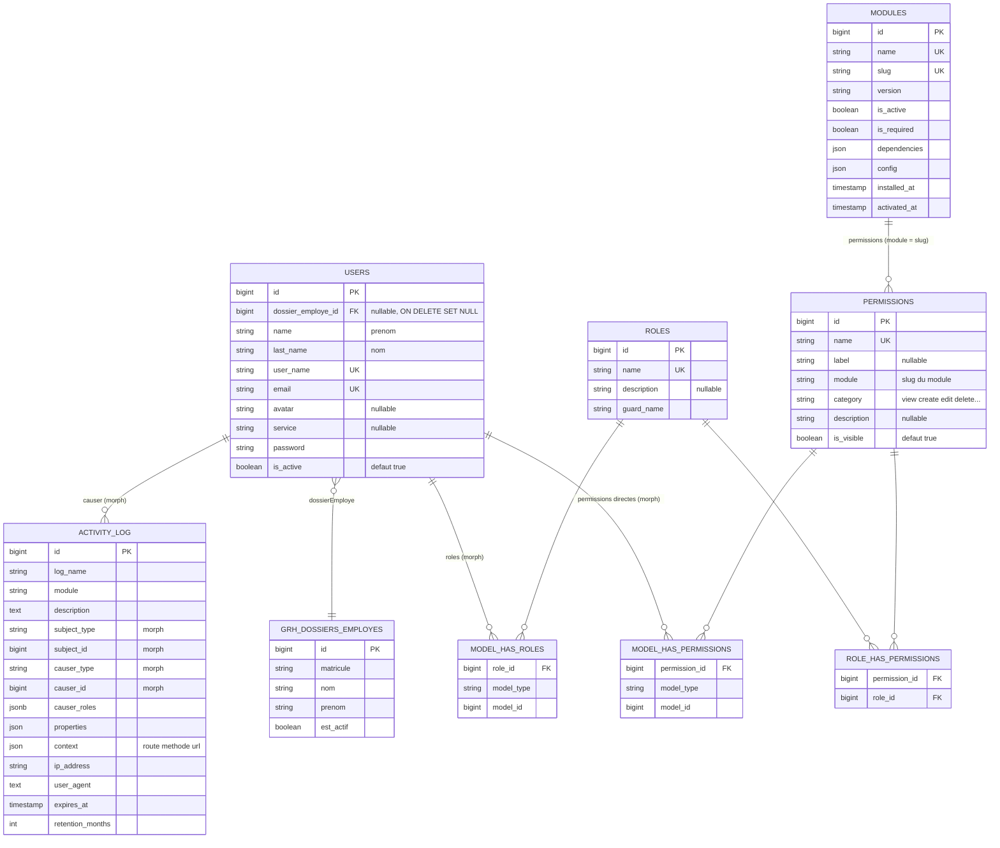
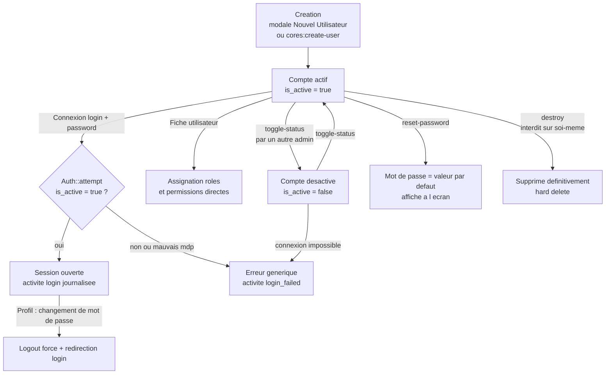
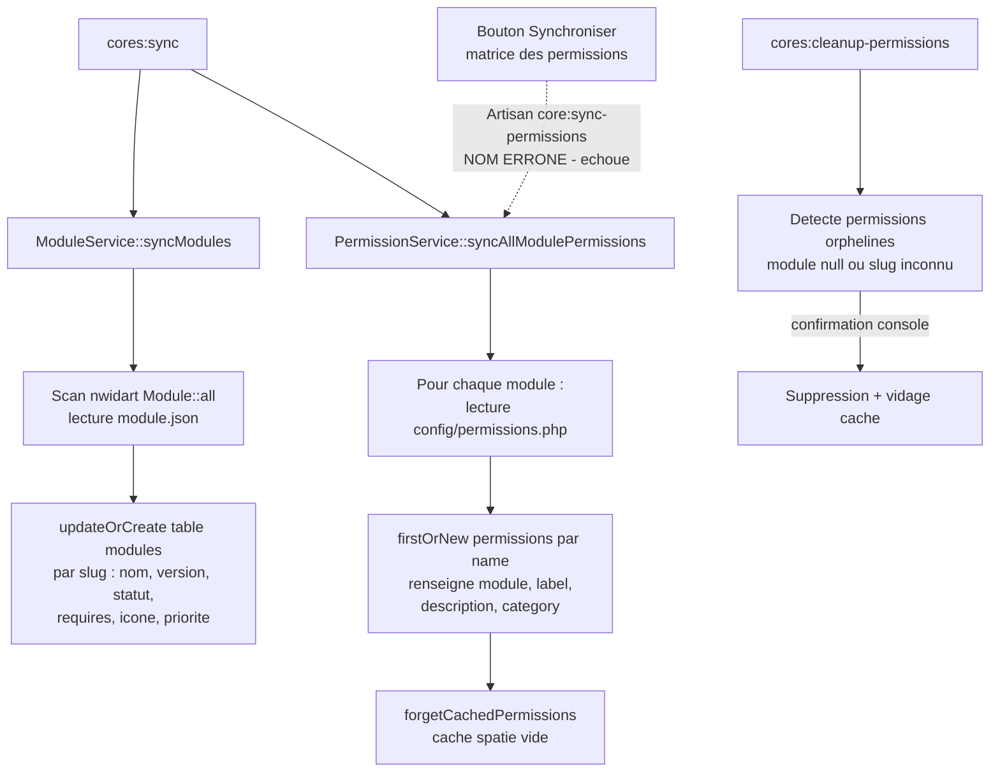
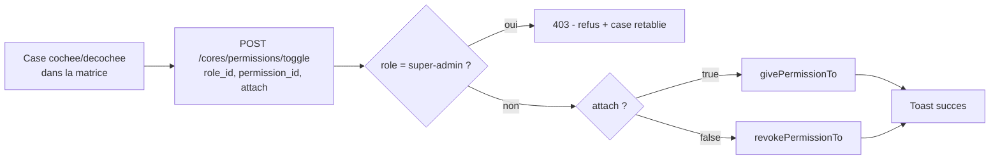

# Module Core — Analyse complète

> **Date :** 27/07/2026 — **Branche :** `refactor/stock-rebuild` — **Auteur :** Analyse générée par Claude Code
> **Périmètre :** `Modules/Core/` + assets `public/js/modules/core/` + migrations racine liées (users, permissions, modules, activity_log)

---

## 1. Vue d'ensemble

Le module **Core** est le socle technique et fonctionnel de l'application ParcInfo (nom interne « Keystone » d'après `Modules/Core/module.json`). Il est déclaré avec la priorité `0` et une liste de dépendances vide : tous les autres modules (Organisation, ParcInfo, Grh) reposent sur lui, jamais l'inverse — à une exception près (voir plus bas).

### Rôle du module

1. **Authentification** : écran de connexion (email OU nom d'utilisateur), déconnexion, blocage des comptes désactivés (`is_active`).
2. **Gestion des utilisateurs** : CRUD complet, avatar, activation/désactivation, réinitialisation de mot de passe, liaison avec le dossier employé GRH.
3. **Gestion des rôles et permissions** (spatie/laravel-permission) : CRUD des rôles, matrice rôles × permissions, attribution de rôles et de permissions directes aux utilisateurs.
4. **Registre des modules** : table `modules` synchronisée avec les modules nwidart détectés sur disque ; installation, activation/désactivation avec gestion des dépendances, écran de détail.
5. **Journal d'activité** (spatie/activitylog étendu) : journalisation enrichie (module, IP, user-agent, rôles du causeur, expiration), consultation filtrée, purge des activités expirées.
6. **Tableau de bord d'administration** : KPI globaux + activités récentes.
7. **Profil personnel** : consultation de ses informations, changement d'avatar et de mot de passe.

### Ce que Core fournit aux autres modules

| Fourniture | Fichier(s) | Consommateurs |
|---|---|---|
| Layout principal (navbar + sidebar + assets Bootstrap 5 / Bootstrap Table / Select2 / SweetAlert2) | `Modules/Core/resources/views/layouts/master.blade.php`, `layouts/partials/navbar.blade.php`, `layouts/partials/sidebar.blade.php` | Toutes les pages Core ; les autres modules étendent ce layout ou le répliquent |
| Sidebar inter-modules pilotée par la config `navigation` de chaque module | `Modules/Core/resources/views/partials/sidebar-modules.blade.php` + `HasModulePermissions::getModuleNavigation()` | Tous les modules (chaque module déclare `navigation` dans son `config/config.php`) |
| Trait `HasModulePermissions` (accès module, navigation, helpers de permissions) | `Modules/Core/app/Traits/HasModulePermissions.php` | Modèle `User`, middleware `CheckModuleAccess` |
| Trait `LogsActivityWithModule` (journalisation enrichie : module, contexte, IP, rétention 12 mois) | `Modules/Core/app/Traits/LogsActivityWithModule.php` | Modèles de tous les modules |
| Modèle `User` (auth global de l'application, table `users`) | `Modules/Core/app/Models/User.php` | Toute l'application |
| Helpers globaux (`has_module_access()`, `is_super_admin()`, `active_modules()`, `breadcrumb()`, …) | `Modules/Core/app/Support/Helpers.php` (autoloadé via `composer.json` du module) | Toute l'application |
| Services `ModuleService` / `PermissionService` (singletons) | `Modules/Core/app/Services/` | Commandes console, controllers Core |
| Gate `before` super-admin (le rôle `super-admin` passe toutes les vérifications `can()`) | `CoreServiceProvider::registerGates()` | Toute l'application |
| Directives Blade `@hasCoreAccess`, `@coreAlert`, `@impersonating` | `CoreServiceProvider::registerBladeDirectives()` | Vues |
| Composants de vue (StatsCard, ModuleCard, RoleBadge, PermissionBadge, PermissionSelector, UserAvatar) | `Modules/Core/app/View/Components/` | Vues (rendu Blade inline) |

### Dépendances de Core

- **Packages** : `nwidart/laravel-modules` (registre des modules), `spatie/laravel-permission` (rôles/permissions), `spatie/laravel-activitylog` (journal), Laravel Prompts (commande `cores:create-user`).
- **Dépendance inverse notable** : `UserController::searchEmployes()` et le modèle `User` (`dossierEmploye()`) importent `Modules\Grh\Models\Employe` — Core dépend donc du module **Grh** pour la liaison utilisateur ↔ dossier employé (voir §9).

---

## 2. Fonctionnalités

### 2.1 Authentification (`AuthController`)

- Connexion par **email ou nom d'utilisateur** : le champ unique `login` est testé avec `FILTER_VALIDATE_EMAIL` pour choisir la colonne (`email` ou `user_name`).
- La tentative `Auth::attempt` inclut `is_active => true` : **un compte désactivé ne peut pas se connecter** (message générique `auth.failed`, clé d'erreur `login_error`).
- « Se souvenir de moi » est **toujours actif** (2e argument `true` d'`Auth::attempt`, non choisi par l'utilisateur).
- Session régénérée à la connexion, invalidée + token régénéré à la déconnexion.
- Un utilisateur déjà connecté qui visite `/login` est redirigé vers `cores.dashboard`.
- **Journalisation** : les événements Laravel `Login`, `Logout`, `Failed` sont écoutés (`EventServiceProvider` → `HandleUserLogin`, `HandleUserLogout`, `HandleUserLoginFailed`) et produisent des activités `login`, `logout`, `login_failed` (log `auth`, module `core`, IP + user-agent).

### 2.2 Gestion des utilisateurs (`UserController`)

- **Liste server-side** (`getData`) : recherche sur `name`, `last_name`, `user_name`, `email`, `service` ; tri et pagination pilotés par Bootstrap Table.
- **Création** (`StoreUserRequest`) : prénom/nom obligatoires, `user_name` **unique**, `email` **unique et valide**, mot de passe obligatoire **confirmé** et fort (min. 8, majuscules/minuscules, chiffres, symboles — `Password::min(8)->letters()->mixedCase()->numbers()->symbols()`), avatar image ≤ 2 Mo, `dossier_employe_id` optionnel devant exister dans `grh_dossiers_employes`. Avatar stocké dans `public/avatars/` sous `{timestamp}_{user_name}.{ext}`.
- **Modification** (`UpdateUserRequest`) : mêmes règles avec unicité ignorant l'utilisateur courant ; le mot de passe n'est mis à jour **que s'il est fourni** ; l'ancien avatar est supprimé du disque.
- **Suppression** : interdite sur **son propre compte** (garde `$user->getKey() === auth()->id()`, HTTP 403).
- **Activation/désactivation** (`toggleStatus`) : interdite sur son propre compte ; bascule `is_active`.
- **Réinitialisation de mot de passe** : remet le mot de passe à `config('core.user_default_password')` (= `password` par défaut) et **affiche ce mot de passe dans la réponse**.
- **Fiche utilisateur** (page `show`) : édition inline du profil (`updateProfile`), changement d'avatar (`updateAvatar`, image ≤ 2 Mo), gestion AJAX des rôles (assigner — refusé si déjà possédé —, retirer) et des **permissions directes** (assigner en masse, retirer — refusé si la permission n'est pas directe).
- **Recherche d'employés GRH** (`searchEmployes`) : alimente le Select2 du formulaire (employés actifs, filtre nom/prénom/matricule, 20 max) ; sert aussi au pré-remplissage nom/prénom.
- Journalisation : `role_assigned`/`role_removed`, `permission_given`/`permission_revoked` (via `logRoleToggle`/`logPermissionToggle` du modèle `User`), `user_activated`/`user_deactivated`, `user_avatar_updated` (via `tapActivity`).

### 2.3 Gestion des rôles (`RoleController`)

- Liste server-side (recherche sur `name`), CRUD en modale.
- **Unicité du nom de rôle** (`StoreRoleRequest`/`UpdateRoleRequest`, description ≤ 500 caractères).
- **Le rôle `super-admin` est verrouillé** : modification, suppression et modification de ses permissions renvoient 403.
- Panneau de permissions par rôle (`getPermissions` groupées par module) et bascule permission par permission (`togglePermission`), journalisée (`permission_given`/`permission_revoked` sur le rôle).

### 2.4 Matrice des permissions (`PermissionController`)

- Matrice **rôles × permissions** filtrable : par défaut les 10 premiers rôles et le module `core`.
- Bascule AJAX case par case (`toggle` avec `role_id`, `permission_id`, `attach` booléen) ; le rôle `super-admin` est protégé (403).
- Synchronisation des permissions depuis l'écran (`cores.permissions.sync` → `ModuleController::syncPermissions` qui lance `Artisan::call('core:sync-permissions')` — **nom de commande erroné**, voir §9).

### 2.5 Registre des modules (`ModuleController`, `ModuleService`)

- Liste des modules enregistrés en base + **modules détectés** sur disque non enregistrés (`ModuleService::getDetectedModules`).
- **Installation** : crée la ligne `modules`, lance `module:migrate` (rollback de la ligne si échec) puis tente `module:seed --class={Module}PermissionsSeeder` (silencieux si absent).
- **Activation** : active récursivement les dépendances (`requires` du `module.json`), appelle `ModuleFacade::enable`, met à jour `is_active`/`activated_at`.
- **Désactivation** : refusée si le module est `is_required` ou si des modules actifs en dépendent (message listant les dépendants).
- **Désinstallation** : refusée si `is_required` ou encore actif ; supprime les permissions du module puis la ligne (soft delete).
- **Configuration** : écran de consultation de la config (l'enregistrement `updateConfiguration` est **désactivé** — code commenté, message de succès trompeur, voir §9).
- **Synchronisation** (`cores:sync-modules` / `cores:sync`) : `updateOrCreate` par slug depuis les `module.json` (nom, description, version, statut enabled, requires, icône, priorité).

### 2.6 Journal d'activité (`ActivityController`, modèle `Activity`)

- Table `activity_log` **étendue** : `module`, `context` (route/méthode/URL), `ip_address`, `user_agent`, `causer_roles` (rôles du causeur figés au moment de l'action), `expires_at`, `retention_months`.
- Liste server-side avec **11 filtres** : module, utilisateur, rôle (JSON contains), type d'action (description), journal (`log_name`), type de modèle (`subject_type`), ID du sujet, IP, origine (système = `causer_id` null / utilisateur), date de début, date de fin + recherche libre (description, log_name, subject_type).
- Fiche détail d'une activité (contexte complet, propriétés old/attributes).
- Rétention : chaque activité reçoit `expires_at = now() + 12 mois` (`LogsActivityWithModule::$activityRetentionMonths`) ; purge par `activities:cleanup-expired` (les descriptions critiques `deleted`, `permission_changed`, `role_changed`, `security_breach_detected` sont conservées sauf `--force`).

### 2.7 Tableau de bord (`DashboardController`)

- 4 KPI : nombre d'utilisateurs, de rôles, de modules, d'activités du jour.
- 10 dernières activités avec causeur.

### 2.8 Profil personnel (`ProfileController`)

- Changement d'avatar (image jpeg/png/jpg/gif ≤ 2 Mo, remplace le fichier précédent).
- Changement de mot de passe : `current_password` vérifié, nouveau mot de passe confirmé et fort ; **déconnexion automatique** après changement avec redirection vers `/login`.

### 2.9 Commandes console (`Modules/Core/app/Console/Commands/`)

| Commande | Signature | Rôle |
|---|---|---|
| SyncCommand | `cores:sync` | Synchronisation globale : modules (fichiers → BDD) puis permissions (`config/permissions.php` de chaque module → table `permissions`) |
| SyncModulesCommand | `cores:sync-modules` | Synchronise uniquement le registre `modules` |
| SyncPermissionsCommand | `cores:sync-permissions {module?}` | Synchronise les permissions d'un module ou de tous (création/mise à jour, label, catégorie déduite du suffixe, cache spatie vidé) |
| CleanupPermissionsCommand | `cores:cleanup-permissions` | Liste et supprime (après confirmation) les permissions orphelines (`module` null ou ne correspondant à aucun slug) |
| CleanupExpiredActivitiesCommand | `activities:cleanup-expired {--dry-run} {--module=} {--force}` | Purge les activités expirées, statistiques, barre de progression, protection des activités critiques |
| MakeSuperAdminCommand | `cores:make-superadmin {email}` | Crée/promeut un super-admin ; crée le rôle `super-admin` si absent et lui synchronise **toutes** les permissions |
| CreateUserCommand | `cores:create-user` | Création interactive (Laravel Prompts) avec validation unicité + rôle optionnel |
| AssignRoleCommand | `cores:assign-role {role} {--users=*}` | Assigne un rôle par ID, email ou user_name |
| ResetUserPassword | `cores:reset-user-password {user_name}` | Remet le mot de passe au défaut (`core.user_default_password`) et l'affiche |
| UserPermissionsCommand | `cores:user-permissions {user}` | Affiche rôles, permissions directes, total et modules accessibles (bug : voir §9) |
| ModuleStatsCommand | `cores:stats` | Statistiques utilisateurs/rôles/permissions/modules |

### 2.10 Règles métier transverses

- **Gate globale super-admin** : `Gate::before` renvoie `true` pour tout utilisateur ayant le rôle `super-admin` → il voit tous les boutons et passe tous les `@can`.
- **Gates dédiées** : `edit-system-role` (seul un super-admin peut toucher le rôle `super-admin`), `delete-user` (interdit de se supprimer soi-même).
- **Synchronisation déclarative des permissions** : chaque module déclare `config/permissions.php` (`nom => libellé`) ; `PermissionService::syncModulePermissions()` renseigne `module`, `label`, `description`, `category` (déduite du suffixe `.index`/`.store`/`.update`/`.destroy`/`.toggle`/…) et vide le cache spatie.
- **Navigation inter-modules déclarative** : chaque module expose `config('<module>.navigation')` (items `{label, icon, route, permission}`) ; `getModuleNavigation()` ne retient que les items dont la route existe et dont la permission est accordée. Pour Core : un seul item « Administration » → `cores.dashboard` (permission `cores.dashboard.view`).

---

## 3. Pages et écrans

### 3.1 Connexion — `/login` (route `login`)

- **Vue :** `Modules/Core/resources/views/auth/login.blade.php` (page autonome AdminLTE `login-page`, hors layout).
- **Objectif :** ouvrir une session par email ou nom d'utilisateur.
- **Structure :** carte centrée « KEYSTONE », message « Connectez-vous pour ouvrir votre session », 2 champs, alerte d'erreur.
- **Champs :** `login` (texte, requis, autofocus, conserve `old('login')`), `password` (requis) avec bascule œil afficher/masquer (JS inline vanilla).
- **Boutons :**

| Libellé | Icône | Action | Permission |
|---|---|---|---|
| Connexion | — | POST `login.post` (soumission classique, non AJAX) | aucune |

- **Erreurs :** alerte rouge « Identifiant ou mot de passe incorrect » sur `@error('login_error')` (message générique, pas de distinction champ).
- Pas de lien « mot de passe oublié », pas de case « se souvenir de moi » (le remember est forcé côté serveur).

### 3.2 Tableau de bord — `/cores/dashboard` (route `cores.dashboard`)

- **Vue :** `dashboard/index.blade.php` — **JS :** aucun (version simplifiée, les plugins jsvectormap/apexcharts sont chargés en CSS mais inutilisés).
- **Permission :** aucune sur la route ; l'entrée sidebar est masquée sans `cores.dashboard.view`.
- **Structure :** 4 « small-box » AdminLTE colorées (Utilisateurs/primary, Rôles/success, Modules/warning, Activités aujourd'hui/danger), chacune avec lien « Plus d'info » vers la liste correspondante ; puis carte « Dernières Activités » (tableau 5 colonnes : Date relative, Utilisateur — badge, « Système » si causer nul —, Module, Action — badge coloré + icône —, Sujet `Type #id`).
- **Boutons :** « Voir tout » (icône liste) → `cores.activities.index`.
- **État vide :** ligne « Aucune activité récente ».

### 3.3 Liste des utilisateurs — `/cores/users` (route `cores.users.index`)

- **Vue :** `users/index.blade.php` + modale `users/_modal.blade.php` — **JS :** `public/js/modules/core/users/{index,UserTable,UserForm,UserActions}.js` (modules ES natifs).
- **Structure :** carte « Liste des utilisateurs » ; toolbar de boutons icône-seul (tooltips Bootstrap) ; Bootstrap Table **server-side** (`data-url=cores.users.data`, pagination 10/25/50/100, recherche, rafraîchir, choix de colonnes, sélection **radio** mono-ligne `data-click-to-select`).
- **Colonnes :** radio, ID, Nom, Prénom, Nom d'utilisateur, Email, Service, Statut (formatter badge vert « Actif » / rouge « Inactif »), Date création (formatter fr-FR).
- **Inventaire des boutons (toolbar) :**

| ID | Libellé/tooltip | Icône | État initial | Action | Permission (`@can`) |
|---|---|---|---|---|---|
| `btn-add-user` | Ajouter un utilisateur | `fa-plus` (primary) | actif | ouvre la modale `#userModal` en mode création | `cores.users.store` |
| `btn-edit-user` | Modifier | `fa-edit` (info) | désactivé sans sélection | **redirige vers la fiche** `cores.users.show` (pas la modale) | `cores.users.update` |
| `btn-delete-user` | Supprimer | `fa-trash` (danger) | désactivé | Swal confirmation « irréversible » → DELETE `cores.users.destroy` → refresh + Swal succès | `cores.users.destroy` |
| `btn-reset-password` | Réinitialiser MDP | `fa-key` (warning) | désactivé | Swal confirmation → POST `cores.users.reset-password` → Swal affichant le nouveau mot de passe | `cores.users.reset-password` |
| `btn-enable-user` | Activer | `fa-check` (success) | masqué/désactivé | Swal question → POST `cores.users.toggle-status` | `cores.users.toggle-status` |
| `btn-disable-user` | Désactiver | `fa-ban` (secondary) | masqué/désactivé | idem | `cores.users.toggle-status` |

  Les boutons Activer/Désactiver s'affichent **mutuellement exclusifs** selon `is_active` de la ligne sélectionnée (`UserTable.handleSelection`).

- **Modale `#userModal` (« Ajouter un utilisateur » / « Modifier un utilisateur ») :**
  - Déclencheur : `btn-add-user` (le mode édition `UserForm.openForEdit` existe dans le code mais n'est **plus appelé** — l'édition passe par la fiche).
  - Champs : avatar (upload + prévisualisation FileReader, bouton caméra), interrupteur « Lier à un employé » révélant un **Select2 AJAX** (`cores.users.search-employes`, thème bootstrap-5, min. 1 caractère, delay 250 ms) qui pré-remplit Nom/Prénom en lecture seule et renseigne `dossier_employe_id` caché ; `last_name`*, `name`*, `user_name`*, `email`* ; `service` ; bloc mot de passe (`password` + `password_confirmation`, boutons œil) requis en création, masqué en édition.
  - Validations client (`UserForm.validateForm`) : requis, format email, force du mot de passe (regex identique à la règle serveur), correspondance confirmation ; erreurs affichées en `is-invalid` + `invalid-feedback`. Erreurs serveur 422 mappées champ par champ.
  - Boutons : « Annuler » (dismiss), « Enregistrer » (`btn-save`, spinner « Enregistrement... » pendant l'AJAX ; POST `cores.users.store` ou POST+`_method=PUT` `cores.users.update` en FormData). Succès → fermeture, refresh table, Swal 2 s.

### 3.4 Fiche utilisateur — `/cores/users/{id}` (route `cores.users.show`)

- **Vue :** `users/show.blade.php` — **JS :** `users/show.js` (750 lignes).
- **Structure :** carte d'en-tête (avatar 80 px avec pastille verte si actif, nom complet, badge du premier rôle, email, date d'inscription, badge statut) + boutons d'action ; 4 cartes KPI (Rôles assignés — avec badge « +N nouveaux » sur 7 jours —, Permissions directes, Total effectif, Dernière connexion — **toujours « Jamais »**, la colonne `last_login_at` n'existe pas, voir §9) ; carte à **4 onglets** : Général, Rôles, Permissions directes, Accès effectif.
- **Boutons d'en-tête :**

| ID | Libellé | Icône | Action | Garde |
|---|---|---|---|---|
| `btn-toggle-status` | Désactiver / Activer | `fa-user-slash` / `fa-user-check` | Swal confirmation → POST `toggle-status` → reload | masqué si c'est son propre compte (`auth()->id() !== $user->id`) — pas de `@can` |
| `btn-reset-password` | Réinitialiser le mot de passe | `fa-key` | Swal confirmation → POST `reset-password` → Swal avec le mot de passe | aucun `@can` |
| `btn-edit-mode` | Modifier le profil | `fa-edit` | passe l'onglet Général en mode édition (retire `disabled`, active le Select2 employé, montre `#form-actions`) | aucun `@can` |

- **Onglet Général :** formulaire `#profile-form` en lecture seule par défaut (Nom*, Prénom*, Nom d'utilisateur*, Email*, Service, bloc employé lié en Select2 désactivé, bloc mot de passe purement décoratif — champs désactivés). En mode édition : boutons « Annuler » (`btn-cancel`, restaure les valeurs) et « Enregistrer » (`btn-save-profile`, PUT `cores.users.update-profile`, erreurs 422 inline, Swal succès puis reload). Avatar : bouton « Modifier la photo » → input file caché → upload immédiat (POST `update-avatar`) avec Swal de chargement.
- **Onglet Rôles :** recherche client (`#search-roles`, filtre les lignes), tableau des rôles (icône bouclier, nom, description tronquée à 60, date d'assignation pivot, bouton « Retirer » rouge par ligne → Swal → DELETE `remove-role` → suppression de la ligne). Bouton « ASSIGNER UN NOUVEAU RÔLE » → **modale `#assignRoleModal`**. État vide : alerte info « Aucun rôle assigné ».
- **Modale `#assignRoleModal` :** liste des rôles **disponibles** chargée en AJAX (`available-roles`, spinner), recherche client `#role-search`, sélection par clic (surbrillance), champ « Note d'assignation (Optionnel) » (**purement décoratif — jamais envoyé**), alerte info « permissions héritées immédiatement ». Boutons : ANNULER / « ASSIGNER LE RÔLE » (`btn-confirm-assign`, POST `assign-role`, refus 422 si déjà possédé, reload).
- **Onglet Permissions directes :** recherche client, tableau (nom `<code>`, libellé, module badge ou « Système », bouton corbeille → Swal → DELETE `remove-permission` → reload). Bouton « ASSIGNER DES PERMISSIONS DIRECTES » → **modale `#assignPermissionsModal`**. État vide : alerte info.
- **Modale `#assignPermissionsModal` (modal-lg) :** recherche + filtre par module (select alimenté par l'AJAX `available-permissions`), liste à cases à cocher groupée par module (permissions non encore détenues), boutons ANNULER / « ASSIGNER PLUSIEURS » (`btn-confirm-assign-permissions`, POST `assign-permissions` avec `permission_ids[]`, reload).
- **Onglet Accès effectif :** lecture seule ; tableau de **toutes** les permissions effectives avec colonne SOURCE (badge « Directe » jaune / « Via rôle » bleu) et module ; recherche client. État vide : alerte info.

### 3.5 Liste des rôles — `/cores/roles` (route `cores.roles.index`)

- **Vue :** `roles/index.blade.php` + `roles/_modal.blade.php` — **JS :** `roles/{index,RoleForm,RoleActions}.js`.
- **Structure :** identique aux utilisateurs : toolbar + Bootstrap Table server-side (`cores.roles.data`), sélection radio. Colonnes : radio, ID, Nom, Description, Guard, Date création.
- **Boutons (toolbar) :**

| ID | Tooltip | Icône | Action | Permission |
|---|---|---|---|---|
| `btn-add-role` | Ajouter un rôle | `fa-plus` (primary) | modale `#roleModal` vide | `cores.roles.store` |
| `btn-edit-role` | Modifier | `fa-edit` (info) | GET `cores.roles.show` (JSON) → `RoleForm.openForEdit` pré-remplit la modale | `cores.roles.update` |
| `btn-delete-role` | Supprimer | `fa-trash` (danger) | Swal → DELETE `cores.roles.destroy` (403 pour super-admin) | `cores.roles.destroy` |
| `btn-manage-permissions` | Gérer les permissions | `fa-shield-alt` (secondary) | modale `#permissionModal` | `cores.permissions.index` |

- **Modale `#roleModal` (« Ajouter/Modifier un rôle ») :** champs `name`* (unicité serveur) et `description` (textarea) ; boutons Annuler / Enregistrer (`btn-save`, AJAX POST/PUT, erreurs 422 inline, Swal succès, refresh table).
- **Modale `#permissionModal` (« Gérer les permissions du rôle : X », modal-lg) :** chargée par GET `cores.roles.permissions` (spinner « Chargement des permissions... ») ; barre d'outils : recherche (`#permission-search` sur nom + libellé), filtre par module (`#module-filter`), interrupteur « Tout sélectionner » (`#select-all-permissions`, agit sur les switches **visibles** filtrés) ; corps : cartes par module (« MODULE xxx ») avec un **form-switch par permission** (libellé + nom technique) qui déclenche immédiatement POST `cores.roles.toggle-permission` (revert du switch en cas d'erreur, 403 pour super-admin). Bouton unique : Fermer. État filtré vide : « Aucune permission trouvée ».

### 3.6 Matrice des permissions — `/cores/permissions` (route `cores.permissions.index`)

- **Vue :** `permissions/index.blade.php` (+ plugin **bootstrap-toggle**) — **JS :** `permissions/index.js`.
- **Structure :** carte « Gestion des privilèges par rôle » ; en-tête avec bouton « Configurer l'affichage » et recherche ; tableau matrice : 1 ligne par permission (libellé + nom technique), 1 colonne par rôle affiché, cellule = toggle Oui/Non (vert/rouge, bootstrap-toggle).
- **Filtres par défaut :** 10 premiers rôles + module `core` (querystring `roles[]`/`modules[]`).
- **Boutons :**

| ID | Libellé | Icône | Action | Permission |
|---|---|---|---|---|
| `btn-permissions-config` | Configurer l'affichage | `fa-sliders-h` | ouvre `#configModal` | — (page sous `cores.permissions.index`) |
| toggles `.permission-toggle` | Oui/Non | — | POST `cores.permissions.toggle` à chaque changement ; toast Swal top-end 2 s ; revert + Swal erreur si échec (super-admin → 403) | désactivés `@cannot('cores.permissions.toggle')` |

- **Modale `#configModal` (« Paramètres d'affichage de la matrice », modal-lg) :** deux groupes de form-switches — MODULES (tous les modules distincts des permissions) et RÔLES (tous les rôles) ; boutons « Annuler » / « Appliquer le filtre » (`btn-apply-filters`) : exige **au moins un module et un rôle** (Swal warning sinon) puis recharge la page avec les paramètres d'URL.
- **Recherche :** filtre client des lignes sur le texte de la cellule permission.
- À noter : le bouton « Synchroniser les permissions » n'est **pas** sur cette page mais sur les pages Modules (§3.7/3.8).

### 3.7 Liste des modules — `/cores/modules` (route `cores.modules.index`)

- **Vue :** `modules/index.blade.php` — **JS :** inline dans la vue (gestionnaire générique `.ajax-form` : confirmation Swal optionnelle par data-attributes, spinner bouton, alerte dans `#ajax-alert`, reload après 1 s).
- **Structure :** en-tête (titre + compteur de modules installés + bouton Sync) ; alerte info « Nouveaux modules détectés » listant les modules sur disque non installés ; grille de cartes (1 carte par module : icône, nom, version, badge Actif/Inactif, description, badges Requis/dépendances, 2 mini-stats Permissions & Utilisateurs, dates installé/activé, groupe de boutons) ; carte « Légende ».
- **Inventaire des boutons :**

| Libellé | Icône | Action | Permission | Condition d'affichage |
|---|---|---|---|---|
| Sync Permissions | `fa-sync` (outline-warning) | Swal « Synchroniser les permissions de tous les modules ? » → POST `cores.permissions.sync` (**échoue : commande `core:sync-permissions` inexistante, §9**) | `cores.permissions.sync` | toujours (en-tête) |
| Installer | — (btn-sm primary) | POST `cores.modules.install` avec `module_slug` caché | `cores.modules.install` | modules détectés non installés |
| Voir | `fa-eye` (outline-primary) | lien vers `cores.modules.show` | — | toujours |
| Désactiver | `fa-pause` (outline-warning) | Swal → POST `cores.modules.disable` | `@can('cores.modules.enable')` (**incohérence : devrait être `disable`**) | actif et non requis |
| Activer | `fa-play` (outline-success) | POST `cores.modules.enable` (sans confirmation) | `cores.modules.enable` | inactif |
| ⚙ (configure) | `fa-cog` (outline-secondary) | lien `cores.modules.configure` | `cores.modules.configure` | toujours |
| Désinstaller | `fa-trash` (outline-danger) | Swal icône error « supprimera toutes ses données et permissions… irréversible » → DELETE `cores.modules.uninstall` | `cores.modules.uninstall` | non requis **et** inactif |

- **États vides :** carte centrale « Aucun module installé » ; l'alerte modules détectés n'apparaît que si non vide.
- **Feedback :** alertes Bootstrap dismissibles dans `#ajax-alert` + reload ; directive `@coreAlert` pour les messages de session.

### 3.8 Fiche module — `/cores/modules/{slug}` (route `cores.modules.show`)

- **Vue :** `modules/show.blade.php` — **JS :** même gestionnaire `.ajax-form` inline.
- **Structure :** en-tête (icône, nom, version, badge statut, description, bouton « Retour à la liste ») ; 4 cartes KPI (Permissions Count, Linked Users, Installation Date, Last Update — libellés **en anglais**) ; colonne principale à 4 onglets (Overview — description, « Key Features » statiques génériques, Dependencies avec badge « Installé » codé en dur ; Permissions — tableau nom/guard/label, état vide « Aucune permission définie » ; Configuration et Activity Log — **placeholders** « seront disponibles ici ») ; colonne latérale « QUICK ACTIONS » + « RECENT ACTIVITY » (pseudo-timeline statique installation/activation) + carte « Besoin d'aide ? » (lien DOCUMENTATION mort `#`).
- **Boutons/contrôles latéraux :**

| Contrôle | Action | Permission |
|---|---|---|
| Switch « Statut du Module » | soumission auto du form au changement → enable/disable ; désactivé + tooltip « Module requis » si requis ; revert visuel si annulation/erreur | `@cannot('cores.modules.disable')` / `@cannot('cores.modules.enable')` désactivent le switch |
| Synchronize Permissions | POST `cores.permissions.sync` (même bug de commande) | `cores.permissions.sync` |
| Uninstall Module | Swal → DELETE uninstall | `cores.modules.uninstall` (si non requis et inactif) |

### 3.9 Configuration d'un module — `/cores/modules/{slug}/configure` (route `cores.modules.configure`)

- **Vue :** `modules/configure.blade.php` (aucun JS).
- **Structure :** carte centrée listant chaque clé du `config/config.php` du module : booléens → select Oui/Non, tableaux → textarea JSON **readonly** (« non éditables directement »), scalaires → input texte.
- **Boutons :** « Annuler » (retour fiche) / « Enregistrer » (POST `configure.update` — **no-op serveur** : le code de sauvegarde est commenté, message « Configuration mise à jour avec succès » trompeur, §9).
- **État vide :** alerte info « Ce module ne possède pas de fichier de configuration éditable via cette interface » (également le cas réel : `module_path($slug, 'Config/config.php')` avec `C` majuscule ne matche pas `config/` sur Linux, §9).

### 3.10 Journal des activités — `/cores/activities` (route `cores.activities.index`)

- **Vue :** `activities/index.blade.php` — **JS :** `activities/activity.js`.
- **Structure :** 2 cartes KPI (Total Activités, Aujourd'hui — **requêtes SQL directement dans la vue Blade**) ; carte « Filtres » avec 11 champs sur 3 lignes (Module — select ; Utilisateur — select ; Rôle — select ; Action — select created/updated/deleted/login/logout ; Journal log_name ; Type Modèle ; ID Sujet — number ; Adresse IP — texte ; Déclencheur Utilisateur/Système ; Depuis le / Jusqu'au — dates) ; Bootstrap Table server-side (`cores.activities.data`, tri par défaut `created_at desc`).
- **Colonnes :** Type (icône FontAwesome de l'action), Date/Heure, Module, Action (badge coloré traduit fr), Utilisateur, Rôles (badges gris — rôles figés au moment de l'action), Modèle, Actions.
- **Boutons :**

| Libellé | Icône | Action | Permission |
|---|---|---|---|
| Exporter | `fa-download` (outline-success) | **aucun handler JS — bouton mort** | `cores.activities.export` |
| Nettoyer | `fa-broom` (outline-danger) | **aucun handler JS — bouton mort** | `cores.activities.cleanup` |
| Réinitialiser (`btn-reset`) | `fa-undo` | vide le formulaire + refresh la table | — |
| Appliquer les filtres (`btn-apply`) | `fa-search` | refresh avec les 11 filtres passés en query params | — |
| 👁 par ligne (`.btn-view-detail`) | `fa-eye` (info) | ouvre la modale `#detailModal` et charge GET `/cores/activities/{id}` en **HTML injecté** | — |

- **Modale `#detailModal` (modal-xl, « Détails de l'activité ») :** spinner puis contenu de `activities/show.blade.php` : Informations générales (généré le, expire le, module, action, sujet), Contexte Utilisateur (causeur + email ou « Système », rôles, IP), tableau « Changements détectés » (champ / ancienne valeur rouge / nouvelle valeur verte, `updated_at` exclu, affiché seulement si old/attributes présents), Détails techniques (user-agent, JSON `properties` et `context` en `<pre>`).
- **Remarque :** la vue `activities/show.blade.php` est un fragment sans layout — la « page » `/cores/activities/{id}` n'est utilisable qu'en AJAX.

### 3.11 Mon profil — `/cores/profile` (route `cores.profile`)

- **Vue :** `profile/index.blade.php` — **JS :** `profile/index.js`.
- **Structure :** colonne gauche : carte profil (avatar 150 px avec bouton caméra, nom complet, service, rôles en badges, « Membre depuis », bouton mot de passe) ; colonne droite : onglet unique « Informations Personnelles » avec 5 champs **readonly** (nom, prénom, user_name, email, service) — aucune édition possible ici.
- **Boutons :**

| Libellé | Icône | Action | Permission |
|---|---|---|---|
| 📷 (label sur input file caché) | `fa-camera` | prévisualisation + **upload immédiat** POST `cores.profile.avatar` ; Swal succès et mise à jour des avatars de la navbar | — |
| Modifier le mot de passe | `fa-key` (warning) | ouvre `#passwordModal` | — |

- **Modale `#passwordModal` (« Changer le mot de passe ») :** alerte info « vous serez automatiquement déconnecté » ; champs `current_password`*, `password`*, `password_confirmation`* — chacun avec bouton œil ; aide « Min 8 caractères, majuscule, minuscule, chiffre, symbole ». Boutons Annuler / « Modifier » (`btn-update-password`, spinner « Modification... », POST `cores.profile.password`) ; succès → Swal 3 s puis redirection `/login` ; erreurs 422 concaténées dans un Swal HTML.

### 3.12 Pages squelettes (code mort visible)

- `/cores` (route `core.index`, `CoreController@index`) → vue `index.blade.php` « Hello World » sur le layout composant `components/layouts/master.blade.php` (layout minimaliste avec police bunny.net, sans navbar/sidebar). Accessible **sans authentification**.
- `core.create/show/edit` renvoient des vues `core::create/show/edit` **inexistantes** (erreur si visitées).

**Récapitulatif : 11 écrans réels + 1 squelette ; 8 modales** (`#userModal`, `#assignRoleModal`, `#assignPermissionsModal`, `#roleModal`, `#permissionModal`, `#configModal`, `#detailModal`, `#passwordModal`).

---

## 4. Spécifications UX

### Navigation

- **Layout AdminLTE 4 / Bootstrap 5** (`layouts/master.blade.php`) : navbar fixe + sidebar sombre repliable (`sidebar-expand-lg sidebar-open`), scrollbar OverlayScrollbars, footer « CHU-YO ». Titre par défaut « CHU-YO | KEYSTONE », favicon `images/chuyo_icon.png`.
- **Sidebar** (`layouts/partials/sidebar.blade.php`) : menus accordéon « treeview » ; groupe **Administration** (Dashboard, Utilisateurs, Rôles, Permissions, Modules, Activités) sous `@canany`, chaque entrée sous son `@can` propre ; groupe **ORGANISATION codé en dur** dans la sidebar Core (sites, directions, services, unités, bâtiments, étages, locaux, postes de travail) — la sidebar Core sert donc aussi de navigation vers le module Organisation. État actif par `request()->routeIs(...)`, ouverture du groupe par `request()->is('core*')`.
- **Partial inter-modules** `partials/sidebar-modules.blade.php` : mécanisme opt-in (`@include('core::partials.sidebar-modules', ['moduleCourant' => 'x'])`) affichant « AUTRES MODULES » depuis `getModuleNavigation()` ; **aucun consommateur restant** dans le code actuel (le module qui l'utilisait a été supprimé).
- **Navbar** (`layouts/partials/navbar.blade.php`) : burger sidebar, recherche (widget AdminLTE), plein écran, menu utilisateur (avatar + prénom, panneau avec « Actif depuis », boutons **Profile** et **Se deconnecter** — formulaire POST logout caché).
- **Breadcrumb** : `@yield('breadcrumb')` dans l'en-tête de contenu, à droite du titre `@yield('header')` ; les items « Accueil » pointent souvent vers `#` (liens morts).
- **Ziggy** : la directive `@routes` expose `route()` côté JS — toutes les URLs AJAX sont construites par nom de route.

### Feedback utilisateur

- **SweetAlert2** partout : confirmations avant toute action destructrice (suppression, réinitialisation, désactivation — couleurs adaptées : rouge destructif, orange reset), toasts `top-end` 2 s pour les bascules de la matrice, alertes bloquantes pour les erreurs. Textes en français.
- **Spinners de boutons** : pattern `prop('disabled', true).html('<i class="fas fa-spinner fa-spin"></i> …')` puis restauration dans `complete` (UserForm, profil, modules).
- **Pages modules** : au lieu de Swal succès, alertes Bootstrap dismissibles injectées dans `#ajax-alert` puis `location.reload()` après 1 s.
- **Rafraîchissement** : les listes Bootstrap Table sont rafraîchies via `bootstrapTable('refresh')` sans reload ; la fiche utilisateur préfère `location.reload()` après modification de rôles/permissions.

### Formulaires

- **Modale AJAX** = pattern dominant (création/édition rôle, création utilisateur, mot de passe profil) ; **édition en page** avec bascule lecture/édition pour la fiche utilisateur (`btn-edit-mode` retire `disabled` et révèle les actions) ; formulaires HTML classiques + gestionnaire `.ajax-form` pour les modules.
- Validation : double (HTML5 personnalisé en français via `setCustomValidity` + regex JS de force du mot de passe identique à la règle serveur, puis erreurs 422 Laravel mappées en `is-invalid`/`invalid-feedback`).
- **Select2** (thème bootstrap-5, `dropdownParent` sur la modale) pour la recherche d'employé GRH ; quick-pattern « interrupteur qui révèle le champ » pour la liaison employé.
- Uploads d'avatar : input file caché derrière un label caméra, prévisualisation FileReader, upload immédiat (profil, fiche) ou différé avec le formulaire (modale création).

### Conventions visuelles

- **Badges de statut** : vert `bg-success` Actif / rouge `bg-danger` Inactif (utilisateurs, modules) ; activités : mapping couleur/icône centralisé dans le modèle `Activity` (`created`→success/plus, `updated`→warning/edit, `deleted`→danger/trash, `login`→primary, `logout`→secondary).
- **KPI** : small-box AdminLTE colorées (dashboard) ou cartes blanches shadow-sm (fiches) ; composants Blade `StatsCard`, `ModuleCard`, `RoleBadge` (super-admin rouge, admin jaune, manager cyan), `PermissionBadge` (couleur par catégorie) disponibles mais peu utilisés dans les vues.
- Tableaux : Bootstrap Table server-side avec locale fr-FR, sélection radio mono-ligne + toolbar de boutons icône-seul à tooltips (pattern « variante 1 » commun aux modules), colonnes triables.
- Interrupteurs `form-check-switch` pour toute bascule booléenne (permissions de rôle, filtres matrice, statut module, liaison employé).

### Accessibilité / limitations constatées

- Points positifs : meta `color-scheme`, `aria-label` sur la navigation, `role="switch"`, boutons de fermeture `aria-label`, tooltips.
- Limites : boutons d'action icône-seul (dépendants du tooltip), pas de skip-link réel (commentaire « accessibility.js » sans fichier chargé), contenus injectés en HTML sans annonce ARIA (modale activité), libellés mélangés français/anglais sur la fiche module, faute « Min 8 carats », messages d'erreur techniques (`$e->getMessage()`) remontés tels quels à l'utilisateur.

---

## 5. Permissions et rôles

### 5.1 Permissions déclarées (`Modules/Core/config/permissions.php`)

| Permission | Libellé | Effet concret observé dans le code |
|---|---|---|
| `cores.dashboard.view` | Voir le tableau de bord | Affiche l'entrée « Administration » de la sidebar inter-modules (`config/config.php` → `navigation`) |
| `cores.users.index` | Voir la liste des utilisateurs | Affiche le lien « Utilisateurs » dans la sidebar Core |
| `cores.users.store` | Créer un utilisateur | Affiche le bouton « Nouvel Utilisateur » (`@can` dans `users/index.blade.php`) |
| `cores.users.update` | Modifier un utilisateur | Affiche le bouton crayon (édition) dans la colonne actions |
| `cores.users.destroy` | Supprimer un utilisateur | Affiche le bouton corbeille dans la colonne actions |
| `cores.users.reset-password` | Réinitialiser le mot de passe | Affiche le bouton clé dans la colonne actions |
| `cores.users.toggle-status` | Activer/Désactiver un utilisateur | Affiche le switch de statut dans la colonne actions |
| `cores.roles.index` | Voir la liste des rôles | Affiche le lien « Rôles » dans la sidebar Core |
| `cores.roles.store` | Créer un rôle | Affiche le bouton « Nouveau Rôle » |
| `cores.roles.update` | Modifier un rôle | Affiche le bouton crayon + l'accès au panneau de permissions du rôle |
| `cores.roles.destroy` | Supprimer un rôle | Affiche le bouton corbeille |
| `cores.permissions.index` | Voir la matrice des permissions | Affiche le lien « Permissions » dans la sidebar Core |
| `cores.permissions.toggle` | Modifier les permissions | Active les cases à cocher de la matrice |
| `cores.permissions.sync` | Synchroniser les permissions | Affiche le bouton « Synchroniser » de la matrice |
| `cores.modules.index` | Voir la liste des modules | Affiche le lien « Modules » dans la sidebar Core |
| `cores.modules.show` | Voir les détails d'un module | Accès à la fiche module |
| `cores.modules.install` | Installer un module | Bouton « Installer » des modules détectés |
| `cores.modules.uninstall` | Désinstaller un module | Bouton « Désinstaller » |
| `cores.modules.enable` | Activer un module | Bouton « Activer » |
| `cores.modules.disable` | Désactiver un module | Bouton « Désactiver » |
| `cores.modules.configure` | Configurer un module | Bouton/écran « Configurer » |
| `cores.activities.index` | Voir le journal des activités | Lien « Activités » dans la sidebar Core |
| `cores.activities.data` | Accéder aux données des activités | (déclarée ; endpoint `/cores/activities/data`) |
| `cores.activities.show` | Voir les détails d'une activité | Accès à la fiche activité |
| `cores.activities.export` | Exporter l'historique | **Déclarée mais aucun écran/route d'export n'existe** |
| `cores.activities.cleanup` | Nettoyer les anciennes activités | **Déclarée mais l'action n'existe qu'en console** (`activities:cleanup-expired`) |

> **Important :** ces permissions ne sont **pas appliquées côté serveur** dans le module Core : les routes n'ont que le middleware `auth` et aucun controller Core ne fait de `authorize()`/`middleware('permission:…')`. Elles ne servent qu'au **masquage des éléments d'interface** (`@can` dans les vues, filtrage de la sidebar). Voir §9.

### 5.2 Rôles

Aucun seeder de rôles « métier » n'est présent dans Core. Les rôles observables dans le code :

| Rôle | Origine | Particularités |
|---|---|---|
| `super-admin` | Créé par `cores:make-superadmin` (avec **toutes** les permissions) | `Gate::before` → accès total ; non modifiable/supprimable via l'UI ; ses permissions ne peuvent pas être basculées |
| `Admin` | Seeder legacy `SeedPermissionsTableSeeder` (avec permissions legacy `users.view`… + utilisateur `admin@admin.com` / `azerty`) | Seeder non référencé par `CoreDatabaseSeeder` (code mort probable, voir §9) |
| `admin`, `manager`, `user` | Référencés uniquement pour la **couleur de badge** (`get_role_badge_color()`, `RoleBadge`) | Purement cosmétiques |

Les autres rôles sont créés librement via l'écran Rôles.

---

## 6. Modèle de données

### 6.1 Tables

**`users`** (créée `cores_users` par `database/migrations/2025_12_24_103711`, renommée en `users` par `2025_12_26_034554` qui **droppe** l'ancienne table `users` Laravel)

| Colonne | Type | Contraintes / remarques |
|---|---|---|
| id | bigint PK | |
| dossier_employe_id | bigint nullable | FK → `grh_dossiers_employes.id`, `ON DELETE SET NULL` (migration `2026_04_24_041115`) |
| name | string | Prénom |
| last_name | string | Nom |
| user_name | string | **unique** |
| email | string | **unique** |
| avatar | string nullable | Chemin relatif `avatars/…` sous `public/` (migration `2026_01_14_120808`) |
| service | string nullable | Libellé libre |
| email_verified_at | timestamp nullable | |
| password | string | Cast `hashed` |
| is_active | boolean, défaut `true` | Ajoutée par `Modules/Core/database/migrations/2025_12_24_151836` (qui cible `cores_users` — voir §9) |
| remember_token, timestamps | | |

**`modules`** (`database/migrations/2026_01_08_110151`)

| Colonne | Type | Contraintes |
|---|---|---|
| id | bigint PK | |
| name | string | **unique** |
| slug | string | **unique**, indexé |
| description | text nullable | |
| version | string défaut `1.0.0` | |
| is_active | boolean défaut `false` | indexé |
| is_required | boolean défaut `false` | indexé — bloque désactivation/désinstallation |
| dependencies | json nullable | slugs des modules requis |
| config | json nullable | non exploité (écran configure en lecture seule) |
| icon | string nullable | classe FontAwesome |
| sort_order | int défaut 0 | |
| installed_at / activated_at | timestamp nullable | |
| timestamps + softDeletes | | |

**`permissions`** (spatie, `2025_12_18_214056`) étendue par :
- `label` (string nullable, `2025_12_26_042753`)
- `module` (string nullable indexé, `2026_01_08_113203`) — **clé de liaison vers `modules.slug`** (relation `Module::permissions()` : hasMany sur `module` = `slug`)
- `category`, `description`, `group`, `sort_order`, `is_visible` (`2026_01_08_114055`)

**`roles`** (spatie) étendue par `description` (string nullable, `2026_01_14_201208`).

Tables pivot spatie : `model_has_permissions`, `model_has_roles`, `role_has_permissions`.

**`activity_log`** (spatie, `2026_01_15_211310`) étendue par :
- `event`, `batch_uuid` (migrations spatie standard)
- `module` (indexé), `context` (json), `ip_address`, `user_agent` (`2026_01_15_213029` + index `causer_id`, `subject_id`, `created_at`)
- `causer_roles` (jsonb), `expires_at` (indexé), `retention_months` (`2026_01_15_232214`)

### 6.2 Diagramme entité-relation

---

## 7. Workflows métier

### 7.1 Cycle de vie d'un utilisateur

### 7.2 Synchronisation modules & permissions

### 7.3 Cycle de vie d'un module applicatif

```mermaid
stateDiagram-v2
    [*] --> Detecte : present sur disque,<br>absent de la table modules
    Detecte --> Installe : install (module migrate<br>+ seed permissions)
    Installe --> Actif : enable (activation recursive<br>des dependances)
    Actif --> Inactif : disable (refuse si is_required<br>ou modules dependants actifs)
    Inactif --> Actif : enable
    Inactif --> Desinstalle : uninstall (refuse si is_required ;<br>supprime les permissions du module,<br>soft delete de la ligne)
    Desinstalle --> [*]
```

### 7.4 Attribution d'une permission à un rôle (matrice)

---

## 8. Routes et endpoints

Préfixe commun : `/cores` (middleware `auth` uniquement — aucune vérification de permission serveur). Fichier : `Modules/Core/routes/web.php`.

### Authentification (hors préfixe, sans `auth`)

| Méthode | URI | Nom | Controller@action | Rôle | Permission |
|---|---|---|---|---|---|
| GET | /login | login | AuthController@showLogin | page | — |
| POST | /login | login.post | AuthController@login | action | — |
| POST | /logout | logout | AuthController@logout | action | — |

### Tableau de bord & profil

| Méthode | URI | Nom | Controller@action | Rôle | Permission |
|---|---|---|---|---|---|
| GET | /cores/dashboard | cores.dashboard | DashboardController@index | page | aucune (UI : `cores.dashboard.view` pour la sidebar) |
| GET | /cores/profile | cores.profile | ProfileController@index | page | — |
| POST | /cores/profile/avatar | cores.profile.avatar | ProfileController@updateAvatar | action | — |
| POST | /cores/profile/password | cores.profile.password | ProfileController@updatePassword | action | — |

### Utilisateurs

| Méthode | URI | Nom | Controller@action | Rôle | Permission (UI seulement) |
|---|---|---|---|---|---|
| GET | /cores/users | cores.users.index | UserController@index | page | `cores.users.index` |
| GET | /cores/users/data | cores.users.data | UserController@getData | data (Bootstrap Table) | — |
| GET | /cores/users/search-employes | cores.users.search-employes | UserController@searchEmployes | data (Select2) | — |
| GET | /cores/users/{id} | cores.users.show | UserController@show | page (ou JSON si `wantsJson`) | — |
| POST | /cores/users | cores.users.store | UserController@store | action | `cores.users.store` |
| PUT | /cores/users/{id} | cores.users.update | UserController@update | action | `cores.users.update` |
| DELETE | /cores/users/{id} | cores.users.destroy | UserController@destroy | action | `cores.users.destroy` |
| POST | /cores/users/{id}/reset-password | cores.users.reset-password | UserController@resetPassword | action | `cores.users.reset-password` |
| POST | /cores/users/{id}/toggle-status | cores.users.toggle-status | UserController@toggleStatus | action | `cores.users.toggle-status` |
| PUT | /cores/users/{id}/profile | cores.users.update-profile | UserController@updateProfile | action | — |
| POST | /cores/users/{id}/avatar | cores.users.update-avatar | UserController@updateAvatar | action | — |
| GET | /cores/users/{id}/roles/available | cores.users.available-roles | UserController@getAvailableRoles | data | — |
| POST | /cores/users/{id}/roles | cores.users.assign-role | UserController@assignRole | action | — |
| DELETE | /cores/users/{id}/roles | cores.users.remove-role | UserController@removeRole | action | — |
| DELETE | /cores/users/{id}/permissions | cores.users.remove-permission | UserController@removePermission | action | — |
| GET | /cores/users/{id}/permissions/available | cores.users.available-permissions | UserController@getAvailablePermissions | data | — |
| POST | /cores/users/{id}/permissions | cores.users.assign-permissions | UserController@assignPermissions | action | — |

### Rôles

| Méthode | URI | Nom | Controller@action | Rôle | Permission (UI seulement) |
|---|---|---|---|---|---|
| GET | /cores/roles | cores.roles.index | RoleController@index | page | `cores.roles.index` |
| GET | /cores/roles/data | cores.roles.data | RoleController@getData | data | — |
| GET | /cores/roles/{id} | cores.roles.show | RoleController@show | data (JSON) | — |
| POST | /cores/roles | cores.roles.store | RoleController@store | action | `cores.roles.store` |
| PUT | /cores/roles/{id} | cores.roles.update | RoleController@update | action | `cores.roles.update` (refus serveur : super-admin) |
| DELETE | /cores/roles/{id} | cores.roles.destroy | RoleController@destroy | action | `cores.roles.destroy` (refus serveur : super-admin) |
| GET | /cores/roles/{id}/permissions | cores.roles.permissions | RoleController@getPermissions | data | — |
| POST | /cores/roles/{id}/toggle-permission | cores.roles.toggle-permission | RoleController@togglePermission | action | refus serveur : super-admin |

### Permissions

| Méthode | URI | Nom | Controller@action | Rôle | Permission (UI seulement) |
|---|---|---|---|---|---|
| GET | /cores/permissions | cores.permissions.index | PermissionController@index | page | `cores.permissions.index` |
| POST | /cores/permissions/toggle | cores.permissions.toggle | PermissionController@toggle | action | `cores.permissions.toggle` (refus serveur : super-admin) |
| POST | /cores/permissions/sync | cores.permissions.sync | ModuleController@syncPermissions | action | `cores.permissions.sync` (**bug commande, §9**) |

### Modules

| Méthode | URI | Nom | Controller@action | Rôle | Permission (UI seulement) |
|---|---|---|---|---|---|
| GET | /cores/modules | cores.modules.index | ModuleController@index | page | `cores.modules.index` |
| POST | /cores/modules/install | cores.modules.install | ModuleController@install | action | `cores.modules.install` |
| GET | /cores/modules/{slug} | cores.modules.show | ModuleController@show | page | `cores.modules.show` |
| POST | /cores/modules/{slug}/enable | cores.modules.enable | ModuleController@enable | action | `cores.modules.enable` |
| POST | /cores/modules/{slug}/disable | cores.modules.disable | ModuleController@disable | action | `cores.modules.disable` |
| DELETE | /cores/modules/{slug} | cores.modules.uninstall | ModuleController@uninstall | action | `cores.modules.uninstall` |
| GET | /cores/modules/{slug}/configure | cores.modules.configure | ModuleController@configure | page | `cores.modules.configure` |
| POST | /cores/modules/{slug}/configure | cores.modules.configure.update | ModuleController@updateConfiguration | action | (no-op, §9) |

### Activités

| Méthode | URI | Nom | Controller@action | Rôle | Permission (UI seulement) |
|---|---|---|---|---|---|
| GET | /cores/activities | cores.activities.index | ActivityController@index | page | `cores.activities.index` |
| GET | /cores/activities/data | cores.activities.data | ActivityController@getData | data | `cores.activities.data` (déclarée, non vérifiée) |
| GET | /cores/activities/{id} | cores.activities.show | ActivityController@show | page | `cores.activities.show` |

### Résiduel / code mort

| Méthode | URI | Nom | Controller@action | Remarque |
|---|---|---|---|---|
| GET/POST/PUT/DELETE | /cores, /cores/create, /cores/{id}, /cores/{id}/edit | core.* | CoreController (resource) | Squelette nwidart : renvoie des vues `core::index/create/show/edit` **dont seule `index` existe** ; hors middleware `auth` ; entre en collision de préfixe avec le groupe `/cores` (déclaré après lui) |
| GET/POST/… | /api/v1/cores | api.core.* | CoreController (apiResource, `auth:sanctum`) | Squelette : les méthodes renvoient des vues ou rien |

`Modules/Core/app/Http/Controllers/Api/ModuleApiController.php` (index/show/enable/disable JSON) n'est **référencé par aucune route** — code mort.

---

## 9. Points d'attention et limites

### 9.1 Sécurité

1. **Aucune permission appliquée côté serveur dans Core.** Toutes les routes `/cores/*` ne portent que `auth` ; aucun controller Core n'appelle `authorize()` ni le middleware `permission:` (pourtant aliasé dans `bootstrap/app.php`). Tout utilisateur connecté peut, en forgeant la requête, créer/supprimer des utilisateurs, s'auto-attribuer des rôles/permissions, désactiver des modules… Le chantier P8 (« contrôle des permissions dans tous les controllers ») a couvert ParcInfo mais pas Core. C'est **la** dette prioritaire du module.
2. **`resetPassword` renvoie le mot de passe en clair** dans la réponse JSON et le Swal ; mot de passe par défaut faible (`password`, `Modules/Core/config/config.php`).
3. **Routes squelettes exposées sans `auth`** : `Route::resource('cores', CoreController::class)` (`routes/web.php:91`) est déclaré hors du groupe `auth` — `/cores` affiche « Hello World » à un visiteur non connecté ; `core.show/edit/create` plantent (vues inexistantes). À supprimer, ainsi que `routes/api.php` (apiResource sanctum sur le même squelette).
4. `updateProfile`/`updateAvatar`/`assign-role`/`assign-permissions` sur `/cores/users/{id}` n'ont même pas de garde « soi-même vs autrui » : seul le masquage d'interface distingue les cas.

### 9.2 Bugs avérés

5. **Bouton « Sync Permissions » cassé** : `ModuleController::syncPermissions()` appelle `Artisan::call('core:sync-permissions')` alors que la signature est `cores:sync-permissions` (`SyncPermissionsCommand`). L'appel lève une exception → toujours le message d'erreur.
6. **`cores:user-permissions` plante** : `UserPermissionsCommand.php:18` appelle `User::findByIdOrUsername()` qui n'existe pas (BadMethodCallException avant le code de repli).
7. **`activities:cleanup-expired` plante** : utilise `Activity::expired()` mais aucun `scopeExpired` n'est défini sur `Modules/Core/app/Models/Activity.php` (seuls `forModule` et `critical` existent). La purge des activités n'est donc pas fonctionnelle en l'état.
8. **Écran de configuration de module inopérant** : `ModuleController::configure()` lit `module_path($slug, 'Config/config.php')` (`C` majuscule) alors que le dossier réel est `config/` — sur Linux le fichier n'est jamais trouvé (toujours « pas de configuration éditable ») ; et `updateConfiguration()` est un no-op (code commenté) qui affiche pourtant « Configuration mise à jour avec succès ».
9. **`avatar_url` incohérent avec le stockage** : les uploads vont dans `public/avatars/` (`$avatar->move(public_path('avatars'))`) mais l'accessor `getAvatarUrlAttribute()` teste `Storage::exists($this->avatar)` (disque `local` = `storage/app`) — le test échoue et **tous les avatars uploadés retombent sur ui-avatars.com** (dépendance externe, de surcroît).
10. **Migration `add_is_active_to_users_table` (module Core)** cible la table `cores_users` alors qu'elle a été renommée `users` par la migration racine du 26/12 — sur une base neuve l'ordre chronologique (24/12 module vs 26/12 racine) fonctionne, mais tout rejeu isolé échoue ; fragilité à documenter.
11. **`last_login_at` inexistant** : `users/show.blade.php:106` affiche `$user->last_login_at` — aucune colonne ni accessor ; la carte « Dernière connexion » affiche toujours « Jamais » (l'information existe pourtant dans `activity_log` via les events `login`).
12. La sidebar marque le groupe Administration actif via `request()->is('core*')` alors que les URLs commencent par `cores/` — fonctionne par coïncidence de préfixe, mais `/profile*` testé dans la même condition ne correspond à aucune route réelle (`/cores/profile`).

### 9.3 Code mort / incohérences

13. **Code mort** : `Api/ModuleApiController` (aucune route) ; `CoreController` + vues `index.blade.php`/`components/layouts/master.blade.php` ; `UserForm.openForEdit()` (l'édition passe par la fiche) ; composants Blade `StatsCard`/`ModuleCard`/`PermissionSelector`/`UserAvatar` non référencés par les vues ; listener `LogAuthenticationEvents` doublonnant les trois `HandleUser*` (seuls ces derniers sont câblés) ; seeders `PermissionSeeder` et `SeedPermissionsTableSeeder` (conventions de nommage legacy `view users`, rôle `Admin`, utilisateur `admin@admin.com`/`azerty` — **à ne pas exécuter en production**) non appelés par `CoreDatabaseSeeder` (vide).
14. **Boutons morts** : « Exporter » et « Nettoyer » du journal des activités (aucun handler JS ; permissions `cores.activities.export`/`cleanup` déclarées pour rien) ; lien « View All » et bouton « DOCUMENTATION » de la fiche module (`href="#"`).
15. **Helpers désynchronisés** : `can_manage_users()`/`can_manage_roles()`/`can_manage_modules()` (`app/Support/Helpers.php`) testent `cores.users.view/create/edit` et `cores.modules.view` — permissions **inexistantes** (les vraies sont `index/store/update`) ; `module_navigation()` lit `config("modules.{$module}.navigation")` alors que la convention réelle est `config("{$module}.navigation")` ; `clear_permissions_cache()` utilise `cache()->tags()` (incompatible avec les stores file/database).
16. **Incohérences de garde UI** : bouton « Désactiver » d'un module sous `@can('cores.modules.enable')` (au lieu de `disable`) ; boutons de la fiche utilisateur (reset password, édition, rôles/permissions) sans aucun `@can` alors que la liste les masque finement ; modale « permissions du rôle » ouverte sous `cores.permissions.index` mais bascules exécutées sans vérification.
17. **Trait `LogsActivityWithModule`** : `bootLogsActivityWithModule()` enregistre des callbacks d'événements vides (no-op) — code confus sans effet ; la rétention est fixée à 12 mois pour tous les modèles sans configuration par module (le champ `retention_months` le laisse pourtant envisager).
18. **Champ décoratif** : « Note d'assignation (Optionnel) » de la modale d'assignation de rôle n'est jamais envoyé au serveur.
19. **Requêtes dans les vues** : KPI du journal des activités calculés par `\Modules\Core\Models\Activity::count()` directement dans le Blade ; `getUsersCountAttribute()` (N+1 potentiel sur la grille modules : 2 requêtes par carte).
20. **i18n/qualité** : libellés anglais résiduels (fiche module : Overview, Linked Users, QUICK ACTIONS…), contenu « Key Features » générique statique, faute « Min 8 carats », description `module.json` mentionnant une future table `configs` inexistante.
21. `PermissionController::index` ne filtre pas `is_visible` (colonne prévue pour l'UI mais jamais exploitée), et le paramètre `roles`/`modules` de l'URL n'est pas validé (IDs arbitraires acceptés).
