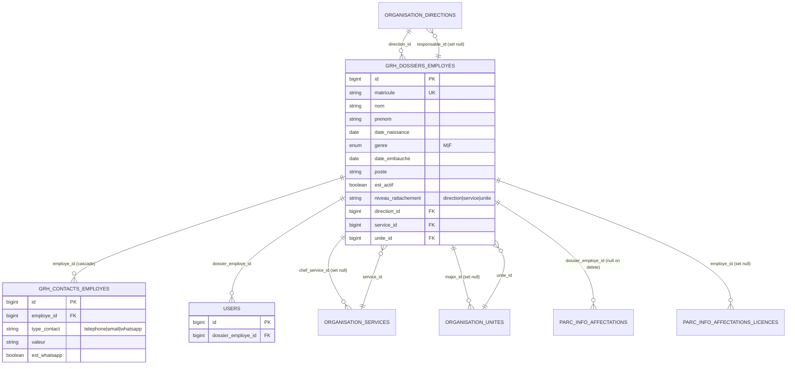
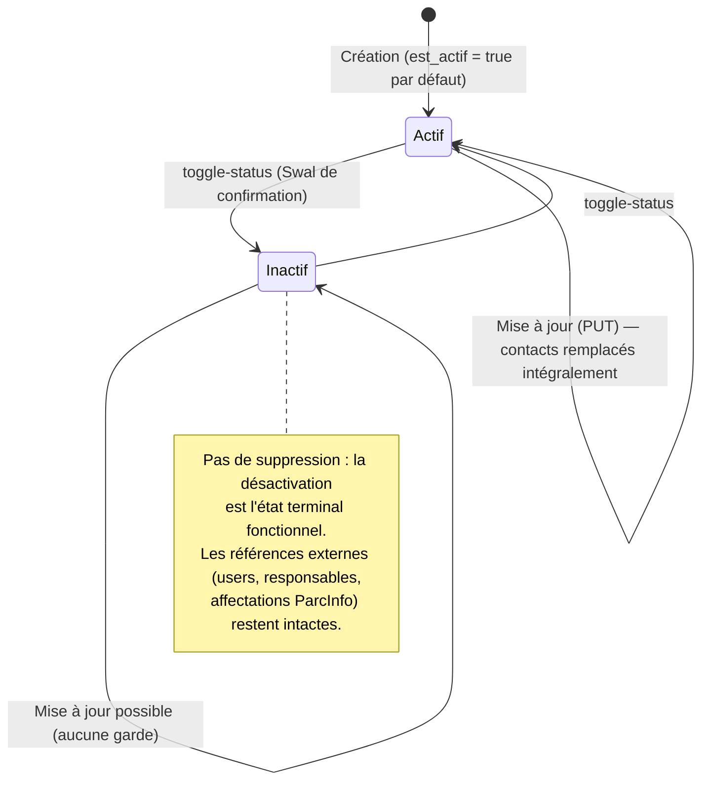
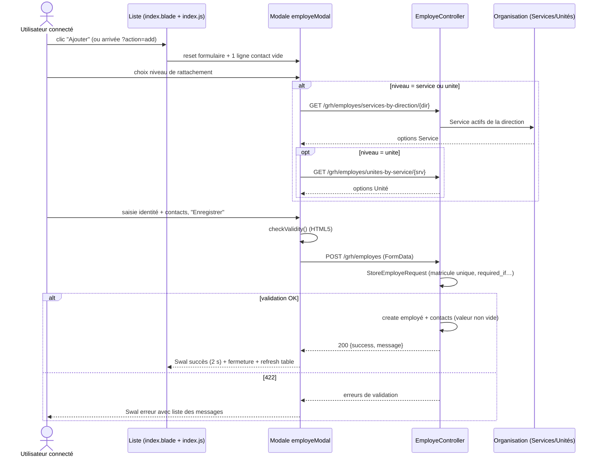
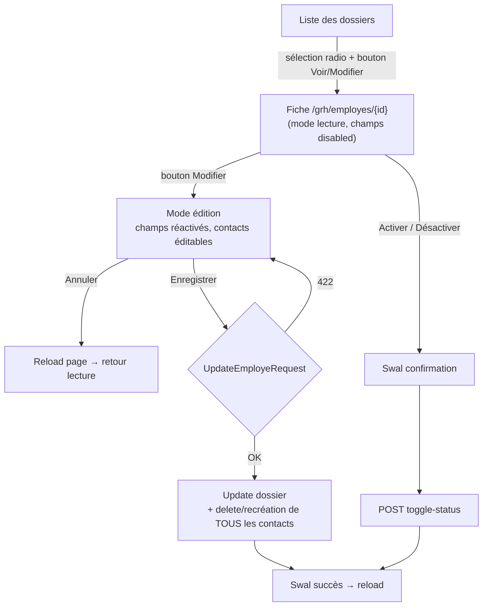
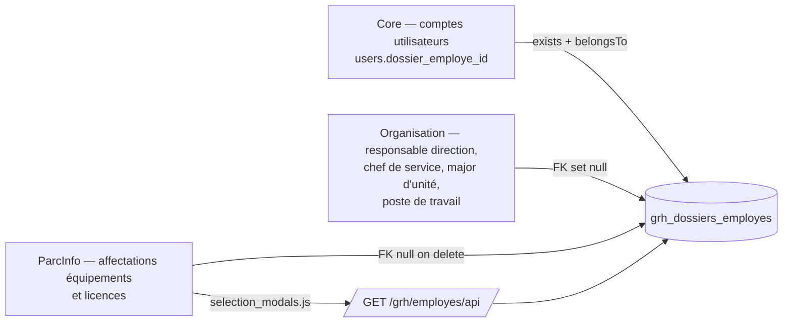

# Module Grh — Analyse complète

> **Date** : 27/07/2026 — **Branche** : `refactor/stock-rebuild` — **Auteur** : Analyse générée par Claude Code
> **Périmètre** : `Modules/Grh/` (Laravel 12 + nwidart/laravel-modules 12), JS associé dans `public/js/modules/grh/`.

---

## 1. Vue d'ensemble

Le module **Grh** (Gestion des Ressources Humaines) est le **référentiel des dossiers employés** du CHU-YO. C'est le plus petit des quatre modules actifs (Core, Organisation, ParcInfo, Grh) : il ne gère à ce jour qu'une seule entité métier, le **dossier employé** (matricule, identité, poste, rattachement organisationnel, contacts). Il n'existe **aucune gestion de contrats, congés ou présences** — aucun modèle, migration, vue ou route ne s'y rapporte (vérifié sur l'ensemble du module).

Malgré sa taille, Grh joue un rôle pivot dans l'écosystème :

- **Grh dépend d'Organisation** : chaque dossier employé est rattaché à une structure administrative (`organisation_directions` / `organisation_services` / `organisation_unites`) via des clés étrangères. Le modèle `Modules\Grh\Models\Employe` référence directement `Modules\Organisation\Models\{Direction, Service, Unite}`.
- **Les autres modules dépendent de Grh** (sens inverse, au niveau données) :
  - **Core** : `users.dossier_employe_id` → `grh_dossiers_employes.id` (un compte utilisateur système peut être lié à un dossier employé ; relation `Employe::users()` / `User::dossierEmploye()`).
  - **Organisation** : `organisation_directions.responsable_id`, `organisation_services.chef_service_id`, `organisation_unites.major_id` → `grh_dossiers_employes.id` (migration `Modules/Organisation/database/migrations/2026_04_22_164204_update_organisation_responsables_to_employes.php`), ainsi que `organisation_postes_travail.dossier_employe_id`.
  - **ParcInfo** : `parc_info` (affectations d'équipements, colonne `dossier_employe_id`) et `parc_info_affectations_licences.employe_id` → `grh_dossiers_employes.id`. Le JS ParcInfo (`public/js/modules/parc-info/ordinateurs/selection_modals.js`) consomme l'endpoint JSON `/grh/employes/api` pour sélectionner un employé lors d'une affectation.

**Note terminologique** : le sens réel de la dépendance est donc **Grh → Organisation** pour le rattachement structurel (l'employé appartient à une direction/service/unité), et **Core/Organisation/ParcInfo → Grh** pour tout ce qui désigne une personne (responsable, chef de service, major, titulaire de compte, bénéficiaire d'affectation). Il y a de fait une **dépendance croisée Grh ↔ Organisation** au niveau base de données (Organisation référence les employés comme responsables).

Composants du module :

| Élément | Fichiers |
|---|---|
| Controllers | `Modules/Grh/app/Http/Controllers/DashboardController.php`, `EmployeController.php` |
| FormRequests | `Modules/Grh/app/Http/Requests/StoreEmployeRequest.php`, `UpdateEmployeRequest.php` |
| Modèles | `Modules/Grh/app/Models/Employe.php`, `Contact.php` |
| Migration | `Modules/Grh/database/migrations/2026_03_28_121211_create_employes_table.php` (2 tables) |
| Vues | `dashboard.blade.php`, `employes/index.blade.php`, `employes/_modal.blade.php`, `employes/show.blade.php`, `index.blade.php` (stub non routé), `layouts/master.blade.php` + partials `navbar`/`sidebar` |
| JS | `public/js/modules/grh/employes/index.js`, `show.js` |
| Config | `Modules/Grh/config/config.php` (navigation inter-modules), `config/permissions.php` (7 permissions) |
| Seeders / Factory | `EmployeSeeder.php` (5 employés CHU-YO + contacts), `GrhDatabaseSeeder.php`, `EmployeFactory.php` |
| Tests | `Modules/Grh/tests/Unit/EmployeTest.php` (**1 seul test**) |
| Services | **Aucun** (pas de dossier `app/Services`) |

---

## 2. Fonctionnalités

### 2.1 Tableau de bord GRH (`DashboardController::index`)
- Statistiques calculées en base : total employés, actifs, inactifs, hommes (`genre = 'M'`), femmes (`genre = 'F'`), répartition par niveau de rattachement (direction / service / unité).
- Liste des 5 derniers employés enregistrés (requête `Employe::latest()->take(5)` exécutée **directement dans la vue** via `@php` — voir §9).
- Actions rapides : lien vers la liste des dossiers, lien « Nouvel employé » (`?action=add` ouvre automatiquement la modale de création côté JS).

### 2.2 Gestion des dossiers employés (`EmployeController`)

**CRUD partiel** : création, consultation, modification, activation/désactivation. **Il n'existe ni suppression ni export** (les permissions `grh.employes.destroy` et `grh.employes.export` sont déclarées mais sans route ni écran correspondants — voir §9).

- **Liste serveur** (`getData`) pour Bootstrap Table : recherche (`nom`, `prenom`, `matricule` en `LIKE` — sensible à la casse sous PostgreSQL, voir §9), filtres (`direction_id`, `service_id`, `unite_id`, `est_actif`), tri (`sort`/`order`, défaut `id asc`), pagination serveur (`limit` défaut 10 / `offset`). Retourne `{total, rows}` avec `full_name`, `niveau` (ucfirst), `rattachement` (accessor `organisation`), `created_at` au format `d/m/Y`.
- **API JSON inter-modules** (`getApiData`) : même filtrage (+ `statut=actif|inactif`), recherche en `ILIKE` (insensible à la casse, PostgreSQL), **sans pagination** — retourne la collection complète. Consommée par ParcInfo pour la sélection d'employé.
- **Cascade organisationnelle** : `getServicesByDirection($directionId)` et `getUnitesByService($serviceId)` renvoient les services/unités **actifs** pour alimenter les listes déroulantes en chaîne.
- **Création** (`store`, via `StoreEmployeRequest`) : crée le dossier puis les contacts (seules les lignes avec `valeur` non vide sont enregistrées). Réponse JSON `{success, message, data}` ; toute exception est catchée et renvoyée en 500 avec le message brut.
- **Consultation/édition** (`show`) : charge l'employé avec `contacts`, `direction`, `service`, `unite` ; toute exception → `abort(404)`.
- **Mise à jour** (`update`, via `UpdateEmployeRequest`) : met à jour le dossier puis **supprime tous les contacts et les recrée** à partir du formulaire (remplacement destructif, les `id` de contacts ne sont pas conservés).
- **Basculement de statut** (`toggleStatus`) : inverse `est_actif` (soft-désactivation, le dossier n'est jamais supprimé).

### 2.3 Règles métier (issues du code)

| Règle | Source |
|---|---|
| **Matricule obligatoire et unique** (`unique:grh_dossiers_employes,matricule`, contrainte `unique()` en base) ; à la mise à jour, unicité ignorant l'enregistrement courant (`unique:...,matricule,{id}`) | `StoreEmployeRequest` / `UpdateEmployeRequest` / migration |
| Nom et prénom obligatoires (`string`, max 255) | FormRequests |
| Genre optionnel, restreint à `M` ou `F` (`in:M,F`, enum en base) | FormRequests / migration |
| Dates de naissance et d'embauche optionnelles (`nullable|date`) | FormRequests |
| Poste optionnel (max 255) | FormRequests |
| **Niveau de rattachement obligatoire** parmi `direction`, `service`, `unite` | FormRequests |
| **Direction toujours obligatoire** (`required` + `exists:organisation_directions,id`) quel que soit le niveau | FormRequests |
| **Service obligatoire si niveau = service ou unite** (`required_if` + `exists:organisation_services,id`) | FormRequests |
| **Unité obligatoire si niveau = unite** (`required_if` + `exists:organisation_unites,id`) | FormRequests |
| Contacts : tableau optionnel ; chaque ligne exige `type_contact` et `valeur` ; côté controller, les lignes à `valeur` vide sont ignorées silencieusement | FormRequests + `EmployeController::store/update` |
| Un employé est **actif par défaut** (`est_actif` défaut `true` en base) | Migration |
| Nom complet affiché = `NOM` en majuscules + `Prenom` capitalisé (accessor `full_name`, `$appends`) | `Employe::getFullNameAttribute` |
| Rattachement affiché = libellé de la structure correspondant au `niveau_rattachement` (accessor `organisation`, `'-'` si niveau inconnu) | `Employe::getOrganisationAttribute` |
| Seules les structures **actives** (`actif = true`) sont proposées dans les filtres et cascades | `EmployeController::index/getServicesByDirection/getUnitesByService` |
| Messages de validation personnalisés en français (« Ce matricule est déjà utilisé. », etc.) | FormRequests `messages()` |

**Gardes absentes (constats)** : aucune vérification de cohérence serveur entre `niveau_rattachement` et la hiérarchie réelle (ex. un `service_id` n'appartenant pas à la `direction_id` envoyée est accepté) ; `authorize()` retourne `true` dans les deux FormRequests ; aucun contrôle de permission dans les controllers (voir §5 et §9).

---

## 3. Pages et écrans

Le module compte **3 pages routées** (dashboard, liste des dossiers, fiche employé), **1 vue stub non routée** (`index.blade.php`, source du bug `view:cache` — §9) et **1 modale** (`employeModal`).

### 3.1 Tableau de bord GRH

- **Route** : `grh.dashboard` — **URL** : `GET /grh/dashboard` — **Permission** : aucune vérifiée (middleware `auth` uniquement ; la permission `grh.dashboard.view` n'est utilisée que pour filtrer la navigation inter-modules).
- **Vue** : `Modules/Grh/resources/views/dashboard.blade.php` — **Objectif** : vision synthétique de l'effectif.
- **Structure visuelle** : 4 cartes statistiques en ligne (`col-md-3`) puis 2 cartes en dessous (`col-md-6`) :
  1. **TOTAL EMPLOYÉS** (icône `fa-users`, filigrane décoratif) ;
  2. **STATUT ACTIF** : compteur vert + barre de progression (% actifs/total, division protégée si total = 0) ;
  3. **RÉPARTITION GENRE** : compteurs Hommes (`fa-mars`, bleu info) / Femmes (`fa-venus`, rose `#e83e8c`) séparés par un `vr` ;
  4. **ACTIONS RAPIDES** (carte bleue `bg-primary`) ;
  5. **Répartition par Niveau de Rattachement** : 3 barres de progression (Directions `bg-primary`, Services `bg-info`, Unités `bg-warning`) ;
  6. **Derniers Employés Enregistrés** : tableau des 5 derniers (avatar générique, nom complet + matricule, poste ou `-`, date `d/m/Y`).
- **Inventaire des boutons** :

| Libellé | Icône | Action | Permission |
|---|---|---|---|
| Liste des dossiers | `fa-list` | Lien vers `route('grh.employes.index')` | aucune |
| Nouvel employé | `fa-user-plus` | Lien vers `route('grh.employes.index')?action=add` (ouvre la modale de création à l'arrivée) | aucune |
| VOIR TOUS LES DOSSIERS | `fa-arrow-right` | Lien vers la liste (affiché seulement si ≥ 1 employé récent) | aucune |

- **Modales** : aucune. **JS** : aucun script dédié.
- **États vides** : ligne « Aucun employé enregistré. » dans le tableau des récents ; pourcentages forcés à 0 si aucun employé.

### 3.2 Liste des dossiers employés

- **Route** : `grh.employes.index` — **URL** : `GET /grh/employes` — **Permission** : aucune vérifiée (auth seul ; `grh.employes.index` déclarée mais non appliquée).
- **Vue** : `Modules/Grh/resources/views/employes/index.blade.php` (+ include `employes/_modal.blade.php`) — **JS** : `public/js/modules/grh/employes/index.js`.
- **Objectif** : rechercher, filtrer et administrer les dossiers employés (création, accès fiche, activation/désactivation).
- **Structure visuelle** : carte « Filtres de recherche » (4 selects + bouton reset) puis carte « Liste des employés » contenant une toolbar de 4 boutons icône et une **Bootstrap Table** en pagination serveur (`data-url="grh.employes.data"`, `data-side-pagination="server"`, sélection **radio simple** `data-single-select`, `data-click-to-select`, recherche intégrée `data-search`, boutons rafraîchir/colonnes, pages 10/25/50/100). Colonnes : sélection (radio), Matricule, Nom Complet, Poste, Niveau, Rattachement, Statut (formatter badge), Date d'enregistrement — toutes triables.
- **Inventaire des boutons** (aucun n'est conditionné par une permission) :

| Id / Libellé | Icône | Action | État initial |
|---|---|---|---|
| `btn-reset-filters` (tooltip « Réinitialiser les filtres ») | `fa-undo` | Reset du formulaire de filtres + refresh de la table | actif |
| `btn-add-employe` (tooltip « Ajouter un employé ») | `fa-user-plus` | Reset complet du formulaire + ouverture de `#employeModal` (titre « Nouveau Collaborateur », 1 ligne contact vide pré-ajoutée) | actif |
| `btn-edit-employe` (tooltip « Voir / Modifier ») | `fa-edit` | Redirection vers la fiche `/grh/employes/{id}` de la ligne sélectionnée | désactivé tant qu'aucune ligne sélectionnée |
| `btn-activate-employe` (tooltip « Activer ») | `fa-check` | Swal de confirmation puis `POST /grh/employes/{id}/toggle-status` | désactivé si aucune sélection ou si la ligne est déjà active |
| `btn-deactivate-employe` (tooltip « Désactiver ») | `fa-ban` | Swal de confirmation puis même toggle | désactivé si aucune sélection ou si la ligne est déjà inactive |

- **Filtres** : Direction / Service / Unité / Statut (Actif=1, Inactif=0). Tout changement de select relance la table (`queryParams` sérialise le formulaire). **Remarque** : les selects Service et Unité du filtre listent *toutes* les structures actives, sans cascade avec la direction choisie (la cascade n'existe que dans la modale).
- **Inventaire des modales** :

| Id | Déclencheur | Contenu |
|---|---|---|
| `employeModal` (`modal-lg`, centrée) — `Modules/Grh/resources/views/employes/_modal.blade.php` | `btn-add-employe`, ou arrivée avec `?action=add` (déclenché après 500 ms puis URL nettoyée via `history.replaceState`) | Voir détail ci-dessous |

  **Champs de `employeModal`** (formulaire `employeForm`, `novalidate` + validation HTML5 `checkValidity`) :
  - Section **Informations de base** : Matricule* (texte, placeholder « ex: EMP-2024-001 »), Nom*, Prénom*, Date de naissance (date), Genre (boutons radio `btn-check` Homme/Femme, « M » coché par défaut), Date d'embauche (date), Poste occupé (texte).
  - Section **Structure administrative** : select Niveau de rattachement* (Direction/Service/Unité) ; conteneur `selection-structure-container` (masqué tant qu'aucun niveau) révélant en cascade Direction (options Blade), Service puis Unité (chargés en AJAX via `services-by-direction` / `unites-by-service`) ; panneau « Visualisation de la structure » (aperçu hiérarchique `preview-direction` / `preview-service` / `preview-unite` mis à jour en direct).
  - Section **Contacts & Communication** : bouton `add-contact-btn` « Ajouter un contact » clonant le `<template id="contact-row-template">` (select type : Téléphone/Email/WhatsApp ; champ valeur requis ; bouton poubelle de suppression de ligne).
  - Pied : **Annuler** (`data-bs-dismiss`) et **Enregistrer** (`btn-save`, submit ; spinner « Enregistrement... » pendant l'AJAX).
  - **Comportement** : `POST` FormData vers `grh.employes.store` ; succès → Swal succès auto-fermant (2 s), fermeture modale, refresh table ; erreur → Swal erreur listant `errors` de la validation Laravel (422) ou message générique.
- **Interactions JS notables** : formatter `statusFormatter` (badge vert « Actif » / rouge « Inactif ») ; gestion de sélection radio activant/désactivant les 3 boutons contextuels ; `required` dynamique sur direction/service/unité selon le niveau choisi ; tooltips Bootstrap initialisés.
- **États vides/erreurs** : gérés par Bootstrap Table (message standard localisé fr-FR « Aucune donnée »); erreurs AJAX en Swal.

### 3.3 Fiche employé (consultation / édition)

- **Route** : `grh.employes.show` — **URL** : `GET /grh/employes/{id}` — **Permission** : aucune vérifiée (auth seul).
- **Vue** : `Modules/Grh/resources/views/employes/show.blade.php` — **JS** : `public/js/modules/grh/employes/show.js` (pattern aligné sur `Core/users/show.js`).
- **Objectif** : consulter le dossier complet et le modifier en place (mode lecture ↔ mode édition), sans page d'édition séparée.
- **Structure visuelle** : carte d'en-tête (avatar rond, nom complet, badge statut vert/rouge `employe-status-badge`, rappels matricule / poste (« Poste non défini » à défaut) / rattachement, boutons d'action à droite) ; puis carte à **2 onglets** :
  - **Général** (`pane-general`) : mêmes sections « Informations de base » et « Structure administrative » que la modale, champs pré-remplis et **tous `disabled`** en mode lecture ; les selects Service/Unité ne contiennent que les options cohérentes avec la hiérarchie enregistrée (filtrage Blade) ; panneau de visualisation reflétant la structure actuelle.
  - **Contacts** (`pane-contacts`, badge compteur si > 0) : lignes de contacts existantes (select type + valeur, `disabled`), boutons de suppression masqués (`contact-actions d-none`) en lecture ; bouton « Ajouter un contact » masqué en lecture.
- **Inventaire des boutons** (aucune permission vérifiée) :

| Id / Libellé | Icône | Action |
|---|---|---|
| `btn-toggle-status` « Désactiver »/« Activer » (selon l'état) | `fa-power-off` | Swal de confirmation (couleur verte pour activer, rouge pour désactiver) puis `POST /grh/employes/{id}/toggle-status` ; succès → Swal puis rechargement de page |
| `btn-edit-mode` « Modifier » | `fa-edit` | Passe en mode édition : réactive tous les champs, permute `#view-actions` ↔ `#form-actions`, révèle « Ajouter un contact » et les poubelles, masque l'alerte « aucun contact » |
| `btn-cancel` « Annuler » (mode édition) | `fa-times` | Repasse en lecture et **recharge la page** (abandon des modifications) |
| `btn-save-profile` « Enregistrer » (mode édition, submit) | `fa-save` | `PUT /grh/employes/{id}` (données sérialisées) ; spinner pendant l'appel ; succès → Swal (2 s) puis reload ; erreur → Swal avec liste des erreurs de validation |
| `add-contact-btn` « Ajouter un contact » | `fa-plus` | Ajoute une ligne contact depuis le `<template>` (index incrémental initialisé au nombre de lignes existantes) |
| `remove-contact-btn` (par ligne) | `fa-trash` | Supprime la ligne (délégation d'événement pour les lignes existantes) |

- **Interactions JS** : même cascade Direction → Services → Unités que la modale (routes `window.grhRoutes.services/unites`), mise à jour du panneau de visualisation, validation HTML5 avant submit.
- **Modales** : aucune modale Bootstrap propre — uniquement des boîtes **SweetAlert2** (confirmation toggle, succès, erreurs).
- **États vides/erreurs** : alerte `no-contacts-alert` « Aucun contact enregistré pour cet employé. » ; id inexistant → 404 ; erreurs de validation en Swal.

### 3.4 Vue stub `index.blade.php` (non routée)

`Modules/Grh/resources/views/index.blade.php` est le squelette généré par nwidart (`<x-grh::layouts.master>` + « Hello World »). **Aucune route ne la rend**, mais elle est compilée par `php artisan view:cache` et fait échouer la commande (voir §9).

---

## 4. Spécifications UX

### 4.1 Navigation
- **Layout propre au module** : `grh::layouts.master` (AdminLTE 4, `@extends`), avec navbar et sidebar dédiées (`layouts/partials/navbar.blade.php`, `sidebar.blade.php`).
- **Sidebar** (thème sombre) : marque « CHU-YO | GRH » (logo `images/chuyo_icon.png`), 2 entrées — Tableau de bord (`bi-speedometer2`) et Dossiers Employés (`bi-people-fill`) — avec état `active` par `request()->routeIs(...)`, puis lien « ACCUEIL GÉNÉRAL » (jaune, `bi-house-door`) vers `url('/')` (page d'accueil `welcome`).
- **Navbar** : burger sidebar, raccourcis DASHBOARD / DOSSIERS EMPLOYÉS (boutons outline, masqués < md), menu utilisateur à droite (avatar, lien « Mon Profil » → `cores.profile`, « Quitter » → formulaire `logout`).
- **Fil d'Ariane** : sections `@section('breadcrumb')` par page (ex. Dossiers employés → nom de l'employé sur la fiche). Les liens « Accueil » du breadcrumb pointent sur `#` (non fonctionnels) sur le dashboard et la liste.
- **Navigation inter-modules** : Grh déclare son entrée dans `config/config.php` (`'Gestion RH'`, icône `bi bi-person-badge`, route `grh.dashboard`, permission `grh.dashboard.view`), consommée par `HasModulePermissions::getModuleNavigation()` et le partial `core::partials.sidebar-modules`. **La sidebar Grh n'inclut pas ce partial** : depuis Grh on ne voit pas les autres modules (retour par « ACCUEIL GÉNÉRAL » uniquement) — asymétrie avec les autres modules (voir §9).
- L'accueil général (`resources/views/welcome.blade.php`) propose plusieurs boutons d'entrée vers `grh.dashboard`.

### 4.2 Feedback utilisateur (SweetAlert2)
- **Succès** : `Swal.fire` icône `success`, fermeture automatique après 2 s (`timer: 2000`, sans bouton) puis refresh de la table (liste) ou `window.location.reload()` (fiche).
- **Confirmations destructives/sensibles** : Swal `question`/`warning` avec boutons « Oui, activer » (vert `#28a745`) / « Oui, désactiver » (rouge `#dc3545`) et « Annuler ».
- **Erreurs** : Swal `error` affichant le `message` serveur et, le cas échéant, la liste `<ul>` des erreurs de validation Laravel (422).
- Pas de toasts ni de messages flash session : tout le feedback passe par Swal + AJAX.

### 4.3 Formulaires
- Soumission **100 % AJAX** (jQuery `$.ajax`), jamais de POST synchrone ; CSRF via meta `csrf-token` + `$.ajaxSetup` global du layout.
- Validation en 2 couches : HTML5 (`checkValidity()` + classe `was-validated`, attributs `required` posés dynamiquement selon le niveau de rattachement) puis validation serveur (FormRequests) restituée en Swal.
- Pattern **selects en cascade** Direction → Service → Unité avec aperçu visuel hiérarchique en temps réel (encadrés imbriqués et indentés).
- Pattern **lignes répétables** pour les contacts : `<template>` HTML cloné avec remplacement d'un placeholder `INDEX` pour indexer `contacts[n][...]`.
- Pattern **lecture/édition in-place** sur la fiche : champs `disabled` par défaut, bascule par bouton « Modifier », annulation par rechargement de page.
- Boutons submit avec état de chargement (spinner + libellé « Enregistrement... », `disabled` pendant l'appel).

### 4.4 Conventions visuelles
- AdminLTE 4 + Bootstrap 5, icônes **Font Awesome** dans les pages (`fa-*`) et **Bootstrap Icons** dans navbar/sidebar (`bi-*`) — double convention.
- Cartes `border-0 shadow-sm`, titres de section `text-primary fw-semibold border-bottom`, badges `bg-success`/`bg-danger` pour Actif/Inactif, boutons icône-seuls avec tooltips dans les toolbars.
- Bootstrap Table avec locale `fr-FR` ; plugins chargés localement (`public/plugins/…` : jquery 3.7.1, sweetalert2, select2, overlayscrollbars, bootstrap-table).
- `@routes` (Ziggy, `tightenco/ziggy`) est injecté dans le layout mais les JS Grh utilisent des **URLs codées en dur** exposées via `window.grhRoutes` (voir §9).

### 4.5 Limitations UX
- Aucun bouton n'est masqué/désactivé selon les permissions (`@can` jamais utilisé dans les vues Grh).
- Filtres Service/Unité de la liste non cascadés avec la Direction sélectionnée.
- Pas de suppression ni d'export malgré les permissions prévues ; pas d'upload de photo (avatar générique).
- « Annuler » en édition recharge toute la page (perte de contexte d'onglet).
- La liste ne propose pas de double-clic ou lien direct sur la ligne : l'accès à la fiche passe obligatoirement par sélection radio + bouton « Voir / Modifier ».

---

## 5. Permissions et rôles

### 5.1 Déclaration et synchronisation
Les 7 permissions sont déclarées dans `Modules/Grh/config/permissions.php` et créées en base (table Spatie `permissions`, guard `web`, colonne `module = 'grh'`) par la commande `php artisan cores:sync-permissions [grh]` (`Modules/Core/app/Services/PermissionService.php::syncModulePermissions`, catégorie déduite du suffixe du nom).

### 5.2 Tableau permission → effet à l'écran

| Permission | Libellé (config) | Effet réel constaté |
|---|---|---|
| `grh.dashboard.view` | Voir le tableau de bord GRH | **Seul usage effectif** : filtre l'entrée « Gestion RH » dans la navigation inter-modules (`config('grh.navigation')` + `getModuleNavigation()`). **N'est pas vérifiée** sur la route `grh.dashboard` elle-même |
| `grh.employes.index` | Voir la liste des dossiers employés | Déclarée, **jamais vérifiée** (ni middleware, ni `@can`) |
| `grh.employes.store` | Créer un dossier employé | Déclarée, jamais vérifiée |
| `grh.employes.update` | Modifier un dossier employé | Déclarée, jamais vérifiée |
| `grh.employes.destroy` | Supprimer un dossier employé | Déclarée, **aucune fonctionnalité de suppression n'existe** |
| `grh.employes.show` | Voir les détails d'un dossier employé | Déclarée, jamais vérifiée |
| `grh.employes.export` | Exporter les dossiers employés | Déclarée, **aucune fonctionnalité d'export n'existe** |

**Contrôle d'accès effectif du module : uniquement le middleware `auth`** sur le groupe de routes. Tout utilisateur connecté peut lire, créer, modifier et activer/désactiver des dossiers employés, quelles que soient ses permissions. C'est un écart notable avec ParcInfo, dont les controllers appliquent `Middleware('permission:…')` depuis le chantier P8 (ex. `Modules/ParcInfo/app/Http/Controllers/ParcInfoController.php`). Les directives Blade personnalisées de contrôle (`app/Providers/BladeServiceProvider.php`) ne sont pas employées dans les vues Grh.

### 5.3 Rôles
Aucun rôle n'est défini par le module Grh. Les rôles proviennent de Core (Spatie) : `SeedPermissionsTableSeeder` crée le rôle **Admin** (toutes permissions, utilisateur `admin@admin.com`). Les rôles supplémentaires sont gérés dynamiquement via l'écran Rôles de Core ; aucune association rôle ↔ permissions Grh n'est seedée.

---

## 6. Modèle de données

Migration unique : `Modules/Grh/database/migrations/2026_03_28_121211_create_employes_table.php` (crée les 2 tables). SGBD : **PostgreSQL** (`DB_CONNECTION=pgsql`).

### 6.1 Table `grh_dossiers_employes` (modèle `Modules\Grh\Models\Employe`)

| Colonne | Type | Contraintes |
|---|---|---|
| `id` | bigint | PK |
| `matricule` | string | **unique**, obligatoire |
| `nom`, `prenom` | string | obligatoires |
| `date_naissance` | date | nullable (cast `date`) |
| `genre` | enum `M`/`F` | nullable |
| `date_embauche` | date | nullable (cast `date`) |
| `poste` | string | nullable |
| `est_actif` | boolean | défaut `true` (cast `boolean`) |
| `niveau_rattachement` | string | obligatoire (valeurs attendues : `direction`, `service`, `unite` — non contraint en base, commentaire de colonne seulement) |
| `direction_id` | FK → `organisation_directions.id` | nullable |
| `service_id` | FK → `organisation_services.id` | nullable |
| `unite_id` | FK → `organisation_unites.id` | nullable |
| `created_at`, `updated_at` | timestamps | |

Accessors : `full_name` (appendé au JSON), `organisation` (libellé de la structure selon le niveau). Relations : `contacts()` hasMany, `direction()/service()/unite()` belongsTo (Organisation), `users()` hasMany vers `Modules\Core\Models\User` (FK `users.dossier_employe_id`).

### 6.2 Table `grh_contacts_employes` (modèle `Modules\Grh\Models\Contact`)

| Colonne | Type | Contraintes |
|---|---|---|
| `id` | bigint | PK |
| `employe_id` | FK → `grh_dossiers_employes.id` | **onDelete cascade** |
| `type_contact` | string | valeurs utilisées par l'UI : `telephone`, `email`, `whatsapp` |
| `valeur` | string | obligatoire |
| `est_whatsapp` | boolean | défaut `false` — **jamais alimenté par l'UI** (le type `whatsapp` est utilisé à la place, voir §9) |
| `created_at`, `updated_at` | timestamps | |

### 6.3 Références entrantes (autres modules → Grh)

| Table (module) | Colonne | Règle de suppression |
|---|---|---|
| `users` (Core) | `dossier_employe_id` | validée `exists` dans Store/UpdateUserRequest et `UserController` |
| `organisation_directions` (Organisation) | `responsable_id` | `set null` |
| `organisation_services` (Organisation) | `chef_service_id` | `set null` |
| `organisation_unites` (Organisation) | `major_id` | `set null` |
| `organisation_postes_travail` (Organisation) | `dossier_employe_id` | validée `exists` (`PosteTravailRequest`) |
| `parc_info` — affectations d'équipements (ParcInfo) | `dossier_employe_id` | `nullOnDelete` |
| `parc_info_affectations_licences` (ParcInfo) | `employe_id` | `set null` |

### 6.4 Diagramme



### 6.5 Données de démonstration
`EmployeSeeder` (appelé par `GrhDatabaseSeeder`) crée 5 dossiers CHU-YO idempotents (`updateOrCreate` sur le matricule `M001`–`M005`) : DG, DSIO, DSI (niveau direction), un technicien du service `MNT-INFO` (niveau service) et une infirmière chef de l'unité `URG` (niveau unité, direction déduite via `unite->service->direction_id`), chacun avec un contact email + téléphone. `EmployeFactory` génère des matricules `EMP###`, niveau `direction` par défaut **sans** `direction_id` (voir §9).

---

## 7. Workflows métier

### 7.1 Cycle de vie d'un dossier employé



### 7.2 Création d'un dossier (liste → modale)



### 7.3 Consultation / modification (fiche)



### 7.4 Consommation inter-modules



---

## 8. Routes et endpoints

Source : `Modules/Grh/routes/web.php` — groupe `Route::middleware(['auth'])->prefix('grh')->name('grh.')`. **Rôle requis : aucun. Permission vérifiée : aucune** (colonne indiquée pour mémoire : permission *déclarée* correspondante, jamais appliquée).

| Méthode | URI | Nom de route | Controller@action | Rôle | Permission (déclarée / appliquée) |
|---|---|---|---|---|---|
| GET | `/grh/dashboard` | `grh.dashboard` | `DashboardController@index` | aucun (auth) | `grh.dashboard.view` / **non appliquée** |
| GET | `/grh/employes` | `grh.employes.index` | `EmployeController@index` | aucun (auth) | `grh.employes.index` / non appliquée |
| GET | `/grh/employes/data` | `grh.employes.data` | `EmployeController@getData` | aucun (auth) | — (source Bootstrap Table) |
| GET | `/grh/employes/api` | `grh.employes.api` | `EmployeController@getApiData` | aucun (auth) | — (API JSON inter-modules, consommée par ParcInfo) |
| GET | `/grh/employes/services-by-direction/{directionId}` | `grh.employes.services-by-direction` | `EmployeController@getServicesByDirection` | aucun (auth) | — (cascade selects) |
| GET | `/grh/employes/unites-by-service/{serviceId}` | `grh.employes.unites-by-service` | `EmployeController@getUnitesByService` | aucun (auth) | — (cascade selects) |
| POST | `/grh/employes` | `grh.employes.store` | `EmployeController@store` | aucun (auth) | `grh.employes.store` / non appliquée |
| GET | `/grh/employes/{id}` | `grh.employes.show` | `EmployeController@show` | aucun (auth) | `grh.employes.show` / non appliquée |
| PUT | `/grh/employes/{id}` | `grh.employes.update` | `EmployeController@update` | aucun (auth) | `grh.employes.update` / non appliquée |
| POST | `/grh/employes/{id}/toggle-status` | `grh.employes.toggle-status` | `EmployeController@toggleStatus` | aucun (auth) | — (aucune permission dédiée déclarée) |

**Routes API** (`Modules/Grh/routes/api.php`, préfixe `api`, nom `api.`) : une seule route stub `GET /api/grh` (closure retournant `$request->user()`) sous guard `auth:api` — **non fonctionnelle en l'état** (aucun guard `api` configuré dans ce projet Laravel 12, et `Request` n'y est même pas importé). Résidu de scaffold.

**Remarque de conception** : `GET /grh/employes/data` et `/api` étant déclarées avant `GET /grh/employes/{id}`, il n'y a pas de collision (`{id}` sans contrainte `whereNumber` capterait sinon `data`/`api`). L'ordre actuel est donc **porteur** : toute nouvelle route littérale `GET /grh/employes/xxx` doit être déclarée avant `/{id}`.

---

## 9. Points d'attention et limites

### 9.1 Bug bloquant : `php artisan view:cache` échoue sur `grh::layouts.master`

Reproduit le 27/07/2026 :

```
InvalidArgumentException — Unable to locate a class or view for component [grh::layouts.master].
at vendor/laravel/framework/src/Illuminate/View/Compilers/ComponentTagCompiler.php:315
```

**Cause** : `Modules/Grh/resources/views/index.blade.php` (stub nwidart, non routé) utilise la balise composant `<x-grh::layouts.master>`. Pour résoudre `grh::layouts.master`, Laravel cherche :
1. une **classe** `Modules\Grh\View\Components\Layouts\Master` — le namespace est bien enregistré par `GrhServiceProvider::registerViews()` (`Blade::componentNamespace('Modules\Grh\View\Components', 'grh')`) mais **le dossier `app/View/Components` n'existe pas** dans Grh ;
2. une **vue de composant anonyme** `grh::components.layouts.master`, c'est-à-dire `Modules/Grh/resources/views/components/layouts/master.blade.php` — **ce fichier n'existe pas non plus** (le layout réel est `resources/views/layouts/master.blade.php`, consommé via `@extends`, ce qui n'est pas la même mécanique).

**Diagnostic confirmé par comparaison** : Core, Organisation et ParcInfo possèdent tous `resources/views/components/layouts/master.blade.php`, ce qui rend leur stub `index.blade.php` compilable ; **Grh est le seul module où ce fichier manque**, d'où l'échec du `view:cache` global. En exécution normale rien ne casse (la vue n'est jamais rendue), mais toute mise en production utilisant `view:cache`/`optimize` échoue.

**Correctifs possibles** (au choix) : supprimer le stub `index.blade.php` inutilisé ; ou créer `Modules/Grh/resources/views/components/layouts/master.blade.php` comme dans les autres modules ; ou remplacer la balise par `@extends('grh::layouts.master')`.

### 9.2 Absence totale de contrôle des permissions
Contrairement à ParcInfo (chantier P8 : `Middleware('permission:…')` dans les controllers), **aucune route ni vue Grh ne vérifie de permission** — seul `auth` protège le module. Les 7 permissions `grh.*` existent en base (via `cores:sync-permissions`) mais sont décoratives, sauf `grh.dashboard.view` qui filtre uniquement l'entrée de navigation inter-modules. Deux permissions (`grh.employes.destroy`, `grh.employes.export`) décrivent des fonctionnalités **inexistantes**.

### 9.3 Maturité du module : faible
- **1 seul test** : `Modules/Grh/tests/Unit/EmployeTest.php` (création d'un employé + accessors `full_name`/`organisation`). Aucun test Feature (le dossier `tests/Feature` ne contient qu'un `.gitkeep`) : endpoints, validation, toggle et API inter-modules non couverts.
- Pas de couche Service ni de policies ; logique entièrement dans les controllers.
- Résidus de scaffold : `routes/api.php` non fonctionnel, `resources/assets/js/app.js` / `sass/app.scss` vides d'usage (aucun build Vite référencé par les vues, qui chargent des plugins depuis `public/plugins/`), `composer.json` avec l'auteur par défaut « Nicolas Widart », `module.json` sans description, meta `author "Jules"` dans le layout.

### 9.4 Incohérences et dettes techniques relevées
- **Recherche incohérente selon l'endpoint** : `getData` (liste) utilise `LIKE` — **sensible à la casse sous PostgreSQL** (le projet est en `pgsql`) — alors que `getApiData` utilise `ILIKE`. La recherche de la liste ne trouve donc pas « dupont » pour « DUPONT », contrairement à l'API.
- **Tri non sécurisé** : `getData` passe `sort`/`order` directement à `orderBy()` sans liste blanche (risque d'erreur SQL sur colonne arbitraire ; les alias calculés `full_name`, `niveau`, `rattachement` marqués triables dans la table **ne correspondent à aucune colonne** réelle → erreur 500 silencieuse au tri de ces colonnes).
- **`getApiData` sans pagination** : renvoie tous les dossiers ; acceptable aujourd'hui, risqué à volumétrie réelle.
- **Cohérence hiérarchique non garantie côté serveur** : on peut enregistrer un `service_id` d'une autre direction ou une `unite_id` d'un autre service (validation `exists` seulement) ; de même `EmployeFactory` crée un niveau `direction` sans `direction_id` alors que la FormRequest l'exige.
- **Contacts remplacés en bloc** à chaque update (delete + recreate) : perte des `created_at` et des ids ; `est_whatsapp` (colonne dédiée) jamais alimenté — l'UI utilise un type de contact `whatsapp` à la place ; aucune validation de format email/téléphone sur `valeur`.
- **URLs codées en dur dans le JS** (`window.grhRoutes`, littéraux `/grh/employes/...` dans `index.js`) alors que Ziggy (`@routes`) est chargé par le layout ; un changement de préfixe casserait le front.
- **Requête en vue** : le dashboard exécute `Employe::latest()->take(5)` dans un bloc `@php` de `dashboard.blade.php` (violation MVC, non testable).
- **Exceptions exposées** : `store`/`update`/`toggleStatus` renvoient `$e->getMessage()` brut au client (fuite potentielle de détails SQL).
- **Navigation asymétrique** : la sidebar Grh n'inclut pas `core::partials.sidebar-modules` (le partial n'est d'ailleurs inclus nulle part à ce jour, uniquement documenté) ; breadcrumbs « Accueil » pointant sur `#`.
- **Périmètre RH réduit** : ni contrats, ni congés, ni présences, ni historique de carrière ; « GRH » est aujourd'hui un annuaire d'employés servant de référentiel aux autres modules — toute évolution RH réelle reste à construire.

### 9.5 Points positifs
- Modèle de données propre (préfixe `grh_`, FK contraintes, cascade sur contacts) et rôle de référentiel bien assumé (consommé par Core, Organisation et ParcInfo avec des règles de suppression douces `set null`).
- Endpoint API dédié (`/grh/employes/api`) au format stable pour l'intégration inter-modules.
- UX soignée et conforme aux patterns du projet (Bootstrap Table serveur, Swal, cascade avec aperçu de structure, mode lecture/édition in-place aligné sur `Core/users/show.js`).
- Seeder idempotent (`updateOrCreate`) et réaliste (organigramme CHU-YO).

