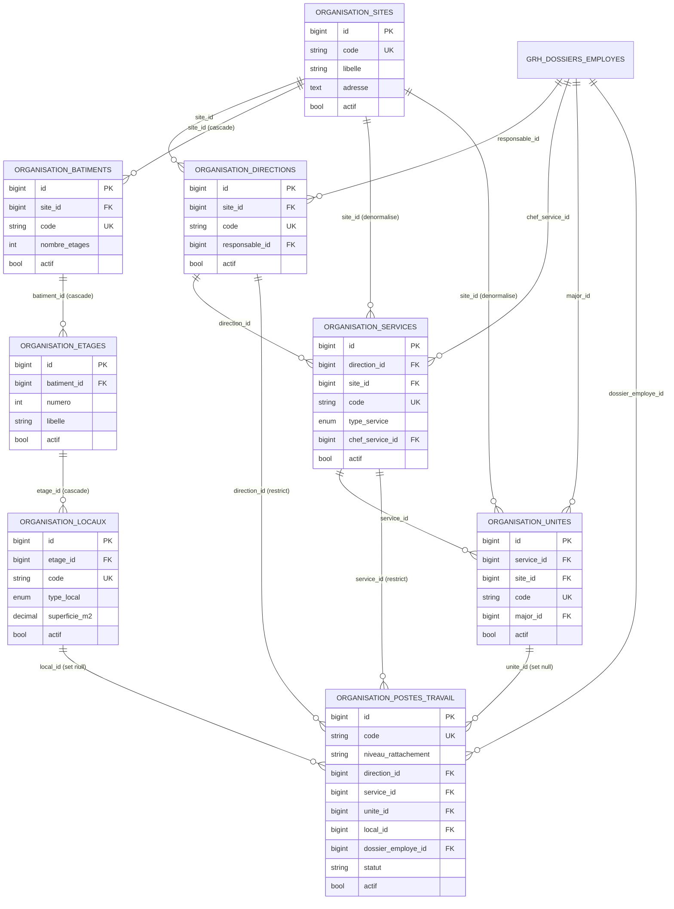
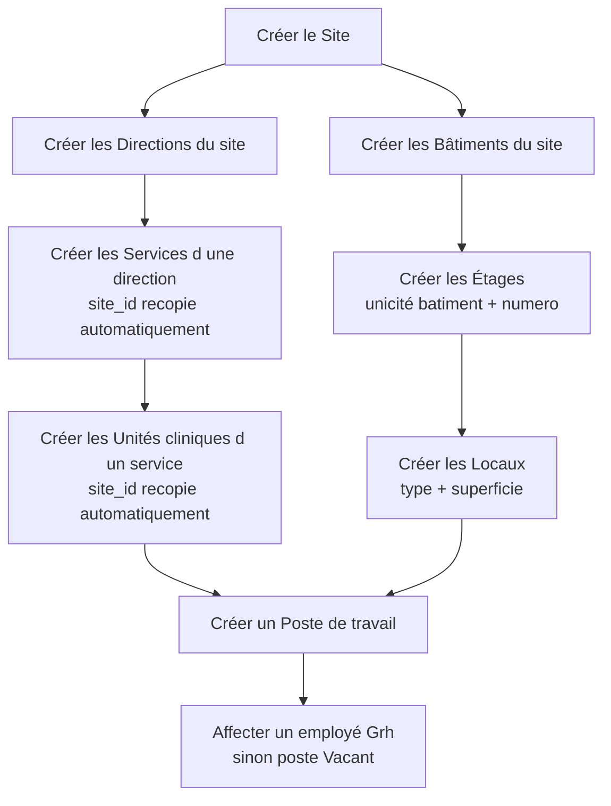
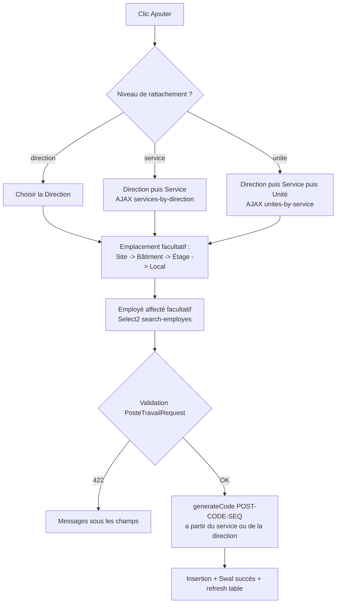
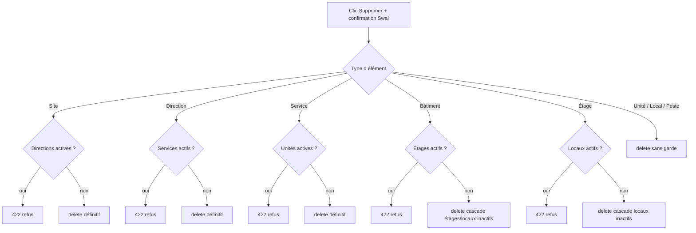
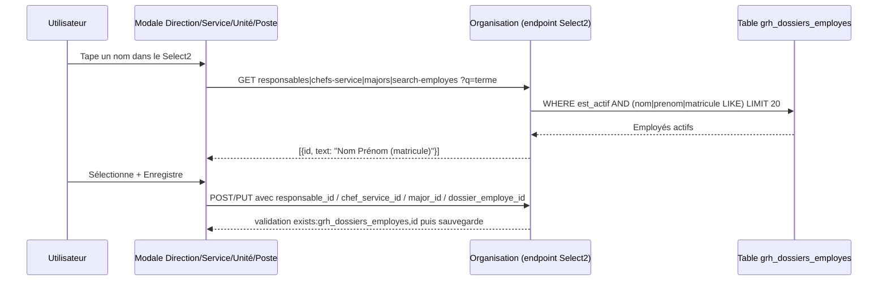

# Module Organisation — Analyse complète

> **Date** : 27/07/2026
> **Branche** : `refactor/stock-rebuild`
> **Auteur** : Analyse générée par Claude Code

---

## 1. Vue d'ensemble

Le module **Organisation** (`Modules/Organisation/`) est le **référentiel structurel** de l'application parc_info (contexte hospitalier CHU-YO, Burkina Faso). Il décrit l'établissement selon deux axes complémentaires :

1. **Axe organisationnel (organigramme)** : Site → Direction → Service → Unité (clinique). Chaque niveau peut être rattaché à un responsable issu du module Grh (dossier employé).
2. **Axe géographique (infrastructure)** : Site → Bâtiment → Étage → Local.

Les deux axes se rejoignent dans l'entité **Poste de travail**, qui rattache un emplacement physique (local) et un occupant (employé Grh) à un niveau organisationnel (direction, service ou unité).

Le module est un module **nwidart/laravel-modules 12** classique :

| Élément | Emplacement |
| --- | --- |
| Contrôleurs (8) | `Modules/Organisation/app/Http/Controllers/` |
| Modèles (8) | `Modules/Organisation/app/Models/` |
| FormRequest (1) | `Modules/Organisation/app/Http/Requests/PosteTravailRequest.php` |
| Routes web | `Modules/Organisation/routes/web.php` (préfixe `/organisation`, middleware `auth`) |
| Vues | `Modules/Organisation/resources/views/organisation/{entité}/index.blade.php` + `_modal.blade.php` |
| JS front | `public/js/modules/organisation/{entité}/index.js` |
| Permissions | `Modules/Organisation/config/permissions.php` (40 permissions) |
| Migrations | `Modules/Organisation/database/migrations/` + 3 migrations racine (`database/migrations/`) pour postes de travail et `type_service` |
| Seeders | `Modules/Organisation/database/seeders/` (données de référence CHU-YO) |

**Consommateurs du module** (surface exposée, sans documenter ces modules) :

- **ParcInfo** : consomme directement les modèles Eloquent (`Site`, `Direction`, `Service`, `Unite`, `Local`, `PosteTravail`) pour les affectations d'équipements et les états/statistiques — imports constatés dans `Modules/ParcInfo/app/Http/Controllers/{EquipementDynamiqueController, BonRepartitionController, ConsommableController, Analyse/EtatController, Analyse/StatistiquesController}.php` et `Modules/ParcInfo/app/Models/AffectationEquipement.php` ; les écrans ParcInfo réutilisent aussi les endpoints AJAX en cascade (`batiments.by-site`, `etages.by-batiment`, `locaux.by-etage`) et les endpoints « API » (`/organisation/*/api`) qui renvoient des listes plates.
- **Grh** : fournit les employés (`Modules\Grh\Models\Employe`, table `grh_dossiers_employes`) référencés comme responsables de direction, chefs de service, majors d'unité et occupants de postes. Organisation dépend donc de Grh (relation inverse : Grh peut lire l'organigramme pour affecter les employés).
- **Core** : la sidebar commune lit `Modules/Organisation/config/config.php` → clé `navigation` (entrée « Organisation », icône `bi bi-diagram-3`, route `organisation.sites.index`, permission `organisation.sites.index`).

Toutes les interfaces suivent le même patron : page d'index avec **Bootstrap Table** chargée en AJAX, création/édition dans une **modale Bootstrap** unique (mode dual create/edit), suppressions et bascules de statut confirmées par **SweetAlert2**.

---

## 2. Fonctionnalités

### 2.1 Domaine « Structure organisationnelle » (organigramme)

#### Sites (`SiteController.php`)
- CRUD complet en AJAX (liste paginée serveur, création, édition, suppression).
- Recherche serveur sur `libelle` et `code` ; tri serveur sur toute colonne.
- **Règles métier** :
  - `code` : obligatoire et **unique** (`unique:organisation_sites,code`).
  - `libelle` : obligatoire ; `adresse` et `description` facultatives.
  - **Garde de suppression** : refus (HTTP 422) si le site contient des **directions actives** (`$site->directions()->actif()->count() > 0`). Message : « Impossible de supprimer ce site car il contient des directions actives. »
- Bascule actif/inactif (`toggleStatus`, route PATCH `toggle-status`).
- Endpoint `getArborescence` : renvoie tous les sites actifs avec `directions.services.unites` (arbre complet en un appel).
- Endpoint `getBatiments($id)` : bâtiments actifs d'un site (pour cascades).

#### Directions (`DirectionController.php`)
- CRUD AJAX, filtre serveur par `site_id`, recherche sur `libelle`/`code`.
- **Règles métier** :
  - `site_id` obligatoire et existant ; `code` obligatoire **unique** ; `libelle` obligatoire.
  - `responsable_id` facultatif, doit exister dans `grh_dossiers_employes` (dossier employé Grh).
  - **Garde de suppression** : refus si la direction contient des **services actifs**.
- `getResponsables` : recherche d'employés actifs (nom/prénom/matricule, limite 20) au format Select2 `{id, text}`.
- `getServices($id)` : services actifs d'une direction (cascade).
- `getApiData` : liste plate `{id, code, libelle, site, statut}` pour consommation inter-modules (recherche `ilike` — PostgreSQL).

#### Services (`ServiceController.php`)
- CRUD AJAX, filtres serveur `site_id` + `direction_id`, recherche `libelle`/`code`.
- **Règles métier** :
  - `direction_id` obligatoire ; `code` obligatoire **unique** ; `libelle` obligatoire.
  - `type_service` obligatoire, valeurs : `administratif`, `clinique`, `medico_technique`.
  - `chef_service_id` facultatif (employé Grh).
  - **Dénormalisation automatique** : `site_id` est recalculé depuis la direction à chaque sauvegarde (hook `saving` du modèle `Service`).
  - **Garde de suppression** : refus si le service contient des **unités actives**.
- `getDirectionsBySite($siteId)`, `getChefsService` (Select2), `getApiData` (liste plate).

#### Unités cliniques (`UniteController.php`)
- CRUD AJAX, filtres serveur `site_id`, `direction_id` (via `whereHas('service')`), `service_id`.
- **Règles métier** :
  - `service_id` obligatoire ; `code` obligatoire **unique** ; `libelle` obligatoire.
  - `major_id` facultatif (infirmier chef, employé Grh).
  - **Dénormalisation automatique** : `site_id` recopié depuis le service (hook `saving` du modèle `Unite`).
  - **Suppression sans garde** : le contrôle sur les employés rattachés est un TODO explicite dans le code (`// Règle métier: vérification des employés (TODO table employes)`).
- `getMajors` (Select2), `getServicesByDirection`, `getApiData`.

### 2.2 Domaine « Infrastructure physique »

#### Bâtiments (`BatimentController.php`)
- CRUD AJAX, filtre serveur `site_id`, recherche `libelle`/`code`.
- **Règles métier** :
  - `site_id` obligatoire ; `code` obligatoire **unique** ; `libelle` obligatoire.
  - `nombre_etages` facultatif, entier ≥ 0.
  - **Garde de suppression** : refus si le bâtiment contient des **étages actifs**.
- `getBySite($siteId)` et `getEtages($id)` pour les cascades.

#### Étages (`EtageController.php`)
- CRUD AJAX, filtres serveur `site_id` (via `whereHas('batiment')`) + `batiment_id`, recherche sur `libelle`/`numero`.
- **Règles métier** :
  - `batiment_id` obligatoire ; `numero` obligatoire (entier, 0 = rez-de-chaussée) ; `libelle` obligatoire.
  - **Unicité composée** `(batiment_id, numero)` vérifiée **manuellement** en création et en édition (message « Ce numéro d'étage existe déjà pour ce bâtiment. »), doublée d'une contrainte unique en base.
  - **Garde de suppression** : refus si l'étage contient des **locaux actifs**.
- `getByBatiment($batimentId)` pour les cascades.

#### Locaux (`LocalController.php`)
- CRUD AJAX, filtres serveur `site_id`, `batiment_id`, `etage_id` (imbriqués via `whereHas`), recherche `libelle`/`code`.
- **Règles métier** :
  - `etage_id` obligatoire ; `code` obligatoire **unique** ; `libelle` obligatoire.
  - `type_local` obligatoire parmi : `bureau`, `salle_soins`, `salle_attente`, `magasin`, `couloir`, `autre`.
  - `superficie_m2` facultatif, numérique ≥ 0.
  - **Aucune garde de suppression** (le poste de travail référençant le local passe à `local_id = NULL` grâce au `onDelete('set null')`).
- `getByEtage($etageId)` (cascade), `getApiData` (liste plate avec site/bâtiment/étage résolus).

### 2.3 Domaine « Postes de travail » (`PosteTravailController.php` + `PosteTravailRequest.php`)

Le poste de travail est le point de jonction organigramme / infrastructure / RH :

- CRUD AJAX, filtres serveur `direction_id`, `service_id`, `unite_id`, `statut` ; recherche sur `libelle`, `code` **et sur l'occupant** (nom/prénom/matricule via `whereHas('agent')`).
- **Règles métier** (validées par `PosteTravailRequest`) :
  - `libelle` obligatoire (max 255) ; `description` facultative.
  - `niveau_rattachement` obligatoire : `direction`, `service` ou `unite`.
  - `direction_id` toujours obligatoire ; `service_id` requis si niveau = `service` ou `unite` ; `unite_id` requis si niveau = `unite` (messages personnalisés en français).
  - Localisation facultative : `site_id`, `batiment_id`, `etage_id` (champs d'aide, **exclus à l'enregistrement** via `safe()->except(...)`) et `local_id` (seul champ persisté).
  - `dossier_employe_id` facultatif : l'occupant ; un poste sans occupant est affiché « Vacant ».
  - **Code auto-généré** au format `POST-{CODE_PARENT}-{SEQ}` (`PosteTravail::generateCode()`) : parent = service si renseigné, sinon direction ; séquence = nombre de postes existants du parent + 1. Champ en lecture seule côté formulaire.
  - **Suppression sans garde** (delete direct).
- Scope `vacant()` disponible sur le modèle (postes sans occupant).
- `searchEmployes` (Select2), `getServicesByDirection`, `getUnitesByService`, `getApiData` (liste plate avec localisation détaillée `local_site`, `local_batiment`, `local_etage`…).

### 2.4 Fonctionnalités transverses

- **Bascule actif/inactif** (`toggleStatus`) disponible sur les 8 entités côté serveur (route PATCH), mais le bouton n'est présent que sur les écrans Bâtiments, Étages et Locaux.
- **Soft-désactivation vs suppression** : malgré des messages comme « Site supprimé (désactivé) avec succès », `destroy()` fait un **vrai `delete()`** — aucun modèle n'utilise `SoftDeletes` (voir §9).
- **Endpoints « API » internes** (`/organisation/{directions,services,unites,locaux,postes-travail}/api`) : listes plates JSON destinées aux autres modules (ParcInfo notamment), avec recherche `ilike`.
- **Synchronisation des permissions** : `config/permissions.php` est lu par la commande `php artisan permissions:generate` (`app/Console/Commands/GenerateModulePermissions.php`) et par `Modules/Core/app/Services/PermissionService.php` (écran d'administration Core), qui créent les entrées Spatie correspondantes.
- **Données de référence CHU-YO** livrées par seeders : 2 sites (insérés directement par la migration `..._create_organisation_sites_table.php`), 13 directions, ~40 services, 33 unités cliniques, 4 bâtiments/7 étages/9 locaux, 5 postes de travail (`Modules/Organisation/database/seeders/`).

---

## 3. Pages et écrans

Le module compte **8 pages** (une par entité) et **8 modales** (une modale duale création/édition par page). Toutes les pages étendent `core::layouts.master`, affichent un fil d'Ariane `Accueil > Organisation > {Entité}` (liens inactifs `#`) et une carte unique contenant : filtres éventuels, barre d'outils, Bootstrap Table en pagination serveur. Les tables partagent les options : `data-pagination`, `data-side-pagination="server"`, `data-search`, `data-show-refresh`, `data-show-columns`, `data-click-to-select`, `data-single-select`, `data-page-list="[10, 25, 50, 100]"`, colonne radio de sélection.

**Comportement commun de la barre d'outils** : « Modifier » et « Supprimer » sont `disabled` tant qu'exactement une ligne n'est pas sélectionnée (événements `check.bs.table`/`uncheck.bs.table`). Si on clique sans sélection, Swal d'avertissement « Veuillez sélectionner une ligne ».

**État vide / erreurs** : aucun écran vide personnalisé — Bootstrap Table affiche son message standard (« Pas de résultat » via la locale fr-FR). Les erreurs AJAX sont remontées en Swal `error` ; les erreurs de validation 422 sont injectées champ par champ (`is-invalid` + `invalid-feedback`).

---

### 3.1 Sites — `/organisation/sites`

| | |
| --- | --- |
| Route | `organisation.sites.index` → `SiteController@index` |
| Vue | `Modules/Organisation/resources/views/organisation/sites/index.blade.php` |
| Permission | `organisation.sites.index` (middleware contrôleur) |
| JS | `public/js/modules/organisation/sites/index.js` + `SiteForm.js` + `SiteActions.js` |

**Structure** : carte « Liste des sites » ; pas de filtre ; table `#sites-table` (source `organisation.sites.data`). Colonnes : sélection (radio), Code, Libellé, Adresse, Statut (badge vert « Actif » / rouge « Inactif » via `statutFormatter`).

**Boutons** :

| Libellé (tooltip) | Icône | Action | Permission (`@can`) |
| --- | --- | --- | --- |
| Ajouter (`#btn-add`) | `fas fa-plus` | Ouvre la modale en mode création | `organisation.sites.store` |
| Modifier (`#btn-edit`) | `fas fa-edit` | GET `sites.show` puis modale pré-remplie | `organisation.sites.update` |
| Supprimer (`#btn-delete`) | `fas fa-trash` | Swal de confirmation « Cette action va désactiver ce site » puis DELETE `sites.destroy` | `organisation.sites.destroy` |

**Modale `#createSiteModal`** (`sites/_modal.blade.php`) :
- Déclencheur : boutons Ajouter/Modifier ; titre dynamique « Nouveau Site » / « Modifier le Site ».
- Champs : `code`* (texte), `libelle`* (texte), `adresse` (textarea 2 lignes), `description` (textarea 2 lignes) + hidden `site_id`.
- Validations JS (`SiteForm.validateForm`) : code et libellé non vides ; messages « Le code est obligatoire » / « Le libellé est obligatoire ». Erreurs serveur 422 affichées sous les champs.
- Boutons : « Annuler » (secondary, dismiss) ; « Enregistrer » (primary, `fas fa-save`, spinner « Enregistrement... » pendant l'AJAX).
- Comportement : POST `sites.store` ou PUT `sites.update/{id}` selon le hidden ; succès → fermeture, refresh table, Swal succès 2 s.

---

### 3.2 Directions — `/organisation/directions`

| | |
| --- | --- |
| Route | `organisation.directions.index` → `DirectionController@index` |
| Vue | `organisation/directions/index.blade.php` |
| Permission | `organisation.directions.index` |
| JS | `directions/index.js` + `DirectionForm.js` + `DirectionActions.js` (cache-busting `?v={{ time() }}`) |

**Structure** : filtre « Filtrer par Site » (`#filter_site_id`, select des sites actifs) ; table `#directions-table`. Colonnes : sélection, Code, Libellé, Site (`site.libelle`), Responsable (`responsable.full_name`). *(Pas de colonne Statut sur cet écran.)*

**Boutons** : mêmes trois boutons Ajouter/Modifier/Supprimer que Sites, gardés par `organisation.directions.{store,update,destroy}` ; suppression avec Swal « Cette action va désactiver cette direction ».

**Filtres JS** : changement de site → `refreshTable()` avec `?site_id=`.

**Modale `#createDirectionModal`** (`directions/_modal.blade.php`) :
- Champs : `site_id`* (select des sites actifs), `code`*, `libelle`*, `responsable_id` (Select2 AJAX sur `directions.responsables`, thème bootstrap-5, `allowClear`, délai 250 ms, recherche employés actifs), `description` (textarea) + hidden `direction_id`.
- Validations JS : site, code, libellé obligatoires. En édition, le responsable courant est injecté comme `Option` sélectionnée (`full_name (matricule)`).
- Boutons : Annuler / Enregistrer (spinner).

---

### 3.3 Services — `/organisation/services`

| | |
| --- | --- |
| Route | `organisation.services.index` → `ServiceController@index` |
| Vue | `organisation/services/index.blade.php` |
| Permission | `organisation.services.index` |
| JS | `services/index.js` + `ServiceForm.js` + `ServiceActions.js` |

**Structure** : deux filtres en cascade — « Filtrer par Site » et « Filtrer par Direction » (désactivé tant qu'aucun site n'est choisi ; peuplé par `services.directions-by-site/{siteId}`). Table `#services-table`. Colonnes : sélection, Code, Libellé, Type (badges via `typeServiceFormatter` : Administratif = gris, Clinique = bleu primaire, Médico-Technique = bleu info), Site, Direction, Chef Service, Statut.

**Boutons** : Ajouter/Modifier/Supprimer (`organisation.services.{store,update,destroy}`).

**Modale `#createServiceModal`** (`services/_modal.blade.php`) :
- Champs : `c_site_id` (select d'aide **non soumis**, hint « Sélectionnez le site pour filtrer les directions »), `c_direction_id`* (`name="direction_id"`, désactivé tant que pas de site, chargé en AJAX avec état « Chargement... »), `code`*, `libelle`*, `type_service`* (select 3 valeurs, hint « Administratif: DAF, DRH | Clinique: Médecine, Chirurgie | Médico-Technique: Radiologie, Labo »), `chef_service_id` (Select2 AJAX sur `services.chefs-service`) + hidden `service_id`.
- Validations JS : direction, code, libellé, type obligatoires.
- Édition : site présélectionné puis `loadDirectionsForModal(site_id, direction_id)` re-sélectionne la direction ; chef de service injecté en `Option`.
- Boutons : Annuler / Enregistrer (spinner).

---

### 3.4 Unités — `/organisation/unites`

| | |
| --- | --- |
| Route | `organisation.unites.index` → `UniteController@index` |
| Vue | `organisation/unites/index.blade.php` |
| Permission | `organisation.unites.index` |
| JS | `unites/index.js` + `UniteForm.js` + `UniteActions.js` (cache-busting `?v=`) |

**Structure** : trois filtres en cascade Site → Direction → Service (les deux derniers désactivés au départ ; peuplés via `services.directions-by-site` et `unites.services-by-direction`). Table `#unites-table`. Colonnes : sélection, Code, Libellé, Site, Direction (`service.direction.libelle`), Service, Major (`major.full_name`), Statut.

**Boutons** (ids spécifiques) : Ajouter `#btn-add-unite`, Modifier `#btn-edit-unite`, Supprimer `#btn-delete-unite` — permissions `organisation.unites.{store,update,destroy}`.

**Modale `#createUniteModal`** (`unites/_modal.blade.php`) :
- Champs : `c_site_id`* (`name="site_id"`), `c_direction_id`* (`name="direction_id"`, cascade), `c_service_id`* (`name="service_id"`, cascade), `code`*, `libelle`*, `major_id` (Select2 AJAX sur `unites.majors`, libellé « Major (Infirmier Chef) ») + hidden `unite_id`.
- Validations JS : service, code, libellé obligatoires.
- Boutons : Annuler / Enregistrer (spinner).
- Note : `site_id` et `direction_id` sont envoyés mais ignorés par le serveur (seul `service_id` est validé/persisté ; `site_id` est recalculé par le modèle).

---

### 3.5 Bâtiments — `/organisation/batiments`

| | |
| --- | --- |
| Route | `organisation.batiments.index` → `BatimentController@index` |
| Vue | `organisation/batiments/index.blade.php` |
| Permission | `organisation.batiments.index` |
| JS | `batiments/index.js` + `BatimentForm.js` + `BatimentActions.js` + script inline toggle-status |

**Structure** : filtre « Filtrer par Site » ; table `#batiments-table`. Colonnes : sélection, Code, Libellé, Site, Nb Étages, Statut.

**Boutons** :

| Libellé (tooltip) | Icône | Action | Permission |
| --- | --- | --- | --- |
| Ajouter | `fas fa-plus` | Modale création | `organisation.batiments.store` |
| Modifier | `fas fa-edit` | Modale édition | `organisation.batiments.update` |
| Supprimer | `fas fa-trash` | Swal + DELETE | `organisation.batiments.destroy` |
| Activer/Désactiver (`#btn-toggle-status`) | `fas fa-power-off` (warning) | Swal « Voulez-vous vraiment activer/désactiver cet élément ? » puis PATCH `batiments.toggle-status` | `organisation.batiments.toggle-status` |

Le handler toggle-status est un script **inline dans la vue** (poussé dans `@push('css')`, voir §9) ; succès → Swal 2 s + refresh.

**Modale `#createBatimentModal`** (`batiments/_modal.blade.php`) :
- Champs : `site_id`* (select), `code`*, `libelle`*, `nombre_etages` (number min 0), `description` (textarea) + hidden `batiment_id`.
- Validations JS : site, code, libellé obligatoires. Boutons : Annuler / Enregistrer (spinner).

---

### 3.6 Étages — `/organisation/etages`

| | |
| --- | --- |
| Route | `organisation.etages.index` → `EtageController@index` |
| Vue | `organisation/etages/index.blade.php` |
| Permission | `organisation.etages.index` |
| JS | `etages/index.js` + `EtageForm.js` + `EtageActions.js` + script inline toggle-status |

**Structure** : filtres en cascade Site → Bâtiment (peuplé par `batiments.by-site`). Table `#etages-table`. Colonnes : sélection, Numéro, Libellé, Bâtiment, Site (`batiment.site.libelle`), Statut.

**Boutons** : Ajouter / Modifier / Supprimer / Activer-Désactiver — permissions `organisation.etages.{store,update,destroy,toggle-status}` (toggle inline comme Bâtiments).

**Modale `#createEtageModal`** (`etages/_modal.blade.php`) :
- Champs : `c_site_id` (aide, non soumis, hint « Sélectionnez le site pour filtrer les bâtiments »), `c_batiment_id`* (`name="batiment_id"`, cascade), `numero`* (number, hint « Ex: 0 pour Rez-de-chaussée, 1 pour 1er étage, etc. »), `libelle`* (hint « Ex: Rez-de-chaussée, 1er Étage, etc. ») + hidden `etage_id`.
- Validations JS : bâtiment, numéro, libellé obligatoires ; le doublon `(batiment, numero)` est détecté côté serveur (422 → message sous le champ).
- Boutons : Annuler / Enregistrer (spinner).

---

### 3.7 Locaux — `/organisation/locaux`

| | |
| --- | --- |
| Route | `organisation.locaux.index` → `LocalController@index` |
| Vue | `organisation/locaux/index.blade.php` |
| Permission | `organisation.locaux.index` |
| JS | `locaux/index.js` + `LocalForm.js` + `LocalActions.js` + script inline toggle-status |

**Structure** : trois filtres en cascade Site → Bâtiment → Étage (via `batiments.by-site` et `etages.by-batiment`). Table `#locaux-table`. Colonnes : sélection, Code, Libellé, Type (`typeLocalFormatter` : libellés français), Superficie (m²), Étage, Bâtiment, Site, Statut.

**Boutons** : Ajouter / Modifier / Supprimer / Activer-Désactiver — permissions `organisation.locaux.{store,update,destroy,toggle-status}`.

**Modale `#createLocalModal`** (`locaux/_modal.blade.php`) :
- Champs : `c_site_id`* (aide non soumise), `c_batiment_id`* (aide non soumise, cascade), `c_etage_id`* (`name="etage_id"`, cascade), `code`*, `libelle`*, `type_local`* (select 6 valeurs : Bureau, Salle de soins, Salle d'attente, Magasin, Couloir, Autre), `superficie_m2` (number step 0.01 min 0) + hidden `local_id`.
- Validations JS : étage, code, libellé, type obligatoires (`LocalForm.validateForm`). Édition : remontée de la hiérarchie via `data.etage.batiment.site_id` pour re-peupler les cascades.
- Boutons : Annuler / Enregistrer (spinner).

---

### 3.8 Postes de travail — `/organisation/postes-travail`

| | |
| --- | --- |
| Route | `organisation.postes-travail.index` → `PosteTravailController@index` |
| Vue | `organisation/postes/index.blade.php` (en-tête « Gestion des Poste de travails » — coquille) |
| Permission | **aucune côté serveur** (voir §9) ; boutons gardés par `@can('organisation.postes.*')` |
| JS | `postes/index.js` + `PosteTravailForm.js` (336 lignes) + `PosteTravailActions.js` |

**Structure** : filtres Direction (select pré-rempli), Service (cascade via `postes-travail.services-by-direction`), Statut (Actif / Inactif / En rénovation) + **bouton « Filtrer »** (`#btn-filter`, `fas fa-filter`, secondary) — contrairement aux autres écrans, le filtre ne s'applique qu'au clic. Table `#postes-table`. Colonnes : sélection, Code, Poste, Direction, Service, Emplacement (`local->nom_complet`, sinon « N/A »), Occupant (nom complet ou badge jaune « Vacant »), Statut (badges : Actif vert, Inactif gris, En rénovation jaune, Supprimé rouge).

**Boutons de toolbar** :

| Libellé (tooltip) | Icône | Action | Permission (`@can`) |
| --- | --- | --- | --- |
| Ajouter | `fas fa-plus` | Modale création (« Créer le Poste ») | `organisation.postes.store` |
| Modifier | `fas fa-edit` | GET `postes-travail.show` puis modale pré-remplie (async) | `organisation.postes.update` |
| Supprimer | `fas fa-trash` | Swal « Cette action va Supprimer ce poste de travail » puis DELETE | `organisation.postes.destroy` |

Particularité : les boutons Modifier/Supprimer sont re-désactivés à chaque `load-success.bs.table`.

**Modale `#posteModal`** (`postes/_modal.blade.php`, `modal-lg`, deux colonnes) :
- Titre : icône `fas fa-laptop` + « Nouveau Poste de Travail » / « Modifier le Poste de Travail ».
- **Colonne gauche « Structure Administrative »** :
  - `niveau_rattachement`* (select Direction/Service/Unité) — affichage conditionnel : les blocs `#field-direction`, `#field-service`, `#field-unite` (classe `d-none`) apparaissent progressivement selon le niveau, et l'attribut `required` est posé dynamiquement (`_applyNiveau`).
  - `direction_id`* (options pré-rendues) → cascade `service_id` (`postes-travail.services-by-direction`) → cascade `unite_id` (`postes-travail.unites-by-service`).
  - Bloc « Informations du Poste » : `code` (readonly, placeholder « Auto-généré », fond gris), `libelle`*, `description` (textarea).
- **Colonne droite « Emplacement Physique »** : cascade complète `site_id` → `batiment_id` (`batiments.by-site`) → `etage_id` (`etages.by-batiment`) → `local_id` (`locaux.by-etage`), chaque niveau désactivé tant que le parent n'est pas choisi, placeholders « — Sélectionner d'abord un … — », état « Chargement... » et « — Erreur de chargement — » en cas d'échec.
- **Bloc « Affectation »** : `dossier_employe_id` (Select2 AJAX sur `postes-travail.search-employes`, placeholder « Rechercher un employé... »).
- Boutons : « Annuler » ; « Enregistrer le Poste » / « Créer le Poste » (`#btn-save-poste`, label dynamique `#btn-save-label`, « Enregistrement... » pendant l'AJAX).
- Édition : `openForEdit` recharge le poste via `show`, rejoue toutes les cascades en `await` (services, unités, bâtiments, étages, locaux) et injecte l'occupant en `Option` Select2 ; le site est déduit de `poste.local.etage.batiment.site_id`.
- Le formulaire ne propose **pas** de champ `statut` (code commenté) : le statut reste `actif` par défaut.

---

## 4. Spécifications UX

### Navigation
- Entrée unique « Organisation » dans la sidebar Core (`config/config.php`, icône `bi bi-diagram-3`) pointant vers **Sites** ; les autres écrans sont accessibles par le menu latéral commun (sous-menus gérés par Core) ou par URL directe.
- Fil d'Ariane statique sur chaque page (`Accueil > Organisation > {Entité}`), sans liens réels (`href="#"`).
- Aucune navigation croisée entre écrans (pas de lien « voir les bâtiments de ce site » depuis la ligne d'un site) : le passage d'un niveau à l'autre se fait par les filtres en cascade de chaque page.

### Formulaires : modale unique création/édition
- Une seule modale par entité, réutilisée en création et en édition (titre et hidden `id` commutés par `openForAdd`/`openForEdit`). Aucune page de formulaire dédiée.
- Classes JS par entité (variante « classes ES modules » du projet) : `XxxForm.js` (validation + soumission), `XxxActions.js` (boutons), `index.js` (bootstrap + filtres). Chargées en `<script type="module">`.
- Convention champs d'aide : les selects de cascade non persistés sont préfixés `c_` et/ou sans attribut `name` (site dans la modale Service/Étage/Local ; site+bâtiment dans Local).
- Double validation : HTML5 (`required` + message personnalisé « Veuillez remplir ce champ. ») puis validation JS manuelle (`validateForm`) puis validation serveur (422 → messages Laravel injectés sous les champs, avec gestion spécifique du positionnement après le conteneur Select2).

### Feedback
- **SweetAlert2** partout : confirmation destructive (warning, boutons « Oui, supprimer » rouge / « Annuler » bleu), confirmation de bascule de statut (question, bouton jaune), succès (timer 2 s), erreurs (message serveur ou libellé générique « Une erreur est survenue »).
- **Spinner de soumission** : bouton Enregistrer désactivé + `fa-spinner fa-spin` + libellé « Enregistrement... » pendant l'appel.
- **Chargement des cascades** : option temporaire « Chargement... » et, sur les postes, spinners dédiés (`#spinner-*`) + option « — Erreur de chargement — » en échec.
- Sélection de ligne obligatoire signalée par Swal warning « Veuillez sélectionner une ligne ».

### Conventions visuelles
- Badges de statut : vert `bg-success` Actif / rouge `bg-danger` Inactif (formatter inline `statutFormatter` dupliqué dans chaque vue) ; variante avec icônes (`fa-check`/`fa-ban`, gris `bg-secondary`) définie dans `window.statusFormatter` sur Bâtiments/Étages/Locaux mais non référencée par les colonnes.
- Boutons toolbar : primaire (ajout), info (édition), danger (suppression), warning (toggle statut), icônes Font Awesome seules + tooltip Bootstrap.
- Modales : `border-0 shadow-lg`, header `bg-primary` avec titre `text-primary` (contraste faible, voir §9), champs requis marqués `*` rouge.
- Tables : locale française (`bootstrap-table-fr-FR.min.js`), boutons refresh et choix de colonnes activés.

### Limitations constatées
- Le filtre des écrans Sites→Locaux s'applique immédiatement au changement, mais l'écran Postes exige un clic sur « Filtrer » — incohérence de comportement.
- La recherche plein-texte de Bootstrap Table est envoyée au serveur mais ne couvre que `code`/`libelle` (ou `numero` pour les étages) ; les colonnes relationnelles affichées (site, responsable…) ne sont pas cherchables (sauf occupant sur Postes).
- Les selects de filtres et de modales ne listent que les éléments **actifs** : un enregistrement rattaché à un parent désactivé ne peut plus être re-sélectionné à l'édition (le select retombe sur le placeholder).
- Pas de vue de détail (« show » n'est utilisé que pour pré-remplir la modale), pas d'export, pas d'impression, pas d'écran d'arborescence exploitant `sites.arborescence`.

---

## 5. Permissions et rôles

**40 permissions** déclarées dans `Modules/Organisation/config/permissions.php` (5 par entité × 8 entités), synchronisées en base via `php artisan permissions:generate` ou l'écran Core (`PermissionService`). Contrôle serveur par middleware Spatie `permission:` déclaré dans chaque contrôleur (`HasMiddleware`), contrôle d'affichage par `@can` dans les vues.

| Permission (motif) | Libellé (config) | Effet concret à l'écran |
| --- | --- | --- |
| `organisation.sites.index` | Voir la liste des sites | Accès page + `getData` + `show` + `arborescence` ; entrée sidebar « Organisation » |
| `organisation.sites.store` | Créer un site | Bouton « Ajouter » + POST |
| `organisation.sites.update` | Modifier un site | Bouton « Modifier » + PUT |
| `organisation.sites.destroy` | Supprimer un site | Bouton « Supprimer » + DELETE |
| `organisation.sites.toggle-status` | Activer/Désactiver un site | **Aucun bouton sur l'écran Sites** ; la route PATCH n'est pas protégée par middleware |
| `organisation.directions.*` (idem ×5) | …une direction | Identique (l'`index` couvre aussi `getApiData`) ; pas de bouton toggle à l'écran |
| `organisation.services.*` | …un service | Identique ; pas de bouton toggle à l'écran |
| `organisation.unites.*` | …une unité clinique | Identique ; boutons ids `#btn-*-unite` ; pas de bouton toggle |
| `organisation.batiments.*` | …un bâtiment | Identique **+ bouton « Activer/Désactiver »** affiché sous `@can('organisation.batiments.toggle-status')` |
| `organisation.etages.*` | …un étage | Identique + bouton toggle (`organisation.etages.toggle-status`) |
| `organisation.locaux.*` | …un local | Identique + bouton toggle (`organisation.locaux.toggle-status`) |
| `organisation.postes.index` | Voir la liste des postes de travail | **Aucun contrôle serveur** (contrôleur sans middleware) ; nom sans rapport avec la route (`postes-travail`) |
| `organisation.postes.store` | Créer un poste de travail | Bouton « Ajouter » (`@can` seulement) |
| `organisation.postes.update` | Modifier un poste de travail | Bouton « Modifier » (`@can` seulement) |
| `organisation.postes.destroy` | Supprimer un poste de travail | Bouton « Supprimer » (`@can` seulement) |
| `organisation.postes.toggle-status` | Activer/Désactiver un poste de travail | Aucun bouton ; route non protégée |

**Points de vigilance transverses** :
- Les routes `toggle-status` des **8** entités ne figurent dans **aucune** liste de middleware : n'importe quel utilisateur authentifié peut basculer un statut.
- Les endpoints utilitaires (`responsables`, `chefs-service`, `majors`, `search-employes`, `directions-by-site`, `services-by-direction`, `unites-by-service`, `by-site`, `by-batiment`, `by-etage`, `directions/{id}/services`, `sites/{id}/batiments`, `batiments/{id}/etages`) ne sont protégés que par `auth`.

**Rôles** : le module Organisation ne définit **aucun rôle propre**. Le seul rôle système est `Admin` (créé par `Modules/Core/database/seeders/SeedPermissionsTableSeeder.php`, utilisateur `admin@admin.com`, toutes permissions). Les autres attributions se font via l'écran de gestion des rôles du module Core.

---

## 6. Modèle de données

8 tables, toutes préfixées `organisation_`. Migrations : 7 dans `Modules/Organisation/database/migrations/` + 3 à la racine (`database/migrations/2026_03_13_194023_create_organisation_postes_travail_table.php`, `2026_03_28_180416_update_organisation_postes_travail_table.php`, `2026_03_14_045206_add_type_service_to_organisation_services_table.php`).

### Tables et colonnes clés

| Table | Colonnes principales | Contraintes / remarques |
| --- | --- | --- |
| `organisation_sites` | `code` (unique), `libelle`, `description`, `adresse`, `actif` (bool, défaut true) | 2 sites insérés par la migration elle-même (SITE-PRINCIPAL, SITE-GERIATRIE) |
| `organisation_directions` | `site_id` FK, `code` (unique), `libelle`, `responsable_id` FK nullable, `description`, `actif` | FK `responsable_id` re-pointée de `users` vers `grh_dossiers_employes` (`set null`) par la migration du 22/04/2026 |
| `organisation_services` | `direction_id` FK, `site_id` FK (**dénormalisé**, maintenu par hook `saving`), `code` (unique), `libelle`, `type_service` (enum `administratif`/`clinique`/`medico-technique`), `chef_service_id` FK nullable, `actif` | ⚠ l'enum en base utilise `medico-technique` (tiret) alors que la validation et le formulaire envoient `medico_technique` (underscore) — voir §9 |
| `organisation_unites` | `service_id` FK, `site_id` FK (dénormalisé, hook `saving`), `code` (unique), `libelle`, `major_id` FK nullable (« Infirmier chef responsable »), `actif` | |
| `organisation_batiments` | `site_id` FK **cascadeOnDelete**, `code` (unique), `libelle`, `description`, `nombre_etages` (int nullable), `actif` | |
| `organisation_etages` | `batiment_id` FK cascadeOnDelete, `numero` (int), `libelle`, `actif` | **Unique composé `(batiment_id, numero)`** ; pas de colonne `code` |
| `organisation_locaux` | `etage_id` FK cascadeOnDelete, `code` (unique), `libelle`, `type_local` (enum 6 valeurs, défaut `autre`), `superficie_m2` (decimal 8,2 nullable), `actif` | |
| `organisation_postes_travail` | `code` (unique, format `POST-XXX-NNN`), `libelle`, `description`, `niveau_rattachement` (nullable : direction/service/unite), `direction_id` FK nullable restrict, `service_id` FK nullable restrict, `unite_id` FK nullable set null, `local_id` FK nullable set null, `dossier_employe_id` FK nullable set null (ex-`agent_id` renommé), `statut` (string, défaut `actif` : actif/inactif/en_renovation/supprime), `actif` (bool) | Index sur `code`, `service_id`, `agent_id` (historique), `statut` |

### Modèles Eloquent (`Modules/Organisation/app/Models/`)

- Tous exposent le scope `actif()` et un accessor `nom_complet` qui concatène la hiérarchie (ex. Local : « Site > Bâtiment > Étage > Local »). `Local` ajoute `type_local_label` (libellé français).
- **Eager loading systématique** : `Batiment::$with = ['site']`, `Direction::$with = ['site']`, `Etage::$with = ['batiment.site']`, `Local::$with = ['etage.batiment.site']`, `Service::$with = ['direction.site']`, `Unite::$with = ['service.direction.site']`.
- `Service` et `Unite` recalculent `site_id` dans `static::boot()` (événement `saving`).
- `PosteTravail` : relations `direction`, `service`, `unite`, `local`, `agent` (vers `Employe`, clé `dossier_employe_id`), scopes `actif()` / `vacant()`, générateur statique `generateCode()`.
- `Site::magasins()` référence `Modules\Organisation\Models\Referentiel\Magasin`, classe **inexistante** (reliquat, voir §9).
- Références croisées Grh : `Direction::responsable()`, `Service::chefService()`, `Unite::major()`, `PosteTravail::agent()` → `Modules\Grh\Models\Employe` (table `grh_dossiers_employes`).

### Diagramme entité-relation

**Hiérarchies** :
- Organisationnelle : `Site (1) → Direction (n) → Service (n) → Unité (n)` — avec `site_id` dénormalisé sur services et unités pour accélérer les filtres.
- Géographique : `Site (1) → Bâtiment (n) → Étage (n) → Local (n)` — suppression physique en cascade sur toute la branche.
- Jonction : `PosteTravail` référence les deux hiérarchies (direction/service/unité + local) et l'employé occupant.

---

## 7. Workflows métier

### 7.1 Mise en place d'une structure complète (ordre imposé par les dépendances)

### 7.2 Création d'un poste de travail (modale `#posteModal`)

### 7.3 Suppression d'un élément hiérarchique (gardes en chaîne)

### 7.4 Rattachement des responsables (dépendance Grh)

---

## 8. Routes et endpoints

Fichier : `Modules/Organisation/routes/web.php`. Préfixe global `/organisation`, noms `organisation.*`, middleware de groupe `auth` (+ `web` via le `RouteServiceProvider`). Colonne « Permission » = middleware effectivement appliqué par le contrôleur (`—` = seulement `auth`).

### Sites (`SiteController`)

| Méthode | URI | Nom | Action | Rôle | Permission |
| --- | --- | --- | --- | --- | --- |
| GET | `/organisation/sites` | `organisation.sites.index` | `index` | Page liste | `organisation.sites.index` |
| GET | `/organisation/sites/data` | `organisation.sites.data` | `getData` | JSON Bootstrap Table | `organisation.sites.index` |
| GET | `/organisation/sites/arborescence` | `organisation.sites.arborescence` | `getArborescence` | Arbre sites→directions→services→unités actifs | `organisation.sites.index` |
| POST | `/organisation/sites` | `organisation.sites.store` | `store` | Création | `organisation.sites.store` |
| GET | `/organisation/sites/{id}` | `organisation.sites.show` | `show` | Détail JSON (pré-remplissage modale) | `organisation.sites.index` |
| PUT | `/organisation/sites/{id}` | `organisation.sites.update` | `update` | Édition | `organisation.sites.update` |
| DELETE | `/organisation/sites/{id}` | `organisation.sites.destroy` | `destroy` | Suppression (garde directions actives) | `organisation.sites.destroy` |
| PATCH | `/organisation/sites/{id}/toggle-status` | `organisation.sites.toggle-status` | `toggleStatus` | Bascule actif | — |
| GET | `/organisation/sites/{id}/batiments` | `organisation.sites.batiments` | `getBatiments` | Cascade bâtiments actifs | — |

### Directions (`DirectionController`)

| Méthode | URI | Nom | Action | Rôle | Permission |
| --- | --- | --- | --- | --- | --- |
| GET | `/organisation/directions` | `organisation.directions.index` | `index` | Page liste | `organisation.directions.index` |
| GET | `/organisation/directions/data` | `organisation.directions.data` | `getData` | JSON table (filtre `site_id`) | `organisation.directions.index` |
| GET | `/organisation/directions/api` | `organisation.directions.api` | `getApiData` | Liste plate inter-modules | `organisation.directions.index` |
| GET | `/organisation/directions/responsables` | `organisation.directions.responsables` | `getResponsables` | Select2 employés | — |
| POST | `/organisation/directions` | `organisation.directions.store` | `store` | Création | `organisation.directions.store` |
| GET | `/organisation/directions/{id}` | `organisation.directions.show` | `show` | Détail JSON | `organisation.directions.index` |
| PUT | `/organisation/directions/{id}` | `organisation.directions.update` | `update` | Édition | `organisation.directions.update` |
| DELETE | `/organisation/directions/{id}` | `organisation.directions.destroy` | `destroy` | Suppression (garde services actifs) | `organisation.directions.destroy` |
| PATCH | `/organisation/directions/{id}/toggle-status` | `organisation.directions.toggle-status` | `toggleStatus` | Bascule actif | — |
| GET | `/organisation/directions/{id}/services` | `organisation.directions.services` | `getServices` | Cascade services actifs | — |

### Services (`ServiceController`)

| Méthode | URI | Nom | Action | Rôle | Permission |
| --- | --- | --- | --- | --- | --- |
| GET | `/organisation/services` | `organisation.services.index` | `index` | Page liste | `organisation.services.index` |
| GET | `/organisation/services/data` | `organisation.services.data` | `getData` | JSON table (filtres `site_id`, `direction_id`) | `organisation.services.index` |
| GET | `/organisation/services/api` | `organisation.services.api` | `getApiData` | Liste plate inter-modules | `organisation.services.index` |
| GET | `/organisation/services/directions-by-site/{siteId}` | `organisation.services.directions-by-site` | `getDirectionsBySite` | Cascade directions actives | — |
| GET | `/organisation/services/chefs-service` | `organisation.services.chefs-service` | `getChefsService` | Select2 employés | — |
| POST | `/organisation/services` | `organisation.services.store` | `store` | Création | `organisation.services.store` |
| GET | `/organisation/services/{id}` | `organisation.services.show` | `show` | Détail JSON | `organisation.services.index` |
| PUT | `/organisation/services/{id}` | `organisation.services.update` | `update` | Édition | `organisation.services.update` |
| DELETE | `/organisation/services/{id}` | `organisation.services.destroy` | `destroy` | Suppression (garde unités actives) | `organisation.services.destroy` |
| PATCH | `/organisation/services/{id}/toggle-status` | `organisation.services.toggle-status` | `toggleStatus` | Bascule actif | — |

### Unités (`UniteController`)

| Méthode | URI | Nom | Action | Rôle | Permission |
| --- | --- | --- | --- | --- | --- |
| GET | `/organisation/unites` | `organisation.unites.index` | `index` | Page liste | `organisation.unites.index` |
| GET | `/organisation/unites/data` | `organisation.unites.data` | `getData` | JSON table (filtres site/direction/service) | `organisation.unites.index` |
| GET | `/organisation/unites/api` | `organisation.unites.api` | `getApiData` | Liste plate inter-modules | `organisation.unites.index` |
| GET | `/organisation/unites/majors` | `organisation.unites.majors` | `getMajors` | Select2 employés | — |
| GET | `/organisation/unites/services-by-direction/{directionId}` | `organisation.unites.services-by-direction` | `getServicesByDirection` | Cascade services actifs | — |
| POST | `/organisation/unites` | `organisation.unites.store` | `store` | Création | `organisation.unites.store` |
| GET | `/organisation/unites/{id}` | `organisation.unites.show` | `show` | Détail JSON | `organisation.unites.index` |
| PUT | `/organisation/unites/{id}` | `organisation.unites.update` | `update` | Édition | `organisation.unites.update` |
| DELETE | `/organisation/unites/{id}` | `organisation.unites.destroy` | `destroy` | Suppression **sans garde** | `organisation.unites.destroy` |
| PATCH | `/organisation/unites/{id}/toggle-status` | `organisation.unites.toggle-status` | `toggleStatus` | Bascule actif | — |

### Bâtiments (`BatimentController`)

| Méthode | URI | Nom | Action | Rôle | Permission |
| --- | --- | --- | --- | --- | --- |
| GET | `/organisation/batiments` | `organisation.batiments.index` | `index` | Page liste | `organisation.batiments.index` |
| GET | `/organisation/batiments/data` | `organisation.batiments.data` | `getData` | JSON table (filtre `site_id`) | `organisation.batiments.index` |
| GET | `/organisation/batiments/by-site/{siteId}` | `organisation.batiments.by-site` | `getBySite` | Cascade bâtiments actifs | — |
| POST | `/organisation/batiments` | `organisation.batiments.store` | `store` | Création | `organisation.batiments.store` |
| GET | `/organisation/batiments/{id}` | `organisation.batiments.show` | `show` | Détail JSON | `organisation.batiments.index` |
| PUT | `/organisation/batiments/{id}` | `organisation.batiments.update` | `update` | Édition | `organisation.batiments.update` |
| DELETE | `/organisation/batiments/{id}` | `organisation.batiments.destroy` | `destroy` | Suppression (garde étages actifs) | `organisation.batiments.destroy` |
| PATCH | `/organisation/batiments/{id}/toggle-status` | `organisation.batiments.toggle-status` | `toggleStatus` | Bascule actif (bouton présent) | — |
| GET | `/organisation/batiments/{id}/etages` | `organisation.batiments.etages` | `getEtages` | Cascade étages actifs (tri `numero`) | — |

### Étages (`EtageController`)

| Méthode | URI | Nom | Action | Rôle | Permission |
| --- | --- | --- | --- | --- | --- |
| GET | `/organisation/etages` | `organisation.etages.index` | `index` | Page liste | `organisation.etages.index` |
| GET | `/organisation/etages/data` | `organisation.etages.data` | `getData` | JSON table (filtres site/bâtiment) | `organisation.etages.index` |
| GET | `/organisation/etages/by-batiment/{batimentId}` | `organisation.etages.by-batiment` | `getByBatiment` | Cascade étages actifs | — |
| POST | `/organisation/etages` | `organisation.etages.store` | `store` | Création (unicité bâtiment+numéro) | `organisation.etages.store` |
| GET | `/organisation/etages/{id}` | `organisation.etages.show` | `show` | Détail JSON | `organisation.etages.index` |
| PUT | `/organisation/etages/{id}` | `organisation.etages.update` | `update` | Édition | `organisation.etages.update` |
| DELETE | `/organisation/etages/{id}` | `organisation.etages.destroy` | `destroy` | Suppression (garde locaux actifs) | `organisation.etages.destroy` |
| PATCH | `/organisation/etages/{id}/toggle-status` | `organisation.etages.toggle-status` | `toggleStatus` | Bascule actif (bouton présent) | — |

### Locaux (`LocalController`)

| Méthode | URI | Nom | Action | Rôle | Permission |
| --- | --- | --- | --- | --- | --- |
| GET | `/organisation/locaux` | `organisation.locaux.index` | `index` | Page liste | `organisation.locaux.index` |
| GET | `/organisation/locaux/data` | `organisation.locaux.data` | `getData` | JSON table (filtres site/bâtiment/étage) | `organisation.locaux.index` |
| GET | `/organisation/locaux/api` | `organisation.locaux.api` | `getApiData` | Liste plate inter-modules | **—** (absent de la liste middleware) |
| GET | `/organisation/locaux/by-etage/{etageId}` | `organisation.locaux.by-etage` | `getByEtage` | Cascade locaux actifs | — |
| POST | `/organisation/locaux` | `organisation.locaux.store` | `store` | Création | `organisation.locaux.store` |
| GET | `/organisation/locaux/{id}` | `organisation.locaux.show` | `show` | Détail JSON | `organisation.locaux.index` |
| PUT | `/organisation/locaux/{id}` | `organisation.locaux.update` | `update` | Édition | `organisation.locaux.update` |
| DELETE | `/organisation/locaux/{id}` | `organisation.locaux.destroy` | `destroy` | Suppression **sans garde** | `organisation.locaux.destroy` |
| PATCH | `/organisation/locaux/{id}/toggle-status` | `organisation.locaux.toggle-status` | `toggleStatus` | Bascule actif (bouton présent) | — |

### Postes de travail (`PosteTravailController`) — **aucun middleware de permission**

| Méthode | URI | Nom | Action | Rôle | Permission |
| --- | --- | --- | --- | --- | --- |
| GET | `/organisation/postes-travail` | `organisation.postes-travail.index` | `index` | Page liste | — |
| GET | `/organisation/postes-travail/data` | `organisation.postes-travail.data` | `getData` | JSON table (filtres direction/service/unité/statut) | — |
| GET | `/organisation/postes-travail/api` | `organisation.postes-travail.api` | `getApiData` | Liste plate inter-modules (localisation détaillée) | — |
| GET | `/organisation/postes-travail/search-employes` | `organisation.postes-travail.search-employes` | `searchEmployes` | Select2 employés | — |
| GET | `/organisation/postes-travail/services-by-direction/{directionId}` | `organisation.postes-travail.services-by-direction` | `getServicesByDirection` | Cascade | — |
| GET | `/organisation/postes-travail/unites-by-service/{serviceId}` | `organisation.postes-travail.unites-by-service` | `getUnitesByService` | Cascade | — |
| POST | `/organisation/postes-travail` | `organisation.postes-travail.store` | `store` | Création (code auto-généré) | — |
| GET | `/organisation/postes-travail/{id}` | `organisation.postes-travail.show` | `show` | Détail JSON | — |
| PUT | `/organisation/postes-travail/{id}` | `organisation.postes-travail.update` | `update` | Édition | — |
| DELETE | `/organisation/postes-travail/{id}` | `organisation.postes-travail.destroy` | `destroy` | Suppression sans garde | — |
| PATCH | `/organisation/postes-travail/{id}/toggle-status` | `organisation.postes-travail.toggle-status` | `toggleStatus` | Bascule actif | — |

### API REST (`Modules/Organisation/routes/api.php`)

| Méthode | URI | Nom | Action | Remarque |
| --- | --- | --- | --- | --- |
| GET/POST/PUT/DELETE | `/api/v1/organisations[/{id}]` | `api.organisation.*` | `OrganisationController` (apiResource) | **Squelette non fonctionnel** : contrôleur stub renvoyant des vues inexistantes (`organisation::create`, `show`, `edit`) ; middleware `auth:sanctum` |

---

## 9. Points d'attention et limites

### Sécurité / permissions

1. **`PosteTravailController` sans aucun middleware de permission** : contrairement aux 7 autres contrôleurs, il n'implémente pas `HasMiddleware`. Tout utilisateur authentifié peut créer/modifier/supprimer des postes de travail via l'API, quels que soient ses droits ; seuls les boutons sont masqués par `@can('organisation.postes.*')`.
2. **Divergence de nommage postes** : permissions déclarées `organisation.postes.*` (config + `@can`) vs routes `organisation.postes-travail.*` — à harmoniser le jour où le middleware sera ajouté.
3. **`toggleStatus` jamais protégé** : les 8 routes PATCH `toggle-status` ne figurent dans aucune liste de middleware alors que les permissions `*.toggle-status` existent et conditionnent l'affichage des boutons (Bâtiments/Étages/Locaux uniquement).
4. **`LocalController@getApiData` non couvert** : la route `organisation.locaux.api` n'est pas dans la liste `only` du middleware `organisation.locaux.index` (contrairement aux directions/services/unités).
5. Endpoints utilitaires (recherche employés, cascades) accessibles à tout utilisateur connecté — exposition de l'annuaire des employés (nom, prénom, matricule) sans permission dédiée.

### Intégrité des données

6. **Suppression réellement définitive malgré les messages** : aucun modèle n'utilise `SoftDeletes` ; les messages « supprimé (désactivé) avec succès » et les textes Swal « Cette action va désactiver… » sont trompeurs — c'est un `DELETE` SQL.
7. **Gardes de suppression limitées aux enfants *actifs*** : un site dont toutes les directions sont inactives passe la garde, mais le `DELETE` échoue alors sur la contrainte FK (`organisation_directions.site_id` sans cascade) → erreur 500 avec message SQL brut. Même schéma pour directions/services.
8. **`type_service` incohérent** : l'enum de la migration (`database/migrations/2026_03_14_045206_add_type_service_to_organisation_services_table.php`) accepte `medico-technique` (tiret) alors que la validation (`ServiceController`) et le formulaire envoient `medico_technique` (underscore) : l'enregistrement d'un service médico-technique échoue au niveau base (contrainte check).
9. **`Site::magasins()` cassé** : `Modules/Organisation/app/Models/Site.php` importe `Modules\Organisation\Models\Referentiel\Magasin`, classe inexistante (reliquat d'un ancien référentiel) — tout appel à la relation lève une erreur fatale. À supprimer.
10. **`PosteTravail::generateCode()` non transactionnel et fragile** : séquence = `count() + 1` ; après suppression d'un poste intermédiaire, le code généré peut entrer en collision avec un code existant (contrainte unique → erreur 500). Pas de verrou contre deux créations simultanées.
11. **Unité et Local supprimables sans garde** : TODO explicite pour les employés d'une unité ; un local supprimé détache silencieusement les postes de travail (`set null`).
12. **Deux notions de statut sur les postes** : colonne `statut` (chaîne actif/inactif/en_renovation/supprime, jamais éditable depuis le formulaire — champ commenté) et booléen `actif` (bascule toggle). `getData` filtre sur `statut`, `getApiData` sur `actif` : les deux endpoints peuvent diverger.

### Portabilité / technique

13. **Opérateur `ilike`** dans les 5 `getApiData` : spécifique PostgreSQL (le reste du module utilise `like`) — non portable MySQL/SQLite (tests).
14. **Scripts inline mal placés** : sur Bâtiments/Étages/Locaux, le handler toggle-status et `window.statusFormatter` sont poussés dans `@push('css')` (donc rendus dans le `<head>`, avant jQuery/Swal) ; le code ne fonctionne que parce que `$(document).ready` est différé — fragile, et `statusFormatter` n'est référencé par aucune colonne (les tables utilisent `statutFormatter`).
15. **Duplication massive** : `statutFormatter`, la logique de toolbar, les classes Form/Actions sont copiées-collées 8 fois avec des variations mineures (ids `#btn-add-unite`, cache-busting `?v={{ time() }}` présent seulement sur Directions/Unités/Postes).
16. **`OrganisationController` + `routes/api.php` morts** : apiResource `api.organisation.*` pointe vers un stub dont les vues (`organisation::create/show/edit`) n'existent pas ; la vue `resources/views/index.blade.php` (« Hello World ») et le layout `components/layouts/master.blade.php` sont des restes de scaffolding nwidart.
17. **Migrations hors module** : la table `organisation_postes_travail` et la colonne `type_service` sont créées par des migrations placées dans `database/migrations/` racine et non dans le module — risque d'oubli lors d'un déploiement modulaire.
18. **`getArborescence` inutilisé côté UI** : l'endpoint existe (protégé par `organisation.sites.index`) mais aucun écran d'organigramme ne l'exploite.

### Limites fonctionnelles

19. Pas d'historique/audit des modifications (pas de traçabilité de qui a changé quoi).
20. Pas de pagination/débit sur les endpoints « API » internes (`getApiData` renvoie tout).
21. Le libellé d'en-tête de l'écran postes (« Gestion des Poste de travails ») et le lien fil d'Ariane inertes (`href="#"`) restent à corriger.
22. L'écran Directions n'affiche pas la colonne Statut alors que la donnée existe et que la ligne peut être désactivée via l'API.

---

*Fin du document — analyse générée le 27/07/2026 sur la branche `refactor/stock-rebuild`.*
