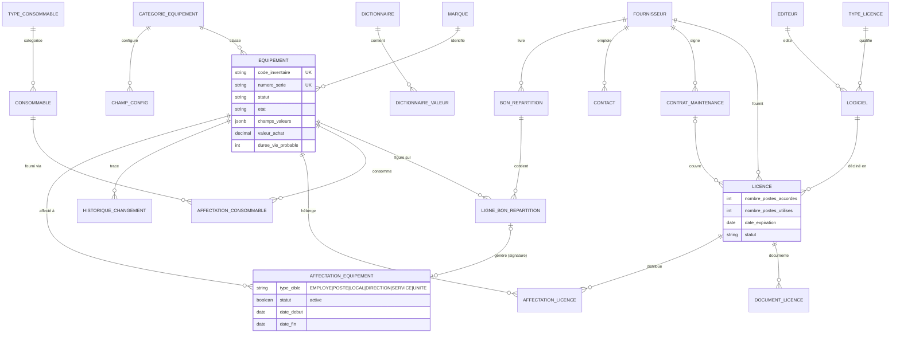
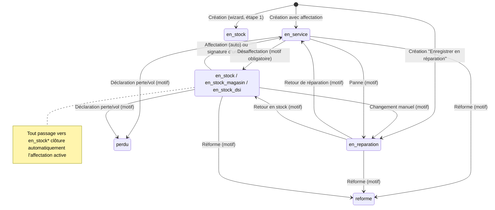
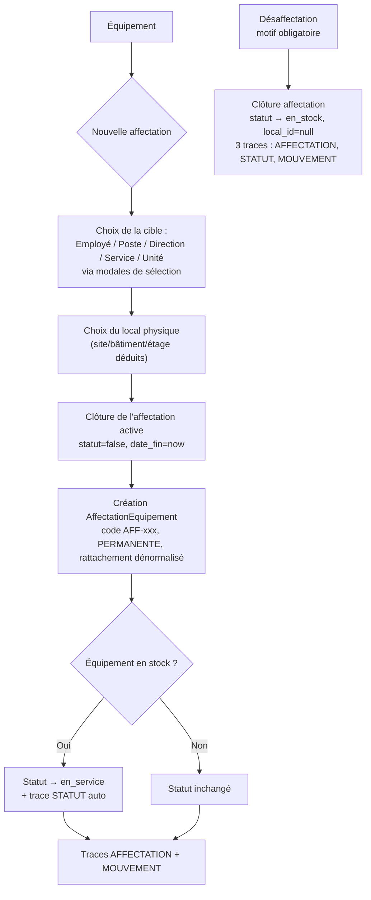
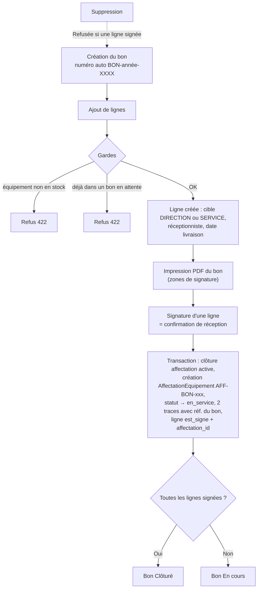
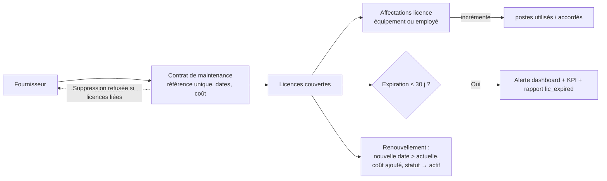

# Module ParcInfo — Analyse complète

> **Date** : 27/07/2026 · **Branche** : `refactor/stock-rebuild` · **Auteur** : Analyse générée par Claude Code
> **Périmètre** : `Modules/ParcInfo/` + JS `public/js/modules/parc-info/` — modules Achat et Stock supprimés le 27/07/2026 (hors périmètre).

## 1. Vue d'ensemble

ParcInfo est le module de **gestion du parc informatique** (contexte : CHU Yalgado). C'est le plus gros module du projet : il gère l'inventaire complet des actifs IT (18 catégories d'équipements codées en dur + catégories créées dynamiquement), leur cycle de vie (statuts, états physiques, historique), leurs affectations (employé, poste de travail, local, direction, service, unité), les licences et logiciels, le catalogue de consommables, les bons de répartition, les contrats de maintenance, les fournisseurs, une vingtaine de référentiels, et un pôle Analyse (statistiques + états exportables CSV/Excel/PDF).

**Chiffres clés du module** :

| Élément | Volume |
|---|---|
| Routes web | ~300 routes (fichier `Modules/ParcInfo/routes/web.php`, 609 lignes, préfixe `/parc-info`, middleware `auth`) |
| Controllers | 10 principaux + 12 référentiels (`Referentiels/`) + 2 analyse (`Analyse/`) + 1 trait `Concerns/AuthorizesDynamicCategory` |
| Modèles Eloquent | 38 (`Modules/ParcInfo/app/Models/`) |
| Vues Blade | ~60 (`Modules/ParcInfo/resources/views/`) |
| Fichiers JS | 42 (`public/js/modules/parc-info/`, ~11 900 lignes) |
| Permissions | ~120 clés (`Modules/ParcInfo/config/permissions.php`) |
| Migrations | 25 (`Modules/ParcInfo/database/migrations/`) |

**Architecture centrale — l'équipement dynamique** : depuis la migration `2026_06_19_183106_create_parc_info_categories_and_champs_config_tables.php`, tous les équipements sont stockés dans **une seule table** `parc_info_equipements`, différenciés par `categorie_id` (table `parc_info_categories_equipements`). Les caractéristiques propres à chaque catégorie (RAM, CPU, nombre de ports, autonomie…) sont décrites en **méta-données** (`parc_info_champs_config`) et stockées dans une colonne **JSONB `champs_valeurs`**. Un unique controller, `EquipementDynamiqueController` (976 lignes), sert les 18 catégories via des routes paramétrées `->defaults('category', '...')`, plus les catégories créées à chaud en base (routes enregistrées dynamiquement au chargement du fichier de routes).

Dépendances inter-modules : **Organisation** (sites, bâtiments, étages, locaux, directions, services, unités, postes de travail), **Grh** (employés pour les affectations), **Core** (layout, permissions Spatie, activity log).

## 2. Fonctionnalités

### 2.1 Équipements (moteur générique)

**Référentiel unique** : chaque équipement (`Modules/ParcInfo/app/Models/Equipement.php`) porte :
- Identification : `code_inventaire` (**unique**, auto-généré `INV-{année}-{n°4 chiffres}` si absent à la création), `numero_serie` (**unique**, obligatoire), `marque_id`, `modele` (obligatoire), `tags` (tableau), `ref_bordereau` (référence du bordereau d'achat, tronquée à 255 caractères par un hook `creating`/`updating`).
- Cycle de vie : `date_acquisition`, `date_mise_en_service`, `date_fin_garantie`, `valeur_achat` (XOF, décimal 2), `duree_vie_probable` (années).
- **Statut** (validation `in:`) : `en_stock_magasin`, `en_stock_dsi`, `en_stock`, `en_service`, `en_reparation`, `perdu`, `reforme`.
- **État physique** : `bon`, `passable`, `mauvais`, `avarie`.
- Localisation / rattachement dénormalisés : `local_id`, `direction_id`, `service_id`, `unite_id` — synchronisés automatiquement depuis l'affectation active (hook `saving` du modèle Equipement + hook `saved` de `AffectationEquipement`) ; remis à `null` quand plus aucune affectation active.
- `champs_valeurs` (JSONB) : valeurs des champs dynamiques de la catégorie.

**Règles métier codées** (`EquipementDynamiqueController`) :
- Création (`store`) : validation de base + règles dynamiques issues de `ChampConfig.regles_validation` (`champs_valeurs.{code}` ⇒ règle Laravel configurée). Transaction DB : création équipement, éventuel `local_id`, puis si `type_cible` fourni et `skip_affectation` faux → création d'une `AffectationEquipement` (code `AFF-{uniqid}`, type `PERMANENTE`) avec dénormalisation du rattachement (direction/service/unité récupérés depuis l'employé ou le poste choisi) + 1 à 2 entrées d'historique (`AFFECTATION`, `MOUVEMENT` si local).
- `updateStatut` : motif **obligatoire** ; si retour vers un statut `en_stock*` alors l'affectation active est clôturée (`statut=false`, `date_fin=now`) ; trace `HistoriqueChangement` type `STATUT` (ancien → nouveau).
- `updateEtat` : motif obligatoire, trace type `ETAT` (ancien/nouvel état).
- `storeAffectation` : clôture l'affectation active, crée la nouvelle ; si l'équipement était `en_stock*`, il passe **automatiquement `en_service`** (trace `STATUT` « Mise en service automatique suite à affectation ») ; traces `AFFECTATION` et `MOUVEMENT`.
- `desaffecter` : motif obligatoire ; clôture l'affectation, force `statut='en_stock'` et `local_id=null` ; 3 traces (`AFFECTATION`, `STATUT`, `MOUVEMENT` « Retour en stock »).
- `update` (fiche technique) : si `local_id` change, trace `MOUVEMENT` « Changement d'emplacement physique : X ➔ Y ».
- `destroy` : suppression directe (`findOrFail($id)->delete()`) — **aucune garde** (pas de contrôle d'affectation active ni d'historique) ; seul le contrôle de permission `.destroy` s'applique.
- Journal complet : le modèle utilise aussi `Spatie\Activitylog` (`logAll()->logOnlyDirty()`).

**Autorisation par catégorie** (`app/Http/Controllers/Concerns/AuthorizesDynamicCategory.php`) : la permission est déduite du nom de route — `parc-info.{ressource}.*` → `parcinfo.{ressource}.{action}` ; repli en cascade sur `parcinfo.{ressource}.index` puis `parcinfo.equipements.view` si la permission fine n'est pas déclarée (cas des catégories qui n'ont que `.index` dans `config/permissions.php`).

**Recherche transversale** : `GET /parc-info/search/equipements` (`ParcInfoController::searchEquipements`) — recherche sur code inventaire / modèle / n° série / marque, filtres `type` et `statut`, limite 50 résultats JSON (consommée par la modale de recherche globale et la création de bons de répartition). La recherche des listes par catégorie (`getData`) couvre aussi le JSONB `champs_valeurs::text` (opérateur PostgreSQL `ilike`).

**Étiquettes** : impression d'étiquette unitaire (`equipements/{id}/etiquette`, vue `informatique/equipements/etiquette.blade.php` avec QR code) et **Centre d'impression** (`equipements/etiquettes/centre`) : sélection multi-équipements toutes catégories avec filtres (catégorie, statut, site, direction), puis impression groupée (`etiquettes/imprimer-selection?ids=1,2,...` — 400 si aucune sélection).

### 2.2 Champs dynamiques et dictionnaires

- `parc_info_categories_equipements` : catégorie (code, libellé, icône Bootstrap Icons). 18 codes « hardcodés » (routes dédiées) : `ordinateur`, `ecran`, `unite-centrale`, `serveur`, `serveur-virtuel`, `mobile`, `switch`, `routeur`, `wifi`, `parefeu`, `onduleur`, `rack`, `brassage`, `camera`, `imprimante`, `scanner`, `telephone`, `terminal-ip`. Toute autre catégorie créée en base reçoit **des routes générées dynamiquement** (`/parc-info/informatique/{pluriel}/...`) en fin de `routes/web.php` (bloc `try/catch` avec `Schema::hasTable`).
- `parc_info_champs_config` (`ChampConfig`) : définition d'un champ par catégorie — `code`, `libelle`, `type_champ` (`text`, `number`, `date`, `boolean`, `select`), `source_options` (`DICT:{code}` → dictionnaire, ou tableau JSON littéral), `regles_validation` (chaîne de règles Laravel appliquée telle quelle), `nom_panel` (regroupement visuel dans la fiche), `ordre_affichage`, et 3 booléens d'exposition : `afficher_dans_modal` (wizard), `afficher_dans_show` (fiche), `afficher_dans_liste` (+ `ordre_colonne_liste`) — ce qui pilote à la fois le formulaire, la fiche et les colonnes du tableau.
- `parc_info_dictionnaires` / `parc_info_dictionnaire_valeurs` : listes de valeurs réutilisables (type_ram, type_os, type_disque, type_cpu, type_mobile, type_imprimante…). `Equipement::getValeurAffichee()` résout l'id stocké en libellé (select → option du dictionnaire, boolean → Oui/Non).
- **Ajout rapide** depuis les formulaires : bouton « + » à côté des selects alimentés par dictionnaire → Swal input → `POST parc-info.dictionnaires.valeurs.store` (`firstOrCreate`, pas de doublon) ; idem pour les marques (`store-marque`, libellé unique).

### 2.3 Affectations (employé / poste / local / direction / service / unité)

- Table `parc_info_affectation_equipements` (`AffectationEquipement`) : `code` (AFF-…), `type_cible` ∈ `EMPLOYE|POSTE|LOCAL|DIRECTION|SERVICE|UNITE`, `type_affectation` (`PERMANENTE` — seul type créé par le code), `statut` booléen (active), `date_debut`/`date_fin`, cible (`dossier_employe_id`, `poste_travail_id`, `local_id`) et rattachement dénormalisé (`niveau_rattachement`, `direction_id`, `service_id`, `unite_id`).
- **Une seule affectation active** par équipement (les précédentes sont clôturées à chaque nouvelle affectation).
- Le lien vers le bon de répartition d'origine est porté par `LigneBonRepartition.affectation_id` (relation `ligneBon`).

### 2.4 Historique

Table `parc_info_historique_changements` (`HistoriqueChangement`) : `type_changement` ∈ `STATUT`, `ETAT`, `AFFECTATION`, `MOUVEMENT` (+ `TECHNIQUE` prévu côté vue), ancien/nouveau statut, ancien/nouvel état, `motif`, `utilisateur_id`, `reference_document`. Alimentée exclusivement par le controller (jamais supprimée). Affichée en timeline dans l'onglet « Journal des Changements » de la fiche.

### 2.5 Logiciels, éditeurs et licences

- **Logiciel** (`parc_info_logiciels`, `LogicielController`) : catalogue — `code` (**unique**), `nom`, `editeur_id`, `type_licence_id` obligatoires, `categorie`, `est_actif`. Suppression **refusée** (422) si des licences y sont rattachées. Quick-add d'éditeur depuis la modale (`storeEditeur`, nom unique, code auto `XXX999`).
- **Licence** (`parc_info_licences`, `LicenceController`, `StoreLicenceRequest`) : rattachée à un logiciel + fournisseur (obligatoires) ; `type_activation` ∈ `volume|concurrent|subscription|free`, `modele_licencing` ∈ `device|user|concurrent|named`, `statut` ∈ `actif|expire|en_renouvellement|suspendu`, `numero_contrat` unique (nullable), `date_expiration` ≥ `date_acquisition`, devise ISO 3, coûts, contact support, contrat de maintenance, documents joints (`parc_info_documents_licences`).
- **Compteur de sièges** : `nombre_postes_accordes` / `nombre_postes_utilises`. `affecter` (type `device|user|concurrent`) refuse (422) si tous les postes sont consommés (sauf accordés = 0 = illimité) et incrémente le compteur ; `desaffecter` clôture l'affectation (`AffectationLicence.actif=false`, `date_fin_affectation`) et décrémente.
- **Indicateurs** (scopes du modèle `Licence`) : `expirantProchainement` (≤ 30 jours, actives), `expire` (date passée), `enSurexploitation` (utilisés > accordés) ; accesseurs `taux_utilisation` (%), `statut_validite` (`EXPIREE` / `ALERTE` (<30 j) / `VALIDE`), `disponibilites`.
- **Renouvellement** (`renouveler`) : nouvelle date d'expiration strictement postérieure à l'actuelle, coût de renouvellement additionné à `cout_total`, statut repassé à `actif`.
- Suppression refusée (422) si affectations actives. Quick-add fournisseur (`storeFournisseur`, code auto `FOUR-XXX999`) et contrat de maintenance (`storeContrat`) sans quitter le formulaire.
- **Job planifié** `app/Jobs/VerifierExpirationLicences.php` : veille d'expiration des licences.

### 2.6 Consommables (catalogue pur)

Depuis la suppression du module Stock (27/07/2026), les consommables sont un **catalogue sans quantités** (`parc_info_consommables`, `ConsommableController`) :
- Fiche article : `code` (**unique**), `nom`, `type_consommable_id` et `fournisseur_principal_id` obligatoires, `marque_id`, `modele_reference`, `cout_unitaire` obligatoire, `compatible_equipements` (tableau JSON), `est_actif`, `notes`.
- **Affectations aux équipements** (`parc_info_affectations_consommables`, `AffectationConsommable`) : quantité fournie, date d'affectation, cycle de remplacement en jours, date de prochain remplacement prévu — consultables sur la fiche consommable (onglet affectations).
- Types de consommables (`parc_info_types_consommables`) : code, nom, catégorie, sous-catégorie, `unite_stock`, seuil de réapprovisionnement (`seul_reapprovisionnement` — sic), durée de conservation. Quick-add depuis la modale (`storeType`, code auto `TYPE-CONS-XXX999`).
- Suppression : **aucune garde** (delete direct). `ApprovisionnerConsommableRequest` existe mais est **vide** (vestige du module Stock).

### 2.7 Fournisseurs, contacts et contrats de maintenance

- **Fournisseur** (`parc_info_fournisseurs`, `FournisseurController`, `StoreFournisseurRequest`) : `code` (unique, max 50), `nom` (**unique**), `email` (unique nullable), type, adresse complète (adresse, code postal, ville, pays), `conditions_paiement`, `delai_livraison`, `fiabilite_score` (0-100), `est_actif`. Suppression refusée (422) si des licences y sont liées.
- **Contacts** (`parc_info_contacts`, CRUD imbriqué `fournisseurs/{id}/contacts`) : nom **ou** prénom requis (`required_without`), fonction, email, téléphone. Un contact peut être « contact principal » du fournisseur (`contact_principal_id`).
- **Contrat de maintenance** (`parc_info_contrats_maintenances`, `ContratMaintenanceController`) : `reference` (**unique**), `nom`, `fournisseur_id` obligatoires ; `date_fin` ≥ `date_debut` ; `cout` ; géré **entièrement en modale/JSON** (pas de page liste dédiée — visible sur la fiche fournisseur et référencé par les licences). Suppression refusée (422) si des licences y sont liées.

### 2.8 Bons de répartition

`BonRepartitionController` + modèles `BonRepartition` / `LigneBonRepartition` :
- **En-tête** : `numero_bon` auto-généré `BON-{année}-{séquence 4 chiffres}` (hook `creating`, séquence par année), `date_bon` obligatoire, fournisseur optionnel, observation, `created_by` (auto).
- **Statut calculé** (accesseur `statut_label`) : `Vide` (0 ligne) / `En cours` (au moins une ligne non signée) / `Clôturé` (toutes signées) + `progression` (%). Pas de colonne statut en base — filtre liste calculé par `whereHas`/`whereDoesntHave` sur `est_signe`.
- **Ligne** (`AjouterLigneBonRequest`) : équipement + `type_cible` ∈ `DIRECTION|SERVICE` uniquement. Gardes à l'ajout : l'équipement doit être **en stock** (`en_stock`, `en_stock_magasin`, `en_stock_dsi`), sinon 422 ; refus si déjà présent dans un bon **en attente** (ligne non signée).
- **Signature d'une ligne** (`signerLigne`, transaction) : clôture l'affectation active, crée une `AffectationEquipement` (`code AFF-BON-…`, `date_debut` = date de livraison de la ligne), passe l'équipement `en_service`, écrit 2 entrées d'historique (`STATUT` + `AFFECTATION`, `reference_document` = n° du bon), marque la ligne signée (`est_signe`, `date_signature`, `affectation_id`).
- Gardes : ligne signée **non modifiable / non supprimable** (422) ; bon contenant des lignes signées **non supprimable** (422).
- **Impression** : PDF A4 paysage via DomPDF (`imprimer`, vue `informatique/bons-repartition/imprimer.blade.php`).

### 2.9 Référentiels

12 controllers CRUD homogènes sous `app/Http/Controllers/Referentiels/` (~150 lignes chacun, même squelette : `index` (vue), `getData` (JSON bootstrap-table), `store`, `show` (JSON), `update`, `destroy`) : Types CPU, Types disque, Types OS, Types RAM, Marques, Types imprimante, Types mobile, Types licence, Types consommable, Éditeurs, Catégories d'équipement, Dictionnaires. Particularités :
- **Catégories** (`CategorieController`, 399 lignes) : CRUD des catégories **et** de leurs champs dynamiques (routes imbriquées `categories/{id}/fields/...`) — c'est ici que l'on définit type de champ, source d'options (`DICT:code` ou liste JSON), règles de validation, panel, ordres, visibilités (modal/fiche/liste).
- **Dictionnaires** (`DictionnaireController`, 326 lignes) : CRUD des dictionnaires + gestion imbriquée des valeurs (`dictionnaires/{code}/valeurs/...`).
- Les modèles « types » historiques (`TypeRam`, `TypeOs`, `TypeDisque`, `TypeCpu`, `TypeMobile`, `TypeImprimante`) subsistent avec le trait `MapsToDictionnaireValeur` (`app/Models/Traits/`) qui les mappe vers les dictionnaires (migration progressive vers le système de dictionnaires).

### 2.10 Analyse — États / Rapports et Statistiques

- **États** (`Analyse/EtatController`, 1 258 lignes) : moteur de **44 rapports** sélectionnables par `report_type` (un `switch` géant dans `getReportData()`), chacun renvoyant `title` + `columns` + `rows`. Familles :
  - *Parc* : `global_park`, `by_status`, `by_state`, `warranty_status`, `end_of_life` (fin de vie = mise en service + durée de vie), `change_history`, `unassigned` ;
  - *Organisation* : `by_direction`, `by_service`, `by_unite`, `by_site`, `by_local`, `by_employee`, `by_post`, `empty_structures`, `org_distribution` ;
  - *Par type d'équipement* : `type_computers`, `type_physical_servers`, `type_virtual_servers`, `type_printers`, `type_scanners`, `type_network`, `type_ip_phones`, `type_mobiles`, `type_cameras`, `type_infra` ;
  - *Licences / logiciels* : `lic_active_util`, `lic_expired`, `lic_underused`, `lic_overused`, `lic_by_employee`, `lic_by_equipment`, `lic_documents`, `software_by_editor` ;
  - *Consommables* : `cons_equip_assign` (affectations aux équipements), `cons_late_replace` (remplacements en retard) ;
  - *Contrats / fournisseurs* : `contracts_active`, `contracts_expiring`, `equip_covered`, `equip_not_covered`, `active_vendors` ;
  - *Habilitations* : `users_roles`, `employees_no_user`, `users_no_employee`.
  - Filtres communs : direction, service, statut, état, recherche libre. Pagination effectuée **en mémoire** (`array_slice` sur toutes les lignes).
- **Exports** (`export`) : `format=pdf` → DomPDF A4 paysage (vue `analyse/etats/pdf.blade.php`, avec rappel des filtres appliqués) ; `format=excel` → `.xlsx` via **FastExcel** ; défaut → `.csv` FastExcel. Formatage : libellés français des statuts/états, dates `d/m/Y`, montants en float.
- **Statistiques** (`Analyse/StatistiquesController`) : agrégat JSON unique (`getData`) — volumétrie par type/statut/état/marque, **valeur résiduelle** (amortissement linéaire : `valeur_achat × max(0, 1 − années_écoulées/durée_vie)`), **taux de vétusté** (part des équipements ayant dépassé mise en service + durée de vie), taux de disponibilité, affectations (actives/terminées, durées moyennes PERMANENTE/TEMPORAIRE, équipements les plus réaffectés), conformité licences (taux d'usage global, coût, modèles, éditeurs), maintenance (nombre de réparations, **durée moyenne de réparation** calculée par paires `en_reparation`→`en_service` dans l'historique, récurrences >1, réformés + valeur résiduelle réformée), finances (coût contrats actifs + licences = budget estimé, équipements/employé).

### 2.11 Dashboard

`ParcInfoController::dashboard` : compteurs globaux (total, en service, en réparation, hors service = perdu+réformé, en stock), ventilation par type d'actif (requêtes par code de catégorie), alertes garanties (expirées / à renouveler sous 90 j), alertes licences (expirées / expirant sous 30 j / surexploitées), 5 derniers équipements enregistrés (avec icône/couleur/lien par catégorie), répartition par famille avec pourcentages, données de graphiques statut et état physique.

## 3. Pages et écrans

Toutes les pages étendent `parcinfo::layouts.master` (layout propre au module avec sidebar dédiée `layouts/partials/sidebar.blade.php` et navbar). Navigation sidebar : Tableau de bord / Accueil général, puis groupes **Matériel** (Ordinateurs, Écrans, Unités Centrales, Serveurs Physiques, Machines Virtuelles, Tablettes & Mobiles…), **Réseau** (Switches, Routeurs, Points d'accès WiFi, Pare-feux), **Infrastructure** (Onduleurs, Baies & Racks, Brassage), **Périphériques** (Imprimantes & Copieurs, Scanners & Lecteurs), **Téléphonie** (Téléphones fixes, Terminaux IP), Caméras IP, catégories dynamiques, **Logiciels & Licences** (Catalogue Logiciels, Licences), **Consommables**, Bons de Répartition, Fournisseurs, **Impression d'étiquettes**, **Analyse** (États des Équipements, Statistiques), **Référentiels** (Marques, Éditeurs, Types CPU/Disques/OS/RAM/Imprimantes/Mobiles/Licences/Consommables, Catégories d'équipement, Dictionnaires).

### 3.1 Dashboard

- **Route** : `GET /parc-info/dashboard` (`parc-info.dashboard`) → `ParcInfoController::dashboard` — permission `parcinfo.dashboard.view` (middleware).
- **Vue** : `resources/views/dashboard/index.blade.php` (476 lignes). Structure : rangée de cartes KPI (total parc, en service, en réparation, hors service, en stock, alertes garanties/licences), liste « Équipements récents » (5 derniers, avec badge type coloré + lien fiche), bloc « Répartition par type » (barres de progression cliquables vers chaque index), 2 graphiques **Chart.js** (`#statusChart` répartition par statut, `#statesChart` par état physique — doughnuts, JS inline).
- **Boutons** : uniquement des liens de navigation (cartes cliquables) ; pas de modale.

### 3.2 Écran générique « liste d'une catégorie d'équipements » (×18 + catégories dynamiques)

Une seule vue `informatique/index.blade.php` (188 lignes) sert toutes les catégories, paramétrée par `$category` et la config des champs. **Route type** : `GET /parc-info/informatique/{slug}` (`parc-info.{slug}.index`) → `EquipementDynamiqueController::index` avec `->defaults('category', ...)` ; permission résolue par `AuthorizesDynamicCategory` (`parcinfo.{slug}.index`).

**Structure visuelle** :
1. 4 cartes KPI (`#kpi-total`, `#kpi-service`, `#kpi-reparation`, `#kpi-stock`) remplies en JS par un appel `.data` avec `limit=9999` ;
2. Carte filtres : selects `#filter-site`, `#filter-direction`, `#filter-statut` + boutons `#btn-apply-filters` / `#btn-reset-filters` ;
3. Bootstrap-table serveur (`#equipements-table`, `data-url={slug}.data`, recherche intégrée, rafraîchir, choix colonnes, pagination 10/25/50/100, sélection radio simple) — colonnes fixes : Code Inventaire (lien fiche), Marque & Modèle, puis **colonnes dynamiques** (`ChampConfig.afficher_dans_liste`, valeurs résolues côté serveur `champs_valeurs_resolus.{code}`), Statut (badge), Affectation (libellé de la cible active), Actions.

**Boutons** (toolbar) : `#btn-add` (ouvre le wizard), `#btn-edit` (activé si 1 ligne sélectionnée, ouvre le wizard pré-rempli via `show-json`), `#btn-delete` (activé si sélection, confirmation Swal « Cette action est définitive ! ») ; par ligne : œil (fiche) + corbeille.

**Modales** :
| Id | Déclencheur | Contenu |
|---|---|---|
| `#equipementModal` (wizard, `_wizard.blade.php`, 417 lignes) | `#btn-add` / `#btn-edit` | Stepper 3 étapes — voir ci-dessous |
| `#employeSelectionModal`, `#posteSelectionModal`, `#localSelectionModal`, `#directionSelectionModal`, `#serviceSelectionModal`, `#uniteSelectionModal` (`_selection_modals.blade.php`, 364 lignes) | cartes de type de cible du wizard / champ « Bureau / Local » | Sélecteurs modaux partagés — voir §4 |
| Swal input « Nouvelle marque » | bouton `+` à côté du select Marque | POST `{slug}.store-marque` (libellé unique) |
| Swal input « Ajouter : {champ} » | bouton `+` des selects `DICT:` | POST `parc-info.dictionnaires.valeurs.store` |

**Wizard de création/édition** (`_wizard.blade.php` + `dynamic-index.js`, 542 lignes) :
- **Étape 1 STATUT** : 3 cartes radio (`en_stock`, `en_service`, `en_reparation`). Si `en_stock*` → l'étape 3 est grisée/barrée (2 étapes seulement, l'équipement est enregistré en stock). Si `en_reparation` → bouton vert dédié `#btn-save-reparation` disponible dès l'étape 2 (`skip_affectation=1`).
- **Étape 2 INFORMATIONS** : code inventaire (readonly, « Généré automatiquement »), n° série*, marque (+ quick-add), modèle*, dates (acquisition, fin de garantie), valeur d'achat (XOF), état ; puis les **champs dynamiques** `afficher_dans_modal` groupés par `nom_panel` (rendu conditionnel select / boolean Oui-Non / number / date / text, astérisque si règle `required`). Validation front (champs `required`) + validation serveur 422 mappée champ à champ (`champs_valeurs.x` → `#champ_x`, message `invalid-feedback`).
- **Étape 3 AFFECTATION** : 5 cartes de cible (Employé, Poste de Travail, Direction, Service, Unité) → chaque clic ouvre la modale de sélection correspondante ; carte récapitulative après choix (`#aff-employe-summary`…) ; section « Emplacement Physique (Où ?) » avec Site/Bâtiment/Étage auto (readonly) + Local sélectionnable ; texte d'aide si aucune affectation (« l'équipement sera enregistré en stock »).
- Navigation `#btn-prev`/`#btn-next`/`#btn-submit` ; soumission AJAX POST/PUT selon présence d'un id ; succès → fermeture, refresh table + KPIs, toast Swal.

**Variantes par catégorie** (différences uniquement dans les routes annexes et les champs configurés — le mécanisme est identique) :

| Catégorie (slug) | URL | Recherches AJAX disponibles | Quick-add dictionnaires dédiés | Particularités |
|---|---|---|---|---|
| Ordinateurs (`ordinateurs`) | `/informatique/ordinateurs` | employés, postes, locaux | type_ram, type_os, type_disque, type_cpu | — |
| Écrans (`ecrans`) | `/informatique/ecrans` | employés, postes, locaux | — | — |
| Unités centrales (`unite-centrales`) | `/informatique/unites-centrales` | employés, postes, locaux | type_ram, type_os, type_disque, type_cpu | — |
| Serveurs (`serveurs`) | `/informatique/serveurs` | locaux (+ alias `search-hotes` → pointe aussi `searchLocaux`) | — | — |
| Serveurs virtuels (`serveurs-virtuels`) | `/informatique/serveurs-virtuels` | aucune | — | pas de route affectation-cible ni marque |
| Mobiles & tablettes (`mobiles`) | `/informatique/mobiles` | employés, postes, locaux | type_mobile | — |
| Switches (`switches`) | `/informatique/switches` | employés, postes, locaux | — | routes search en `/{ressource}/search` inversé (`employes/search`) |
| Routeurs (`routeurs`) | `/informatique/routeurs` | employés, postes, locaux | — | — |
| WiFi (`wifi`) | `/informatique/wifi` | locaux | — | — |
| Pare-feux (`parefeux`) | `/informatique/parefeux` | locaux | — | — |
| Onduleurs (`onduleurs`) | `/informatique/onduleurs` | employés, postes, locaux | — | — |
| Baies & racks (`racks`) | `/informatique/infrastructure/racks` | locaux | — | préfixe `infrastructure/` |
| Brassage (`brassage`) | `/informatique/infrastructure/brassage` | locaux | — | préfixe `infrastructure/` |
| Imprimantes (`imprimantes`) | `/informatique/imprimantes` | employés, postes, locaux | type_imprimante | — |
| Scanners (`scanners`) | `/informatique/scanners` | employés, postes, locaux | — | — |
| Téléphonie (`telephonie`) | `/informatique/telephonie` | locaux | — | catégorie `telephone` |
| Terminaux IP (`terminaux-ip`) | `/informatique/terminaux-ip` | locaux | — | **pointe aussi la catégorie `telephone`** (même données que Téléphonie) |
| Caméras IP (`cameras`) | `/informatique/cameras` | locaux | — | — |
| Catégories dynamiques | `/informatique/{pluriel}` | employés, postes, locaux | — | routes générées à l'exécution |

### 3.3 Fiche équipement (`show`)

- **Route type** : `GET /parc-info/informatique/{slug}/{id}` (`parc-info.{slug}.show`) → `EquipementDynamiqueController::show` — vue unique `informatique/show.blade.php` (1 083 lignes).
- **En-tête** : icône de catégorie, marque + modèle, badges statut et état, code inventaire, n° série, nom d'hôte éventuel (`champs_valeurs.nom_hote`).
- **Boutons d'en-tête** : dropdown **Statut** (7 items `data-statut` → Swal textarea motif obligatoire → PATCH `update-statut` → reload) ; **Désaffecter** (`#btn-desaffecter`, visible si affectation active ; Swal motif obligatoire → POST `desaffecter`) ; **Affecter** (`#btn-nouvelle-affectation` → modale `#affectationModal`) ; **Étiquette** (lien nouvelle fenêtre `equipements.imprimer-etiquette`) ; **Modifier** (`#btn-edit-toggle`, bascule le mode édition de la fiche : active tous les `field-input` sauf le code inventaire, affiche les boutons `+` de quick-add et la barre `#fiche-actions` Annuler / Enregistrer → PUT `.update`, erreurs 422 champ à champ).
- **6 onglets** :
  1. **Fiche Technique** : section « 01 Identification & Localisation » (code, n° série, marque, modèle, statut, état, dates, valeur, local physique — avec bouton loupe `#btn-select-local` ouvrant `#localSelectionModal` en mode édition —, durée de vie, réf. bordereau, tags) puis sections dynamiques numérotées 02+ par `nom_panel` (champs `afficher_dans_show`).
  2. **Affectation Actuelle** : carte de la cible (type, dates, direction/service) ; **état vide** : icône + « Aucune affectation active » + bouton « Créer une affectation ».
  3. **Licences** (`_licences.blade.php`) : licences actives sur l'équipement + formulaire `#form-associer-licence` (select des licences disponibles, POST `licences/{id}/affecter` type `device`) + bouton désassocier par ligne (Swal confirm → `licences/affectations/{id}/desaffecter`).
  4. **Historique Affectations** : tableau (type, cible, rattachement, début, fin, badge Active/Terminée) ; état vide avec icône.
  5. **Journal des Changements** : timeline colorée par type (`STATUT` bleu, `ETAT` jaune, `AFFECTATION` cyan, `MOUVEMENT` vert), ancien→nouveau, motif, référence document ; état vide.
  6. **Bons de Répartition** : lignes de bon concernant l'équipement (n°, date, fournisseur, destination, réceptionniste, livraison, badge Signé/En attente) ; état vide.
- **Modale `#affectationModal`** : réplique de l'étape 3 du wizard (5 cartes de cible + cartes récapitulatives + section emplacement) ; soumission POST `.store-affectation` avec `equipement_id` ; garde front « Veuillez sélectionner un type d'affectation » ; reset complet à la fermeture.

### 3.4 Centre d'impression d'étiquettes

- **Routes** : `GET /parc-info/informatique/equipements/etiquettes/centre` (vue `centre_impression.blade.php`), `.../etiquettes/data` (JSON), `.../etiquettes/imprimer-selection?ids=…` (vue `etiquettes_multiples.blade.php`), `/equipements/{id}/etiquette` (`etiquette.blade.php`) — permission `parcinfo.equipements.view` (Gate).
- **Écran** : filtres (catégorie, statut, site, direction) + bootstrap-table multi-sélection (checkbox) toutes catégories confondues ; boutons `#btn-apply-filters`, `#btn-reset-filters`, `#btn-print-selected` (ouvre la vue d'impression groupée dans un nouvel onglet ; erreur 400 si aucune sélection). JS : `centre-impression.js`.
- **Étiquette** : format imprimable avec QR code, code inventaire, catégorie, marque/modèle.

### 3.5 Licences

- **Liste** — `GET /parc-info/informatique/licences` (`parc-info.licences.index`, permission `parcinfo.licences.index`), vue `informatique/licences/index.blade.php`, JS `licences/index.js`.
  - KPI : Licences Actives, Expirant dans 30 j, Surexploitées, Budget Annuel (somme `cout_total` actives) — alimentés par le bloc `stats` de `.data`.
  - Filtres : `#filter-logiciel`, `#filter-statut` + Appliquer/Réinitialiser.
  - Toolbar : `#btn-add`, `#btn-edit`, `#btn-toggle-status` (PATCH `.toggle`), `#btn-delete` (garde serveur : refus si affectations actives). Colonnes : Logiciel, Clé/Contrat, Expiration (badge VALIDE/ALERTE/EXPIREE), Postes (x/y), Utilisation (barre de %), Coût total, Statut, Actions.
  - **Modale `#modal-licence`** (`_modal.blade.php`, partagée création/édition) : 4 sections — Logiciel & Identification (logiciel* en select2, clé, n° contrat), Type & Volume (type d'activation*, modèle de licencing*, nombre de postes* avec aide « 0 = Illimité », statut*), Dates & Coûts (acquisition*, activation, expiration*, coût unitaire/total), Tiers & Support (fournisseur* + bouton `#btn-quickadd-fournisseur` → `#modal-quickadd-fournisseur`, contact support, contrat de maintenance + `#btn-quickadd-contrat` → `#modal-contrat`). Champs cachés `devise=EUR`, `actif=1`.
- **Création pleine page** — `GET .../licences/create` (vue `create.blade.php`, 207 lignes) : même formulaire en page entière (avec quick-add fournisseur).
- **Fiche** — `GET .../licences/{id}` (vue `show.blade.php`, 386 lignes), JS `licences/show.js` : en-tête avec compteur de postes disponibles, boutons `#btn-enable-edit`/`#btn-save-edit` (édition en place), `#btn-open-renouveler` (Swal/modale : nouvelle date d'expiration > actuelle + coût de renouvellement → POST `.renouveler`) ; onglet **Affectations** : tableau (cible employé ou équipement, type, date, statut Actif/Terminé, bouton désaffecter) + **modale `#modal-affectation`** à 2 onglets pill « Collaborateurs » / équipements — recherche débouncée (`search-employes` pour les employés, `search-equipements` filtrée par type pour le matériel), cartes de résultats avec bouton « Affecter » (POST `.affecter` type `user`/`device` ; erreur 422 si plus de poste disponible) ; documents liés.

### 3.6 Logiciels

- **Liste** — `GET /parc-info/informatique/logiciels` (permission `parcinfo.logiciels.index`), vue `logiciels/index.blade.php`, JS `logiciels/index.js`. Filtres éditeur / type de licence. Toolbar add/edit/toggle/delete (delete refusé si licences rattachées). Colonnes : code, nom, éditeur, type de licence, catégorie, nb licences, statut.
- **Modales** : `#modal-logiciel` (code*, nom*, éditeur* + `#btn-quickadd-editeur` → `#modal-quickadd-editeur` (nom* unique, site web, email/téléphone support), type de licence*, catégorie, description, notes) .
- **Fiche** — `GET .../logiciels/{id}` (vue `show.blade.php`), JS `logiciels/show.js` : édition en place (`#btn-enable-edit`/`#btn-save-edit`), toggle actif, liste des licences du logiciel + `#btn-add-licence` qui réutilise la modale licence (`licences/_modal`), quick-add éditeur/fournisseur/contrat.

### 3.7 Consommables (catalogue)

- **Liste** — `GET /parc-info/informatique/consommables` (permission `parcinfo.consommables.index`), vue `consommables/index.blade.php`, JS `consommables/index.js`. Filtre par type. Toolbar add/edit/toggle/delete. Colonnes : code, nom, type, marque, unité, statut actif.
- **Modale `#modal-consommable`** : code*, nom*, type* (+ `#btn-quickadd-type-cons` → `#modal-quickadd-type-cons` : nom*, catégorie*, unité de stock*), marque (+ `#btn-quickadd-marque`), modèle/référence, fournisseur principal*, coût unitaire*, notes.
- **Fiche** — `GET .../consommables/{id}` (vue `show.blade.php`, 256 lignes), JS `consommables/show.js` : fiche article éditable en place (`#btn-edit-toggle`, `#btn-save-fiche`, `#btn-cancel-edit`), toggle actif, suppression ; tableau des **affectations aux équipements** (quantité, date, cycle de remplacement, prochain remplacement prévu).

### 3.8 Fournisseurs

- **Liste** — `GET /parc-info/informatique/fournisseurs` (permission `parcinfo.fournisseurs.index`), vue `fournisseurs/index.blade.php`, JS `fournisseurs/index.js`. Toolbar add (renvoie vers la page `create`), edit, toggle, delete (refus si licences liées). Colonnes : code, nom, type, email, téléphone, statut.
- **Création pleine page** — `GET .../fournisseurs/create` (vue `create.blade.php`) : identité (code*, nom*, type), coordonnées (email, téléphone, adresse, CP, ville, pays), conditions commerciales (conditions de paiement, délai de livraison, score de fiabilité 0-100) ; `#btn-save` → POST puis redirection vers la fiche.
- **Fiche** — `GET .../fournisseurs/{id}` (vue `show.blade.php` + partials `_contacts`, `_contrats`, `_licences`), JS `fournisseurs/show.js` : édition en place de la fiche ; onglets/blocs **Contacts** (CRUD en modale `#modal-quickadd-contact` — nom ou prénom requis, fonction, email, téléphone ; routes `store-contact`/`update-contact`/`delete-contact`), **Contrats de maintenance** (modale `#modal-contrat` : référence*, nom*, dates, coût — CRUD via `ContratMaintenanceController`), **Licences** fournies (lecture).
- La modale `#modal-fournisseur` (`fournisseurs/_modal.blade.php`) sert à l'édition rapide depuis la liste.

### 3.9 Bons de répartition

- **Liste** — `GET /parc-info/informatique/bons-repartition` (permission `parcinfo.bons-repartition.index`), vue `bons-repartition/index.blade.php` (383 lignes, JS inline). Filtres : fournisseur, statut calculé (En cours / Clôturé), plage de dates. Colonnes : n° bon, date, fournisseur, nb lignes, progression signature (barre %), statut (badge Vide/En cours/Clôturé).
  - **Boutons** : `#btn-create-bon` → modale `#modal-create-bon` (date du bon*, fournisseur, observation ; `#btn-submit-bon` → POST puis **redirection vers la fiche du bon**) ; par ligne : voir, imprimer (`#btn-modal-print` → modale `#printPdfModal` avec iframe PDF), supprimer (garde : refus si lignes signées).
- **Fiche bon** — `GET .../bons-repartition/{bon}` (vue `show.blade.php`, 599 lignes, JS inline) : carte d'en-tête (n°, date, fournisseur, badge statut, progression), boutons `#btn-print-bon` (PDF) et `#btn-add-ligne` ; tableau des lignes (équipement, catégorie, destination DIRECTION/SERVICE, réceptionniste, date de livraison, état signature).
  - **Modales** : `#modal-add-ligne` (recherche d'un équipement **en stock** via `search-equipements`, choix cible Direction ou Service, réceptionniste, date livraison, observation ; `#btn-submit-ligne`) ; `#modal-edit-ligne` (mêmes champs, lignes non signées uniquement) ; `#modal-signer` (`#btn-confirm-signer` — confirmation de réception → POST `lignes/{ligne}/signer` : crée l'affectation et passe l'équipement en service) ; `#printPdfModal` (aperçu PDF en iframe).
- **Impression** — `GET .../{bon}/imprimer` : flux PDF DomPDF A4 paysage (`imprimer.blade.php`, avec zones de signature).

### 3.10 Analyse

- **États des équipements** — `GET /parc-info/analyse/etats` (permission `parcinfo.analyse.view`), vue `analyse/etats/index.blade.php` (602 lignes, JS inline).
  - Structure : **sidebar de rapports** (liste de `.report-item` groupés par famille, chacun portant `data-type` + `data-desc` ; attributs conditionnels `data-show-days` → champ « jours » pour la garantie, `data-show-employe` → filtre employé) ; zone principale avec titre/description du rapport (`#report-title-display`, `#report-desc-display`), formulaire de filtres (`#filter-direction`, `#filter-service`, `#filter-statut`, `#filter-etat`, `#filter-days`, `#filter-employe`) et bootstrap-table à **colonnes dynamiques** (`#dynamic-report-table`, reconstruite à chaque changement de rapport à partir de `columns` renvoyées par `.data`).
  - **Boutons** : Appliquer / Réinitialiser ; dropdown **Exporter** (`.export-action` `data-format` = `csv` | `excel` | `pdf`). CSV/Excel → téléchargement direct ; PDF → modale `#pdfPreviewModal` avec iframe d'aperçu + `#btn-print-iframe` (impression depuis l'iframe).
- **Statistiques** — `GET /parc-info/analyse/statistiques` (même permission), vue `analyse/statistiques/index.blade.php` (464 lignes) : loader (`#stats-loader`) puis tableau de bord analytique — tuiles (valeur d'achat totale, valeur résiduelle, taux de vétusté, disponibilité, équipements/employé, budget estimé, licences), 4+ graphiques Chart.js (`#typesChart`, `#statusChart`, `#statesChart`, `#directionsChart`, `#financeChart`), blocs conformité licences et maintenance (durée moyenne de réparation, récurrences, réformes). Aucune modale ; lecture seule.

### 3.11 Référentiels (modèle générique ×12)

- **Route type** : `GET /parc-info/referentiels/{ressource}` (permissions `parc-info.referentiels.{ressource}.*`). Vues `referentiels/{ressource}/index.blade.php` + `_modal.blade.php` ; JS dédié `referentiels/{ressource}.js` (~150 lignes chacun, même squelette).
- **Écran type** : bootstrap-table (recherche serveur, tri, pagination) + toolbar Ajouter / Modifier / Supprimer + **modale unique** création/édition avec un champ `libelle` (ou `nom`) requis. Suppression avec confirmation Swal.
- **Variantes** :
  | Référentiel | Champs de la modale | Spécificités |
  |---|---|---|
  | Marques, Types CPU/Disque/OS/RAM/Imprimante/Mobile | libellé* | les « types » écrivent en réalité dans `parc_info_dictionnaire_valeurs` via le trait `MapsToDictionnaireValeur` |
  | Types licences | libellé*, description | — |
  | Types consommables | nom*, catégorie, sous-catégorie, unité de stock, seuil, durée de conservation | — |
  | Éditeurs | nom*, site web, email/téléphone support | — |
  | Catégories d'équipement | libellé*, code* (`[a-z0-9-]`, non modifiable ensuite), icône Bootstrap | à la création : **génération automatique des 4 permissions Spatie** `parcinfo.{pluriel}.{index,store,update,destroy}` assignées aux rôles Admin/super-admin ; suppression refusée (422) si la catégorie contient des équipements, sinon suppression en cascade des champs + permissions |
  | Dictionnaires | code, libellé, description | — |
- **Fiche catégorie** — `GET /parc-info/referentiels/categories/{id}` (vue `categories/show.blade.php`, JS `referentiels/categories-show.js`) : gestion des **champs dynamiques** de la catégorie — table des champs + modale `_modal_field.blade.php` (code* `[a-z0-9_]` unique par catégorie, libellé*, type de champ* text/number/select/boolean/date, source d'options (dictionnaire existant ou liste JSON), règles de validation Laravel, panel*, ordre*, cases afficher dans modal/fiche/liste + ordre colonne).
- **Valeurs de dictionnaire** — `GET /parc-info/referentiels/dictionnaires/{code}/valeurs` (vue `dictionnaires/values.blade.php`, JS `dictionnaires-values.js`) : CRUD des valeurs (valeur*, description) via modale `_modal_values.blade.php`.

### 3.12 Modales partagées (`resources/views/shared/`)

| Modale (id) | Fichier | Champs | Utilisée par |
|---|---|---|---|
| `#modal-quickadd-fournisseur` | `_modal_fournisseur.blade.php` | nom*, type, email, téléphone, adresse | licences (liste/fiche/create), logiciels show — POST `licences.store-fournisseur` (code auto) |
| `#modal-contrat` | `_modal_contrat_maintenance.blade.php` | référence*, nom*, fournisseur*, dates, coût | licences, logiciels show, fournisseurs show |
| `#modal-quickadd-editeur` | `_modal_editeur.blade.php` | nom*, site web, email/téléphone support | logiciels |
| `#modal-quickadd-contact` | `_modal_contact.blade.php` | nom/prénom (l'un requis), fonction, email, téléphone | fiche fournisseur |
| `#modal-quickadd-type-cons` | `_modal_type_consommable.blade.php` | nom*, catégorie*, unité de stock* | consommables |
| `#equipementSelectionModal` | `_modal_selection_equipement.blade.php` | filtres type/statut + recherche + tableau à sélection | **non incluse par aucune vue actuellement** (voir §9) |

## 4. Spécifications UX

### Navigation
- Layout module dédié (`layouts/master.blade.php`) avec sidebar propre à ParcInfo (toutes les entrées listées en §3) et lien « Accueil général » pour revenir au portail. Breadcrumb systématique « Parc Info > {section} ».
- Les listes mènent aux fiches par lien sur le code inventaire ou l'action « œil » ; le dashboard renvoie vers les listes par famille.

### Patterns d'écran
- **Liste** : cartes KPI → carte filtres → carte tableau. Tableaux = **bootstrap-table** (pagination serveur, recherche, rafraîchir, choix des colonnes, locale FR) avec toolbar d'actions activées par sélection radio (1 ligne) : Ajouter (bleu), Modifier (cyan), Activer/Désactiver (jaune, si applicable), Supprimer (rouge).
- **Fiche** : carte d'en-tête (identité + badges + boutons d'action) puis onglets ou sections numérotées (`01`, `02`…). Mode lecture par défaut, bascule **édition en place** (`#btn-edit-toggle` : inputs activés, boutons quick-add révélés, barre Annuler/Enregistrer) — pattern répété sur équipement, consommable, fournisseur, licence, logiciel.
- **Deux variantes de création** : modale (référentiels, logiciels, consommables, licences) ou wizard/page dédiée (équipements → wizard 3 étapes ; fournisseurs et licences → page `create` complète).

### Wizard équipement (pattern signature du module)
Stepper visuel 3 étapes (STATUT → INFORMATIONS → AFFECTATION) avec cercles numérotés/cochés et lignes de progression ; le choix du statut adapte le parcours (2 étapes si stock, bouton spécial « Enregistrer en réparation ») ; cartes cliquables (statut, type de cible) avec état `selected` et icône check ; validation par étape avant navigation.

### Sélecteurs modaux partagés
`_selection_modals.blade.php` + `ordinateurs/selection_modals.js` (859 lignes) fournissent 6 modales XL réutilisables (employé, poste, local, direction, service, unité) : filtres en cascade (direction → service ; site → bâtiment → étage), recherche débouncée, **squelettes de chargement** (placeholders animés), tableau à sélection radio, double-clic = sélection immédiate, bouton Confirmer désactivé tant que rien n'est choisi. Les données viennent des API des autres modules (`/grh/employes/api`, `/organisation/postes-travail/api`, `/organisation/locaux/api`, `/organisation/directions/api`, `/organisation/services/api`, `/organisation/unites/api`). La sélection est propagée par événements jQuery (`employe:selected`, `poste:selected`, `local:selected`, `direction:selected`, `service:selected`, `unite:selected`) écoutés par le wizard et la modale d'affectation.

### Feedback
- **SweetAlert2 partout** : toasts de succès (timer 1,5–2 s sans bouton), confirmations de suppression (« Êtes-vous sûr ? Cette action est définitive ! », bouton rouge), **saisie de motif obligatoire** en textarea pour changement de statut/état et désaffectation, inputs Swal pour les quick-add à un champ (marque, valeur de dictionnaire).
- Erreurs 422 : marquage `is-invalid` champ par champ + message `invalid-feedback` (mapping `champs_valeurs.x` → `#champ_x` / `#f_champ_x`) + Swal « Erreur de validation ».
- Boutons de soumission désactivés avec spinner/« Enregistrement... » pendant l'AJAX ; la plupart des actions de fiche se terminent par `location.reload()`.

### Conventions visuelles
- **Badges statut équipement** : En service = vert, En stock/Magasin = gris, Stock DSI = cyan, En réparation = jaune, Perdu/Volé = rouge, Réformé = noir (`Equipement::statut_label` et `statutFormatter` JS). États physiques : bon = vert, passable = jaune/cyan, mauvais/avarié = rouge. Licences : VALIDE/ALERTE/EXPIREE ; bons : Vide/En cours/Clôturé + barre de progression.
- Cartes KPI uniformes (icône dans pastille colorée translucide + libellé uppercase + valeur en gros), coins arrondis 12–16 px, ombres légères, labels de champs `.field-label` uppercase.
- Formulaires : selects **Select2** (thème Bootstrap 5) dans les modales licences/logiciels ; boutons `+` d'ajout rapide accolés aux selects référentiels.

### Limitations UX
- Les KPIs des listes de catégories chargent **toutes les lignes** (`limit=9999`) pour compter côté client.
- Rechargement complet de page après la plupart des actions de fiche (pas de mise à jour ciblée du DOM).
- Cache-busting par `?v={{ time() }}` sur les scripts (aucun cache navigateur possible).
- Les libellés du wizard mentionnent « CHU Yalgado » en dur ; devise incohérente (XOF dans le wizard équipement, EUR forcé dans la modale licence).

## 5. Permissions et rôles

Permissions déclarées dans `Modules/ParcInfo/config/permissions.php` (Spatie). Deux conventions de nommage coexistent : `parcinfo.*` (écrans fonctionnels) et `parc-info.referentiels.*` / `parc-info.analyse.*` (référentiels et analyse).

| Permission | Effet écran |
|---|---|
| `parcinfo.dashboard.view` | Accès dashboard + recherche transversale `search-equipements` |
| `parcinfo.{ordinateurs,serveurs,mobiles,ecrans,unite-centrales}.{index,store,update,destroy}` | CRUD complet des 5 catégories « majeures » (liste/wizard/fiche/suppression) |
| `parcinfo.{switches,routeurs,wifi,parefeux,onduleurs,racks,brassage,cameras,imprimantes,scanners,telephonie,terminaux-ip}.index` | Ces catégories n'ont **que** `.index` déclaré : le trait `AuthorizesDynamicCategory` fait un repli — create/update/delete y sont donc couverts par `.index` (voir §9) |
| `parcinfo.equipements.view` | Vues transversales : centre d'impression, étiquettes, données multi-catégories ; permission de repli ultime du trait |
| `parcinfo.logiciels.*`, `parcinfo.licences.*`, `parcinfo.consommables.*`, `parcinfo.fournisseurs.*` | CRUD des domaines respectifs (middleware `permission:` par action dans chaque controller) |
| `parcinfo.contrats.{index,store,update,destroy}` | Contrats de maintenance (JSON/modales) |
| `parcinfo.bons-repartition.{index,store,update,destroy}` | Bons : `update` couvre aussi ajout/modif/suppression/signature des lignes |
| `parcinfo.marques.*`, `parcinfo.editeurs.*`, `parcinfo.dictionnaires.*`, `parcinfo.categories.*` | Doublons historiques déclarés côté `parcinfo.*` (les controllers référentiels utilisent la variante `parc-info.referentiels.*`) |
| `parc-info.referentiels.{types-cpus,types-disques,types-os,types-rams,marques,types-imprimantes,types-mobiles,types-licences,types-consommables,editeurs,categories,dictionnaires}.{index,store,update,destroy}` (+ `dictionnaires.manage`) | CRUD de chaque référentiel |
| `parc-info.analyse.etats.view`, `parc-info.analyse.statistiques.view` | Déclarées mais les controllers exigent en réalité `parcinfo.analyse.view` (déclarée aussi) — voir §9 |
| `parcinfo.{pluriel}.{index,store,update,destroy}` (générées) | Créées **dynamiquement** à la création d'une catégorie d'équipement (assignées automatiquement aux rôles `Admin` et `super-admin`), supprimées avec la catégorie |

**Rôles** : le projet ne définit pas de rôles en dur dans ParcInfo. Côté Core : rôle **`Admin`** (seeder `Modules/Core/database/seeders/SeedPermissionsTableSeeder.php` — reçoit toutes les permissions, utilisateur par défaut `admin@admin.com`) et rôle **`super-admin`** qui **bypasse toutes les vérifications** via `Gate::before` (`Modules/Core/app/Providers/CoreServiceProvider.php:133`). Les autres rôles sont créés à la volée dans l'écran Rôles du module Core.

## 6. Modèle de données

Toutes les tables sont préfixées `parc_info_`. Migrations dans `Modules/ParcInfo/database/migrations/` (+ `database/migrations/2026_07_05_224005_create_parc_info_bons_repartition_tables.php` à la racine du projet pour les bons).

### Entités principales

- **`parc_info_equipements`** : `code_inventaire` (unique), `numero_serie` (unique), `marque_id` (FK nullable, `nullOnDelete`), `modele`, dates (acquisition, mise en service, fin de garantie), `valeur_achat` (decimal 12,2), `duree_vie_probable` (années), `statut`, `etat`, `tags` (json), `ref_bordereau`, `categorie_id`, `champs_valeurs` (**JSONB**), dénormalisation `direction_id`/`service_id`/`unite_id`/`local_id`.
- **`parc_info_affectation_equipements`** : FK équipement `cascadeOnDelete` (la suppression d'un équipement supprime ses affectations), FK employé Grh (`grh_dossiers_employes`, `nullOnDelete`), FK poste/local/direction/service/unité Organisation.
- **`parc_info_historique_changements`** : journal métier (type, ancien/nouveau statut, ancien/nouvel état, motif, utilisateur, référence document).
- **Méta-modèle** : `parc_info_categories_equipements` → `parc_info_champs_config` (config des champs) → `parc_info_dictionnaires` / `parc_info_dictionnaire_valeurs` (options des selects).
- **Licences** : `parc_info_logiciels` (FK éditeur, type de licence) → `parc_info_licences` (FK fournisseur, contact support, contrat de maintenance) → `parc_info_affectations_licences` (cible équipement **ou** employé) et `parc_info_documents_licences`.
- **Consommables** : `parc_info_types_consommables` → `parc_info_consommables` → `parc_info_affectations_consommables` (FK équipement).
- **Bons** : `parc_info_bons_repartition` → `parc_info_lignes_bon_repartition` (FK équipement, direction/service, `affectation_id` vers l'affectation créée à la signature).

Les cibles d'affectation (Employé, Poste de travail, Local, Direction, Service, Unité, Site/Bâtiment/Étage) appartiennent aux modules **Grh** et **Organisation** (non redessinées ici).

### Autres tables

| Table | Rôle |
|---|---|
| `parc_info_marques` | Marques (libellé unique) |
| `parc_info_editeurs`, `parc_info_types_licences` | Référentiels logiciels |
| `parc_info_contacts` | Contacts fournisseurs (+ `contact_principal_id` sur fournisseur) |
| `parc_info_types_consommables` | Types avec unité de stock, seuil, conservation |
| `parc_info_dictionnaires`, `parc_info_dictionnaire_valeurs` | Listes de valeurs génériques (type_ram, type_os, type_cpu, type_disque, type_mobile, type_imprimante…) |
| ~~`parc_info_ordinateurs`, `parc_info_serveurs`, `parc_info_serveurs_virtuels`, `parc_info_mobiles`, `parc_info_imprimantes`, `parc_info_scanners`, `parc_info_telephones`, `parc_info_cameras_ip`, `parc_info_equipements_reseaux`, `parc_info_infrastructures`, `parc_info_types_{rams,cpus,disques,os,imprimantes,reseaux,mobiles,infrastructures}`~~ | **Supprimées** par la migration `2026_06_19_194711_drop_old_parc_info_cti_tables.php` (ancien modèle « une table par type ») — mais leurs modèles Eloquent existent encore (voir §9) |

## 7. Workflows métier

### Cycle de vie d'un équipement (statuts)

Chaque transition manuelle exige un **motif** et écrit une ligne `HistoriqueChangement` (type `STATUT`). L'état physique (`bon` → `passable` → `mauvais` → `avarie`) évolue indépendamment via `update-etat` (type `ETAT`).

### Affectation / restitution

### Bon de répartition

### Contrat de maintenance / licences

## 8. Routes et endpoints

Toutes les routes : préfixe `/parc-info`, noms `parc-info.*`, middleware `auth` (`Modules/ParcInfo/routes/web.php`). Les permissions sont appliquées **dans les controllers** (middleware `permission:` ou trait `AuthorizesDynamicCategory`) — colonne « Permission » ci-dessous. Aucune route n'est réservée à un rôle : `super-admin` bypasse tout, les autres rôles dépendent des permissions attribuées.

### Transversal

| Méthode | URI | Nom | Controller@action | Permission |
|---|---|---|---|---|
| GET | `/dashboard` | `dashboard` | ParcInfoController@dashboard | `parcinfo.dashboard.view` |
| GET | `/search/equipements` | `search-equipements` | ParcInfoController@searchEquipements | `parcinfo.dashboard.view` |
| GET | `/informatique/equipements/{id}/json` | `equipements.show-json` | EquipementDynamiqueController@showJson | repli trait (`parcinfo.equipements.view`) |
| GET | `/informatique/equipements/{id}/etiquette` | `equipements.imprimer-etiquette` | @imprimerEtiquette | `parcinfo.equipements.view` |
| GET | `/informatique/equipements/etiquettes/centre` | `equipements.centre-impression` | @centreImpression | `parcinfo.equipements.view` |
| GET | `/informatique/equipements/etiquettes/data` | `equipements.etiquettes-data` | @getEquipementsData | `parcinfo.equipements.view` |
| GET | `/informatique/equipements/etiquettes/imprimer-selection` | `equipements.imprimer-etiquettes` | @imprimerEtiquettesSelectionnees | `parcinfo.equipements.view` |
| POST | `/informatique/dictionnaires/valeurs` | `dictionnaires.valeurs.store` | @storeDictionnaireValeur | trait (action `store`) |

### Équipements par catégorie (bloc générique ×18 + catégories dynamiques)

Bloc type sous `/informatique/{slug}` (nom `parc-info.{slug}.*`), tout sur `EquipementDynamiqueController`, permission résolue par le trait (`parcinfo.{slug}.{action}` → repli `.index` → `parcinfo.equipements.view`) :

| Méthode | URI (relative au slug) | Nom | Action |
|---|---|---|---|
| GET | `/` | `.index` | index (vue liste, `->defaults('category', ...)`) |
| GET | `/data` | `.data` | getData (JSON bootstrap-table) |
| POST | `/` | `.store` | store |
| GET | `/{id}` | `.show` | show (fiche) |
| GET | `/{id}/json` | `.show-json` | showJson *(absent pour switches, routeurs, wifi, parefeux, telephonie, terminaux-ip, cameras)* |
| PUT | `/{id}` | `.update` | update |
| DELETE | `/{id}` | `.destroy` | destroy |
| PATCH | `/{id}/statut` | `.update-statut` | updateStatut |
| PATCH | `/{id}/etat` | `.update-etat` | updateEtat |
| POST | `/{id}/desaffecter` | `.desaffecter` | desaffecter |
| POST | `/affectation` | `.store-affectation` | storeAffectation *(absent pour serveurs-virtuels)* |
| POST | `/marques` | `.store-marque` | storeMarque *(absent pour serveurs-virtuels)* |
| GET | `/search/employes`, `/search/postes`, `/search/locaux` | `.search-employes` etc. | searchEmployes/searchPostes/searchLocaux *(sous-ensembles par catégorie, cf. tableau §3.2 ; parfois inversés en `/{ressource}/search`)* |
| POST | `/types-ram`, `/types-os`, `/types-disque`, `/types-cpu` | `.store-type-*` | storeDictionnaireValeur avec `->defaults('dictionnaire_code', ...)` *(ordinateurs et unités centrales)* |
| POST | `/types-mobile` | `.store-type-mobile` | idem *(mobiles)* |
| POST | `/types-imprimante` | `.store-type-imprimante` | idem *(imprimantes)* |

Slugs concernés : `ordinateurs`, `ecrans`, `unites-centrales` (nom `unite-centrales.*`), `serveurs` (+ `search/hotes`), `serveurs-virtuels`, `mobiles`, `switches`, `routeurs`, `wifi`, `parefeux`, `onduleurs`, `infrastructure/racks` (`racks.*`), `infrastructure/brassage` (`brassage.*`), `imprimantes`, `scanners`, `telephonie` (catégorie `telephone`), `terminaux-ip` (catégorie `telephone`), `cameras` — plus le même bloc généré à l'exécution pour chaque catégorie non codée en dur (`Str::plural(code)`).

### Licences / Logiciels / Fournisseurs / Contrats / Consommables

| Méthode | URI | Nom | Controller@action | Permission |
|---|---|---|---|---|
| GET | `/informatique/licences` | `licences.index` | LicenceController@index | `parcinfo.licences.index` |
| GET | `/informatique/licences/data` | `licences.data` | @getData | `parcinfo.licences.index` |
| GET | `/informatique/licences/create` | `licences.create` | @create | `parcinfo.licences.index`¹ |
| POST | `/informatique/licences` | `licences.store` | @store | `parcinfo.licences.store` |
| GET/PUT/DELETE | `/informatique/licences/{id}` | `licences.show/.update/.destroy` | @show/@update/@destroy | `.index` / `.update` / `.destroy` |
| PATCH | `/informatique/licences/{id}/toggle` | `licences.toggle` | @toggleStatus | `parcinfo.licences.update` |
| POST | `/informatique/licences/{id}/affecter` | `licences.affecter` | @affecter | `parcinfo.licences.update` |
| POST | `/informatique/licences/{id}/renouveler` | `licences.renouveler` | @renouveler | `parcinfo.licences.update` |
| POST | `/informatique/licences/affectations/{affectationId}/desaffecter` | `licences.desaffecter` | @desaffecter | `parcinfo.licences.update` |
| POST | `/informatique/licences/fournisseurs/quick-add` | `licences.store-fournisseur` | @storeFournisseur | `parcinfo.licences.store` |
| POST | `/informatique/licences/contrats/quick-add` | `licences.store-contrat` | @storeContrat | `parcinfo.licences.store` |
| GET | `/informatique/logiciels` (+ `/data`) | `logiciels.index/.data` | LogicielController | `parcinfo.logiciels.index` |
| POST/GET/PUT/PATCH/DELETE | `/informatique/logiciels[...]` | `logiciels.store/.show/.update/.toggle/.destroy` | LogicielController | `parcinfo.logiciels.{store,index,update,update,destroy}` |
| POST | `/informatique/logiciels/editeurs/quick-add` | `logiciels.store-editeur` | @storeEditeur | `parcinfo.logiciels.store` |
| GET | `/informatique/fournisseurs` (+ `/data`, `/create`) | `fournisseurs.index/.data/.create` | FournisseurController | `parcinfo.fournisseurs.index` (create → `.store`) |
| POST/GET/PUT/PATCH/DELETE | `/informatique/fournisseurs[...]` | `fournisseurs.store/.show/.update/.toggle/.destroy` | FournisseurController | `parcinfo.fournisseurs.*` |
| POST/PUT/DELETE | `/informatique/fournisseurs/{id}/contacts[/{contactId}]` | `fournisseurs.store-contact/.update-contact/.delete-contact` | FournisseurController | `parcinfo.fournisseurs.update` |
| POST/GET/PUT/DELETE | `/informatique/contrats[/{id}]` | `contrats.store/.show/.update/.destroy` | ContratMaintenanceController | `parcinfo.contrats.*` (show → `.index`) |
| GET | `/informatique/consommables` (+ `/data`) | `consommables.index/.data` | ConsommableController | `parcinfo.consommables.index` |
| POST/GET/PUT/PATCH/DELETE | `/informatique/consommables[...]` | `consommables.store/.show/.update/.toggle/.destroy` | ConsommableController | `parcinfo.consommables.*` |
| POST | `/informatique/consommables/types/quick-add` | `consommables.store-type` | @storeType | `parcinfo.consommables.store` |

¹ `create` n'est pas listé dans le middleware du controller — accessible à tout utilisateur authentifié (voir §9).

### Bons de répartition

| Méthode | URI | Nom | Action | Permission |
|---|---|---|---|---|
| GET | `/informatique/bons-repartition` (+ `/data`) | `bons-repartition.index/.data` | index/data | `parcinfo.bons-repartition.index` |
| POST | `/informatique/bons-repartition` | `.store` | store | `.store` |
| GET/PUT/DELETE | `/informatique/bons-repartition/{bon}` | `.show/.update/.destroy` | show/update/destroy | `.index`/`.update`/`.destroy` |
| GET | `/informatique/bons-repartition/{bon}/imprimer` | `.imprimer` | imprimer (PDF) | `.index` |
| POST/PUT/DELETE | `/informatique/bons-repartition/{bon}/lignes[/{ligne}]` | `.lignes.add/.lignes.update/.lignes.remove` | addLigne/updateLigne/removeLigne | `.update` |
| POST | `/informatique/bons-repartition/{bon}/lignes/{ligne}/signer` | `.lignes.signer` | signerLigne | `.update` |

### Référentiels (bloc générique ×12)

Bloc type sous `/referentiels/{ressource}` (nom `parc-info.referentiels.{ressource}.*`), controller `Referentiels\{X}Controller`, permissions `parc-info.referentiels.{ressource}.{index,store,update,destroy}` : GET `/` (`.index`), GET `/data` (`.data`), POST `/` (`.store`), GET `/{id}` (`.show`), PUT `/{id}` (`.update`), DELETE `/{id}` (`.destroy`). Ressources : `types-cpus`, `types-disques`, `types-os`, `types-rams`, `marques`, `types-imprimantes`, `types-mobiles`, `types-licences`, `types-consommables`, `editeurs`, `categories`, `dictionnaires`. Routes supplémentaires :

| Méthode | URI | Nom | Action |
|---|---|---|---|
| GET | `/referentiels/categories/{id}/fields/data` | `categories.fields.data` | getDataFields |
| POST/GET/PUT/DELETE | `/referentiels/categories/{id}/fields[/{fieldId}]` | `categories.fields.store/.show/.update/.destroy` | storeField/showField/updateField/destroyField |
| GET | `/referentiels/dictionnaires/{code}/valeurs` (+ `/data`) | `dictionnaires.valeurs.index/.data` | indexValues/getDataValues |
| POST/GET/PUT/DELETE | `/referentiels/dictionnaires/{code}/valeurs[/{id}]` | `dictionnaires.valeurs.store/.show/.update/.destroy` | storeValue/showValue/updateValue/destroyValue |

### Analyse

| Méthode | URI | Nom | Action | Permission |
|---|---|---|---|---|
| GET | `/analyse/etats` (+ `/data`, `/export`) | `analyse.etats.index/.data/.export` | EtatController@index/getData/export | `parcinfo.analyse.view` |
| GET | `/analyse/statistiques` (+ `/data`) | `analyse.statistiques.index/.data` | StatistiquesController@index/getData | `parcinfo.analyse.view` |

## 9. Points d'attention et limites

### Dette structurelle
1. **18 blocs de routes quasi identiques** (~15 lignes chacun) dans `routes/web.php` (609 lignes) : seuls le slug, la catégorie par défaut et les routes annexes varient. Une factorisation (macro/boucle comme celle déjà utilisée pour les catégories dynamiques lignes 573-607) réduirait le fichier de ~70 %. Incohérences induites : routes de recherche tantôt `/search/employes` tantôt `/employes/search` ; route `.show-json` déclarée dans 11 blocs sur 18 alors que le wizard utilise en réalité la route transversale `parc-info.equipements.show-json` — les 11 routes par catégorie sont donc redondantes.
2. **Exécution de requêtes SQL au chargement des routes** : le bloc « catégories dynamiques » interroge la base à chaque `php artisan route:*` / boot (encapsulé dans `try/catch` + `Schema::hasTable` pour ne pas casser les commandes). `route:cache` fige les catégories existantes.
3. **JS mort massif** : `public/js/modules/parc-info/` contient 18 dossiers par catégorie (`ordinateurs/index.js` 560 l., `serveurs/index.js` 448 l., `mobiles`, `switches`, `racks`, `brassage`, `reseaux`, `telephonie`, `terminaux-ip`, `cameras`, `onduleurs`, `parefeux`, `routeurs`, `scanners`, `serveurs-virtuels`, `wifi`, `imprimantes`…, ≈ 6 000 lignes) **jamais référencés par les vues** — seuls `dynamic-index.js` et `ordinateurs/selection_modals.js` sont chargés par l'écran générique. De même, `shared/_modal_selection_equipement.blade.php` n'est inclus nulle part.
4. **Modèles orphelins** : `Ordinateur`, `Serveur`, `ServeurVirtuel`, `Mobile`, `Imprimante`, `Scanner`, `Telephone`, `CameraIP` (et les relations `hasOne` correspondantes dans `Equipement`) pointent vers des tables **supprimées** en juin 2026 (`drop_old_parc_info_cti_tables`). Idem `StoreCameraRequest`, `UpdateCameraRequest`, `Store/UpdateInfrastructureRequest`, `LicenceService`, et la commande `MigrateEquipmentToDynamic` (usage unique). `ApprovisionnerConsommableRequest` a des règles vides (vestige Stock).

### Permissions
5. **Granularité incomplète** : 12 catégories n'ont que `.index` déclaré ; grâce au repli du trait, un utilisateur qui peut *voir* les switches peut aussi les **créer/modifier/supprimer**. Les permissions `parcinfo.marques.*`, `parcinfo.editeurs.*`, `parcinfo.dictionnaires.*`, `parcinfo.categories.*` sont déclarées mais **jamais vérifiées** (les controllers utilisent la variante `parc-info.referentiels.*`) ; inversement `parc-info.analyse.etats.view` / `parc-info.analyse.statistiques.view` sont déclarées mais les controllers exigent `parcinfo.analyse.view`.
6. `LicenceController::create` (page de création pleine page) n'apparaît dans aucun middleware `permission:` — accessible à tout utilisateur connecté.
7. La création d'une catégorie génère des permissions avec `Str::plural()` (pluriel **anglais**) : un code `bureau` donne `parcinfo.bureaus.*` ; le repli du trait masque les écarts mais le nommage est fragile.

### Métier / données
8. **Suppression d'équipement sans garde** : `destroy` supprime même un équipement en service ; les affectations partent en cascade (FK `cascadeOnDelete`) et l'historique métier devient orphelin de son contexte. Comparer avec les gardes systématiques des licences/logiciels/fournisseurs/contrats/bons.
9. **Historique des mouvements de consommables disparu** avec la suppression du module Stock : il ne reste que `parc_info_affectations_consommables` (équipement), aucune traçabilité de qui a reçu quoi ni des quantités restantes.
10. Incohérences résiduelles : `terminaux-ip` et `telephonie` pointent la **même catégorie** `telephone` (deux menus, mêmes données, alors que le dashboard compte un code `terminal-ip` distinct — compteur toujours à 0) ; `searchEquipements` et `StatistiquesController` filtrent encore sur des codes de catégorie disparus (`reseau`, `infrastructure`) ; devise EUR en dur dans la modale licence vs XOF ailleurs ; « CHU Yalgado » en dur dans le wizard.
11. `getData` (listes) : le filtre site combine `whereHas`/`orWhereHas` **sans parenthésage** (fuite de logique OR avec le `where categorie_id`) — corrigé dans `getEquipementsData` (centre d'impression) mais pas dans la liste générique ; la recherche `champs_valeurs::text ilike` suppose PostgreSQL (l'opérateur `ilike` est utilisé partout, le module n'est pas portable MySQL malgré le test `getDriverName()` fait à 2 endroits seulement).

### Performance
12. KPIs des listes chargés via `limit=9999` (double requête complète) ; rapports d'analyse paginés **en mémoire** après chargement complet ; `getValeurAffichee()` fait une requête `ChampConfig` **par champ et par ligne** affichée (N+1 sur les colonnes dynamiques) ; `BonRepartition::statut_label` recharge les lignes par bon.
13. Cache-busting `?v={{ time() }}` : aucun cache navigateur des JS du module.

### Autre
14. La vue `components/layouts/master.blade.php` du module référence le pattern de layouts nwidart ; attention connue du projet : `php artisan view:cache` casse sur `grh::layouts.master` (dépendance inter-modules au moment de la compilation des vues) — ParcInfo compile, mais le cache de vues global du projet reste inutilisable tant que Grh n'est pas corrigé.
