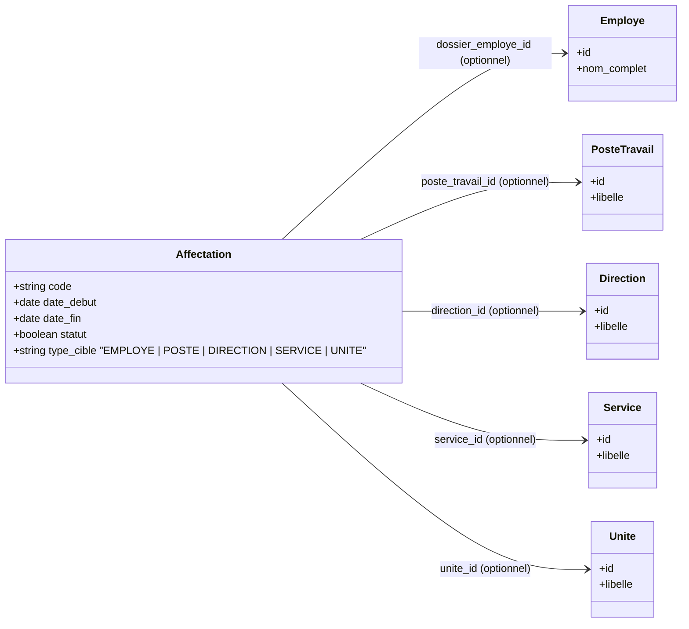

# Plan d'implémentation : Module Achat, Livraison et Ajustements Parc Info

Ce document contient l'analyse complète du module **ParcInfo** existant et propose un plan détaillé pour intégrer le module **Achat & Livraison**, gérer la séparation des statuts de stock (Magasin vs DSI), simplifier les affectations et appliquer les contraintes d'inventaire sur les équipements.

---

## 1. Analyse Complète du Module `ParcInfo` Existant

Le module `ParcInfo` gère le cycle de vie des équipements informatiques, réseaux et infrastructures du CHU.

### 1.1. Architecture des Modèles et Base de Données
Le système utilise une stratégie d'héritage de type **Class Table Inheritance (CTI)**.
* **Table parente :** `parc_info_equipements` (gérée par le modèle [Equipement](file:///home/ibrahim/projets/web/parc_info/Modules/ParcInfo/app/Models/Equipement.php)). Elle stocke les données communes à tous les équipements :
  * `code_inventaire`, `numero_serie` (uniques)
  * `marque_id` (clé étrangère vers `parc_info_marques`)
  * `modele`, `date_acquisition`, `valeur_achat`
  * `statut` (actuellement : `en_stock`, `en_service`, `en_reparation`, `perdu`, `reforme`)
  * `ref_bordereau` (référence du bordereau de livraison sous forme de chaîne libre)
  * `direction_id`, `service_id`, `unite_id` (liés à l'affectation active)
* **Tables spécialisées (liaisons 1:1) :**
  * `parc_info_ordinateurs` (modèle [Ordinateur](file:///home/ibrahim/projets/web/parc_info/Modules/ParcInfo/app/Models/Ordinateur.php)) : CPU, RAM, OS, Licences, Disque, Adresse MAC, etc.
  * `parc_info_imprimantes` (modèle [Imprimante](file:///home/ibrahim/projets/web/parc_info/Modules/ParcInfo/app/Models/Imprimante.php)) : type d'impression, couleur, multifonction, IP, SNMP.
  * `parc_info_scanners` (modèle [Scanner](file:///home/ibrahim/projets/web/parc_info/Modules/ParcInfo/app/Models/Scanner.php)) : résolution, recto-verso, chargeur, capteur.
  * Autres spécialisations : `serveurs`, `mobiles`, `reseaux`, `telephones`, `cameras_ip`.

### 1.2. Architecture Applicative et UI
* **Contrôleurs :** Les contrôleurs (ex: [OrdinateurController](file:///home/ibrahim/projets/web/parc_info/Modules/ParcInfo/app/Http/Controllers/OrdinateurController.php)) sont de type REST classique avec requêtes AJAX pour remplir les tables.
* **Vues :** Construites avec Blade sous AdminLTE 4 (Bootstrap 5) avec `bootstrap-table` pour le rendu des tableaux interactifs et SweetAlert2 pour les alertes.

---

## 2. Ajustement des Statuts de Stock et Localisation Physique

### 2.1. Séparation des Statuts de Stock
La DSI souhaite différencier le matériel en magasin (stock général) et le matériel à la disposition directe de la DSI avant déploiement.
* `en_stock_magasin` : Stock dans le magasin d'approvisionnement général.
* `en_stock_dsi` : Stock physique au niveau de la Direction des Services Informatiques.
* `en_service` : Équipement déployé et actif.

### 2.2. Séparation de la Localisation Physique et de l'Affectation
Auparavant, le local (salle/bureau) était une cible d'affectation. Pour clarifier le suivi :
* **Localisation Physique :** Nous ajoutons un champ `local_id` directement sur la table principale `parc_info_equipements` (clé étrangère vers `organisation_locaux`). Chaque équipement a ainsi un local de présence permanent ou courant.
* **Affectation (Responsabilité) :** La table des affectations (`parc_info_affectation_equipements`) ne gère plus que l'entité responsable (Poste de travail, Employé, Direction, Service, Unité).

---

## 3. Réforme du Système d'Affectation

Les affectations sont simplifiées et étendues pour permettre un ciblage direct des entités administratives :



### 3.1. Évolution des Cibles d'Affectation
Le champ `type_cible` de la table `parc_info_affectation_equipements` accepte désormais :
* `EMPLOYE` : Affecté directement à une personne.
* `POSTE` : Affecté à un poste de travail (ex: bureau d'accueil).
* `DIRECTION` : Affecté directement à une direction (sans personne spécifique).
* `SERVICE` : Affecté directement à un service spécifique.
* `UNITE` : Affecté directement à une unité.

---

## 4. Nouveau Module : `Achat` (Gestion des Commandes et Livraisons)

Le module **`Achat`** sera créé via `php artisan module:make Achat`.

### 4.1. Configuration Globale des Articles dans `Core`
Afin de centraliser les données de référence et permettre à d'autres modules de réutiliser les articles (achats généraux, mobiliers, etc.) :
* L'interface de configuration des **Articles** sera placée au niveau du module **`Core`** ou sous forme de service partagé.
* Les articles disposent d'un attribut `type_article` ("general" ou "specifique").
* Pour les articles spécifiques, un attribut `type_equipement` est configuré (ex: `ordinateur`, `imprimante`, `scanner`, `camera`, `reseau`, etc.).

### 4.2. Système d'Enregistrement Dynamique des Écrans (Formulaires)
Pour permettre d'ajouter dynamiquement des champs de saisie pour de nouveaux types d'équipements sans surcharger le module `Core` :
1. **Le Hook Registry (Laravel) :**
   Le module `Core` (ou `Achat`) met à disposition un `EquipmentFieldsRegistry`.
2. **L'Enregistrement par les modules tiers :**
   Dans le `boot()` de son Service Provider, le module `ParcInfo` (ou tout autre module d'équipements futur) enregistre les sous-formulaires spécifiques :
   ```php
   $registry->register('ordinateur', [
       'view' => 'parcinfo::achat.articles.ordinateurs_fields',
       'validation_rules' => [
           'ram_capacite_go' => 'required|integer',
           'cpu_type_id' => 'required|exists:parc_info_types_cpus,id',
           // ...
       ]
   ]);
   ```
3. **Le Rendu Dynamique dans l'UI :**
   * Lors de la saisie des détails de livraison (Bordereau de livraison), si l'article est lié à un équipement de type `ordinateur`, le système charge dynamiquement en AJAX (ou inclut en Blade) la vue `parcinfo::achat.articles.ordinateurs_fields`.
   * Cela permet d'ajouter dynamiquement de nouveaux écrans de saisie spécifiques à chaque fois qu'un nouveau type d'équipement est créé dans le système.

### 4.3. Contrainte sur les composants (Écrans physiques seuls / Unités Centrales seules)
* Les écrans de visualisation (moniteurs) et les unités centrales isolées sont configurés comme des articles de type `type_article = 'general'`.
* Lors de la validation d'une livraison, seuls les articles marqués `type_article = 'specifique'` génèrent automatiquement un équipement physique dans le module `ParcInfo`.
* Ainsi, un écran ou une unité centrale seule ne créera pas d'enregistrement autonome dans le parc informatique. Seul l'assemblage complet configuré comme article "Ordinateur" créera un équipement de type `Ordinateur`.

---

## 5. Plan de Travail Détaillé (Étapes)

### Étape 1 : Conception & Migrations de Base de Données
1. **Migrations ParcInfo :**
   * Ajouter le champ `local_id` sur la table `parc_info_equipements`.
   * Modifier la colonne `statut` de `parc_info_equipements` pour y ajouter `en_stock_magasin` et `en_stock_dsi`.
   * Mettre à jour `type_cible` dans `parc_info_affectation_equipements` pour autoriser `DIRECTION`, `SERVICE`, `UNITE` et adapter les contraintes d'intégrité.
2. **Création du module Achat :**
   * Générer le module via Artisan : `php artisan module:make Achat`.
   * Créer les tables pour les bons de commande, les bordereaux de livraison et les lignes associées.

### Étape 2 : Implémentation du Registre de Formulaires Dynamiques
1. Créer la classe `EquipmentFieldsRegistry` dans le module `Core` (ou `Achat`).
2. Mettre en place les routes et contrôleurs pour charger dynamiquement les vues de saisie d'équipements en AJAX dans les formulaires de réception.
3. Enregistrer les sous-formulaires des ordinateurs, imprimantes et scanners depuis le module `ParcInfo`.

### Étape 3 : Gestion et Configuration des Articles
1. Créer l'interface de gestion des articles dans `Core` / `Achat` (libellé, marque, type article, type équipement).
2. Ajouter la validation pour s'assurer que les écrans physiques seuls ou unités centrales seules ne soient pas configurés comme des articles générant des équipements autonomes.

### Étape 4 : Workflow Achat -> Livraison -> ParcInfo
1. Créer l'interface de saisie des Bons de Commande.
2. Créer l'interface des Bordereaux de Livraison. Lors de la saisie d'une réception d'articles de type spécifique, charger dynamiquement le sous-formulaire associé pour saisir le numéro de série, le code inventaire et les attributs techniques de chaque unité livrée.
3. Développer le service de validation de livraison :
   * Insertion transactionnelle dans `parc_info_equipements` avec le statut choisi (`en_stock_magasin` ou `en_stock_dsi`) et la localisation physique (`local_id`).
   * Insertion dans les tables filles (`parc_info_ordinateurs`, etc.).

### Étape 5 : Refonte des Affectations et Vues
1. Adapter le modèle `AffectationEquipement` et le trait de synchronisation pour prendre en compte les nouveaux types de cible (`DIRECTION`, `SERVICE`, `UNITE`).
2. Mettre à jour l'interface utilisateur d'affectation pour permettre la sélection directe d'une Direction, d'un Service ou d'une Unité.
3. Remplacer les filtres et indicateurs de stock existants par la distinction Magasin / DSI.

### Étape 6 : Validation et Tests
1. Écrire des tests fonctionnels pour valider :
   * La réception d'une livraison d'ordinateurs et leur insertion automatique.
   * L'exclusion des articles généraux (ex : écrans seuls) de l'inventaire automatique.
   * Les affectations directes aux directions, services et unités.
2. Lancer `vendor/bin/pint --dirty` sur les fichiers créés/modifiés.
