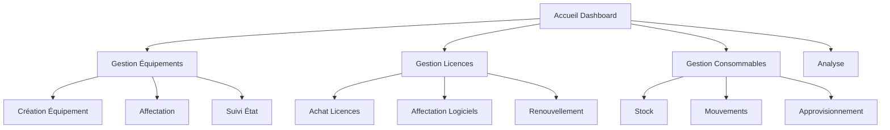
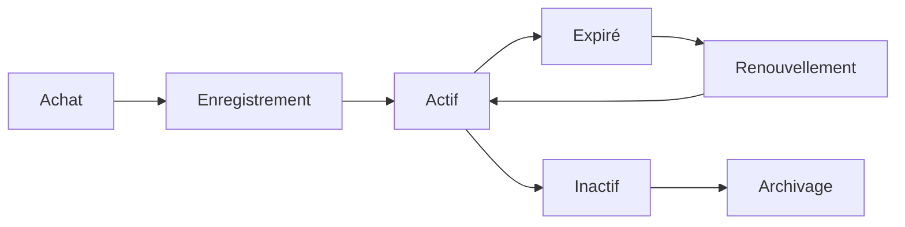
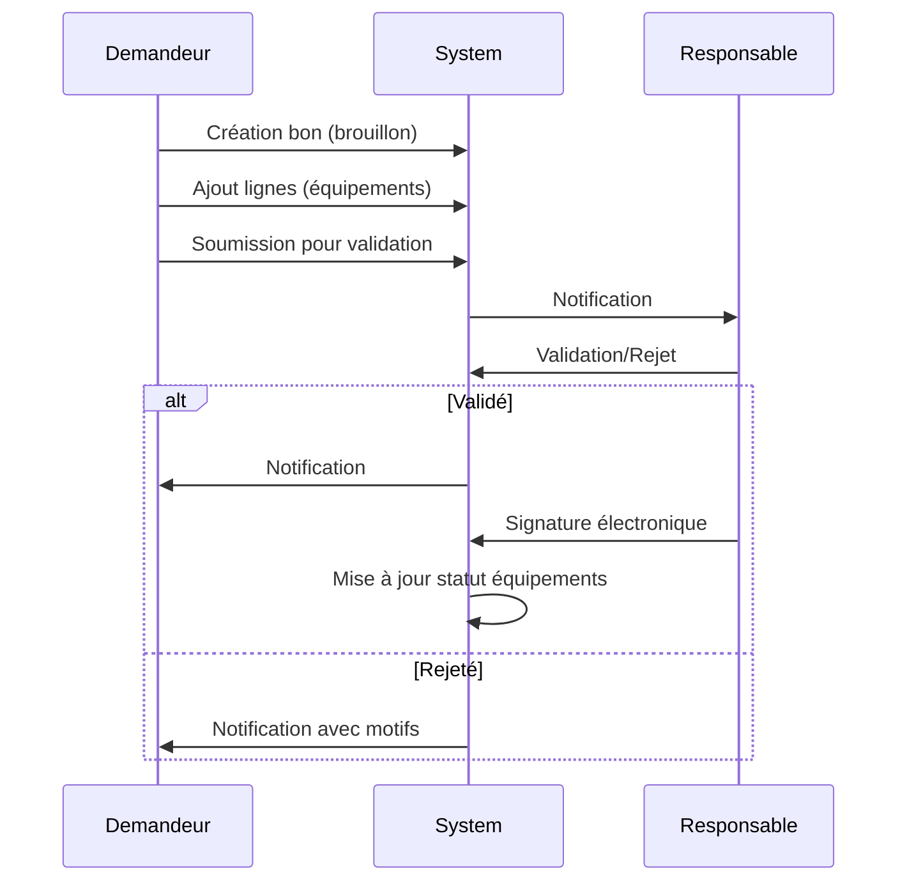

# Spécifications Fonctionnelles Détaillées - Module ParcInfo

> **Document:** vibe-specifications-fonctionnelles-parcinfo.md  
> **Version:** 1.0  
> **Date:** 11 Juillet 2026  
> **Auteur:** Mistral Vibe (Analyse automatisée)  
> **Module:** ParcInfo - Gestion du Parc Informatique  

---

## Table des Matières

1. [Introduction](#1-introduction)
2. [Architecture Technique](#2-architecture-technique)
3. [Fonctionnalités Principales](#3-fonctionnalités-principales)
4. [Modèles de Données](#4-modèles-de-données)
5. [Gestion des Équipements](#5-gestion-des-équipements)
6. [Gestion des Référentiels](#6-gestion-des-référentiels)
7. [Gestion des Licences](#7-gestion-des-licences)
8. [Gestion des Consommables](#8-gestion-des-consommables)
9. [Gestion des Fournisseurs](#9-gestion-des-fournisseurs)
10. [Gestion des Contrats de Maintenance](#10-gestion-des-contrats-de-maintenance)
11. [Bons de Répartition](#11-bons-de-répartition)
12. [Analyse et Statistiques](#12-analyse-et-statistiques)
13. [Fonctionnalités Dynamiques](#13-fonctionnalités-dynamiques)
14. [Intégration et Sécurité](#14-intégration-et-sécurité)
15. [Interfaces Utilisateur](#15-interfaces-utilisateur)
16. [API et Services](#16-api-et-services)
17. [Exigences Techniques](#17-exigences-techniques)
18. [Évolutions Futures](#18-évolutions-futures)

---

## 1. Introduction

### 1.1 Contexte

Le module **ParcInfo** est une solution complète de gestion du parc informatique développée sous Laravel, conçue pour répondre aux besoins des organisations en matière de suivi, gestion et maintenance de leur infrastructure informatique.

### 1.2 Objectifs

- Centraliser la gestion de tous les équipements informatiques
- Faciliter le suivi des affectations et des mouvements
- Automatiser la gestion des licences et leurs renouvellements
- Fournir des outils d'analyse et de reporting
- Offrir une architecture flexible et extensible

### 1.3 Périmètre

Le module couvre :
- Gestion des équipements informatiques (matériels et logiciels)
- Gestion des licences et de leurs affectations
- Gestion des consommables et du stock
- Gestion des fournisseurs et contrats
- Analyse et statistiques du parc
- Système de référentiels dynamiques

### 1.4 Public Cible

- Administrateurs système
- Responsables informatiques
- Techniciens support
- Services achats
- Direction générale (reporting)

---

## 2. Architecture Technique

### 2.1 Technologie

| Composant | Technologie | Version |
|-----------|-------------|---------|
| Framework | Laravel | 10.x |
| Base de données | PostgreSQL | - |
| Frontend | Bootstrap 5 | - |
| JavaScript | Vanilla + jQuery | - |
| CSS | SASS | - |
| Module System | Nwidart/Modules | - |
| Activity Log | Spatie Laravel-Activitylog | - |

### 2.2 Structure du Module

```
Modules/ParcInfo/
├── app/
│   ├── Console/           # Commandes Artisan
│   ├── Http/
│   │   ├── Controllers/   # 15+ contrôleurs
│   │   └── Requests/      # 30+ requêtes de validation
│   ├── Jobs/              # Tâches planifiées
│   ├── Models/            # 25+ modèles Eloquent
│   │   └── Traits/        # Functionnalités partagées
│   ├── Providers/         # Fournisseurs de services
│   └── Services/          # Services métier
├── config/               # Configuration
├── database/
│   ├── migrations/        # 20+ migrations
│   └── seeders/           # Données initiales
├── resources/
│   ├── assets/            # Assets frontend
│   └── views/             # 73+ vues Blade
└── routes/               # Routes web et API
```

### 2.3 Intégration

- **Module Laravel** : Utilise le package `nwidart/laravel-modules` pour une architecture modulaire
- **Authentification** : Intègre le système d'authentification Laravel existant
- **Organisation** : Dépend du module Organisation pour les entités (Directions, Services, Locaux, etc.)
- **GRH** : Dépend du module GRH pour la gestion des employés
- **Achat** : Intègre le module Achat pour les processus d'achat

---

## 3. Fonctionnalités Principales

### 3.1 Vue d'Ensemble

Le module ParcInfo offre **8 catégories principales** de fonctionnalités :

1. **Gestion des Équipements** - Suivi complet du cycle de vie
2. **Gestion des Référentiels** - Paramétrage flexible des données
3. **Gestion des Licences** - Suivi et alertes automatiques
4. **Gestion des Consommables** - Stock et mouvements
5. **Gestion des Fournisseurs** - Contacts et contrats
6. **Bons de Répartition** - Processus de distribution
7. **Analyse et Reporting** - Statistiques et états
8. **Configuration Dynamique** - Personnalisation des champs

### 3.2 Workflow Principal



---

## 4. Modèles de Données

### 4.1 Diagramme Entité-Relation (Simplifié)

```
┌─────────────────────────────────────────────────────────────────┐
│                        EQUIPEMENTS                                  │
├─────────────────────────────────────────────────────────────────┤
│ id | code_inventaire | numero_serie | marque_id | modele | ...      │
│ categorie_id | statut | etat | date_acquisition | valeur_achat   │
│ ref_bordereau | direction_id | service_id | unite_id | local_id │
│ tags | champs_valeurs (JSON) | created_at | updated_at               │
└─────────────────────────────────────────────────────────────────┘
                              │
                              ├─┬─ Spécialisations (One-to-One) ─┬─┐
                              │ ├──── Ordinateur (type_pc, ram, cpu, disque, os, ...)
                              │ ├──── Serveur (ip, roles, virtualisation, ...)
                              │ ├──── ServeurVirtuel (hote_id, ressources, ...)
                              │ ├──── Mobile (imei, num_tel, version_os, ...)
                              │ ├──── Imprimante (type_id, pp_multi, recto_verso, ...)
                              │ ├──── Scanner (type, resolution, ...)
                              │ ├──── Telephone (type, ligne, ...)
                              │ ├──── CameraIP (ip, resolution, ...)
                              │ └──── ... (15+ types spécialisés)
                              │
                              ├─ Has Many ─┬─ AFFECTATIONS
                              │            ├─ id | code | date_debut | date_fin | equipement_id
                              │            ├─ statut | type_affectation | type_cible
                              │            ├─ dossier_employe_id | poste_travail_id | local_id
                              │            ├─ direction_id | service_id | unite_id
                              │            └─ niveau_rattachement
                              │
                              ├─ Has Many ─ AFFECTATIONS_LICENCES
                              ├─ Has Many ─ LIGNES_BON_REPARTITION
                              ├─ Has Many ─ HISTORIQUE_CHANGEMENTS
                              └─ Belongs To ─ CATEGORIE
```

### 4.2 Catégories d'Équipements

Le module gère **2 types de catégories** :

#### 4.2.1 Catégories Prédéfines (Hardcoded)

| Code | Libellé | Modèle Spécialisé | Routes |
|------|---------|-------------------|--------|
| ordinateur | Ordinateurs | Ordinateur | /informatique/ordinateurs |
| ecran | Écrans | - | /informatique/ecrans |
| unite-centrale | Unités Centrales | - | /informatique/unites-centrales |
| serveur | Serveurs | Serveur | /informatique/serveurs |
| serveur-virtuel | Serveurs Virtuels | ServeurVirtuel | /informatique/serveurs-virtuels |
| mobile | Mobiles & Tablettes | Mobile | /informatique/mobiles |
| switch | Switches | - | /informatique/switches |
| routeur | Routeurs | - | /informatique/routeurs |
| wifi | Équipements WiFi | - | /informatique/wifi |
| parefeu | Pare-feux | - | /informatique/parefeux |
| onduleur | Onduleurs | - | /informatique/onduleurs |
| rack | Baies & Racks | - | /informatique/infrastructure/racks |
| brassage | Brassage | - | /informatique/infrastructure/brassage |
| imprimante | Imprimantes | Imprimante | /informatique/imprimantes |
| scanner | Scanners | Scanner | /informatique/scanners |
| telephone | Téléphones | Telephone | /informatique/telephonie |
| terminal-ip | Terminaux IP | - | /informatique/terminaux-ip |
| camera | Cameras IP | CameraIP | /informatique/cameras |

#### 4.2.2 Catégories Dynamiques

- Créées via l'interface d'administration
- Permettent la définition de **champs personnalisés**
- Routes générées dynamiquement à l'exécution
- Stockées dans la table `parc_info_categories_equipements`

### 4.3 Modèles Principaux

#### 4.3.1 Equipement (Table: parc_info_equipements)

| Champ | Type | Description | Obligatoire |
|-------|------|-------------|-------------|
| id | bigint | Identifiant unique | Oui |
| categorie_id | bigint | Catégorie de l'équipement | Oui |
| code_inventaire | text | Code d'inventaire unique | Oui |
| numero_serie | text | Numéro de série unique | Non |
| marque_id | bigint | Marque de l'équipement | Non |
| modele | text | Modèle de l'équipement | Oui |
| date_acquisition | date | Date d'acquisition | Non |
| date_mise_en_service | date | Date de mise en service | Non |
| valeur_achat | decimal(12,2) | Valeur d'achat | Non |
| duree_vie_probable | integer | Durée de vie en années | Non |
| date_fin_garantie | date | Date de fin de garantie | Non |
| statut | text | État de l'équipement | Oui |
| etat | text | État physique | Oui |
| tags | json | Tags pour classification | Non |
| ref_bordereau | text | Référence bordereau | Non |
| direction_id | bigint | Direction actuelle | Non |
| service_id | bigint | Service actuel | Non |
| unite_id | bigint | Unité actuelle | Non |
| local_id | bigint | Local actuel | Non |
| champs_valeurs | json | Champs dynamiques | Non |
| created_at | timestamp | Date de création | Oui |
| updated_at | timestamp | Date de modification | Oui |

**Statuts possibles :**
- `en_stock_magasin` - En stock dans le magasin
- `en_stock_dsi` - En stock DSI
- `en_stock` - En stock général
- `en_service` - En service actif
- `en_reparation` - En réparation
- `perdu` - Perdu ou volé
- `reforme` - Réformé/hors service

**États possibles :**
- `bon` - Bon état
- `passable` - État passable
- `mauvais` - Mauvais état
- `avarie` - En panne/avarié

#### 4.3.2 CategorieEquipement (Table: parc_info_categories_equipements)

| Champ | Type | Description |
|-------|------|-------------|
| id | bigint | Identifiant unique |
| code | text | Code unique de la catégorie |
| libelle | text | Libellé affiché |
| icone | text | Icône pour l'interface |

#### 4.3.3 ChampConfig (Table: parc_info_champs_config)

| Champ | Type | Description |
|-------|------|-------------|
| id | bigint | Identifiant unique |
| categorie_id | bigint | Catégorie associée |
| code | text | Code du champ |
| libelle | text | Libellé du champ |
| type_champ | text | Type de champ (text, number, select, boolean, date) |
| source_options | text | Source des options (DICT:code, JSON array) |
| regles_validation | text | Règles de validation |
| nom_panel | text | Nom du panel de regroupement |
| ordre_affichage | integer | Ordre d'affichage |
| afficher_dans_modal | boolean | Afficher dans le modal |
| afficher_dans_show | boolean | Afficher dans la page détail |
| afficher_dans_liste | boolean | Afficher dans la liste |
| ordre_colonne_liste | integer | Ordre dans la liste |

#### 4.3.4 AffectationEquipement (Table: parc_info_affectation_equipements)

| Champ | Type | Description |
|-------|------|-------------|
| id | bigint | Identifiant unique |
| code | text | Code unique de l'affectation |
| date_debut | date | Date de début d'affectation |
| date_fin | date | Date de fin d'affectation |
| equipement_id | bigint | Équipement affecté |
| statut | boolean | Statut actif/inactif |
| type_affectation | text | TEMPORAIRE ou PERMANENTE |
| type_cible | text | EMPLOYE, POSTE, ou LOCAL |
| dossier_employe_id | bigint | Employé affecté (si type_cible=EMPLOYE) |
| poste_travail_id | bigint | Poste de travail (si type_cible=POSTE) |
| local_id | bigint | Local (si type_cible=LOCAL) |
| niveau_rattachement | text | DIRECTION, SERVICE, ou UNITE |
| direction_id | bigint | Direction de rattachement |
| service_id | bigint | Service de rattachement |
| unite_id | bigint | Unité de rattachement |

---

## 5. Gestion des Équipements

### 5.1 Fonctionnalités

#### 5.1.1 Création d'Équipement

**Processus :**
1. Sélection de la catégorie d'équipement
2. Saisie des informations de base (code inventaire, numéro de série, marque, modèle)
3. Saisie des informations financières (valeur d'achat, date acquisition, garantie)
4. Définition de l'état initial (statut, état physique)
5. Saisie des champs spécifiques à la catégorie
6. Validation et enregistrement

**Champs communs à tous les équipements :**
- Code inventaire (obligatoire, unique)
- Numéro de série (unique)
- Marque (référentiel)
- Modèle
- Date d'acquisition
- Date de mise en service
- Valeur d'achat
- Durée de vie probable
- Date de fin de garantie
- Statut
- État
- Tags

#### 5.1.2 Recherche et Filtres

**Critères de recherche disponibles :**
- Code inventaire
- Numéro de série
- Modèle
- Marque
- Catégorie
- Statut
- État
- Site/Direction/Service/Unité
- Local
- Date d'acquisition
- Tags
- Champs dynamiques

**Fonctionnalités avancées :**
- Recherche full-text sur les champs principaux
- Filtres combinés (ET/OU)
- Export des résultats (CSV, Excel, PDF)
- Impression d'étiquettes

#### 5.1.3 Affectation d'Équipement

**Processus d'affectation :**
1. Sélection de l'équipement à affecter
2. Choix du type de cible (Employé, Poste de travail, Local)
3. Sélection de la cible spécifique
4. Définition de la date de début
5. Définition du type d'affectation (Temporaire/Permanente)
6. Validation et enregistrement

**Règles de gestion :**
- Un équipement ne peut avoir qu'une seule affectation active à la fois
- L'affectation active détermine la direction/service/unité de l'équipement
- Historique complet des affectations conservé
- Possibilité de désaffecter manuellement

#### 5.1.4 Suivi des Équipements

**Fonctionnalités de suivi :**
- Historique des changements (qui, quand, quoi)
- Journal des activités (via Spatie Activity Log)
- Alertes automatiques (fin de garantie, expiration licences)
- Indicateurs de performance et d'utilisation

**Changements suivis :**
- Création/modification/suppression
- Changement de statut
- Changement d'état
- Affectation/désaffectation
- Modification des champs spécifiques

### 5.2 Types d'Équipements Spécialisés

#### 5.2.1 Ordinateurs

**Champs spécifiques :**
- Type de PC (Portable, Fixe, Workstation)
- Type de RAM (référentiel)
- Capacité RAM (Go)
- Type de CPU (référentiel)
- Modèle du processeur
- Type de disque (référentiel)
- Capacité de stockage (Go)
- Type d'OS (référentiel)
- Type de licence Windows (OEM, CLE, AUCUNE)
- Clé de licence Windows
- Type de licence Office (CLE, AUCUNE)
- Clé de licence Office
- Support TPM 2.0
- Support Secure Boot
- Version BIOS
- Version UEFI
- Nom d'hôte
- Compte administrateur local
- Domaine/Workgroup
- Adresse MAC WiFi
- Adresse MAC Ethernet
- Cycle de batterie (pour portables)

#### 5.2.2 Serveurs

**Champs spécifiques :**
- Adresse IP principale
- Adresse IP secondaire
- Rôles (Web, Base de données, Fichiers, etc.)
- Système d'exploitation
- Version OS
- Architecture (32/64 bits)
- Nombre de CPU
- Mémoire totale (Go)
- Espace disque total (Go)
- Virtualisation (Oui/Non)
- Type de virtualisation
- Hôte (pour serveurs virtuels)
- Nom d'hôte
- Domaine

#### 5.2.3 Serveurs Virtuels

**Champs spécifiques :**
- Hôte physique (référence à un serveur)
- Nom de la machine virtuelle
- OS invité
- CPU alloués
- RAM allouée (Go)
- Disque alloué (Go)
- Statut (En cours, Arrêté, Suspendu)

#### 5.2.4 Mobiles & Tablettes

**Champs spécifiques :**
- Type de mobile (référentiel : Tablette, Smartphone, Lecteur code-barre)
- IMEI 1
- IMEI 2
- Numéro de téléphone associé
- Version OS
- Statut MDM (Enrôlé, Non enrôlé)
- Capacité de batterie (mAh)
- État de l'écran
- Présence de coque de protection

#### 5.2.5 Imprimantes

**Champs spécifiques :**
- Type d'imprimante (référentiel : LASER, JET_ENCRE, MATRICIELLE)
- Impression recto-verso (Oui/Non)
- Impression multiple pages par feuille
- Résolution (DPI)
- Vitesse d'impression (PPM)
- Type de connexion (USB, Réseau, WiFi)
- Adresse IP
- Compteur page noir
- Compteur page couleur
- Niveau toner noir (%)
- Niveau toner couleur (%)

#### 5.2.6 Caméras IP

**Champs spécifiques :**
- Adresse IP
- Résolution
- Type de caméra
- Emplacement
- Angle de vue
- Stockage (Local, Cloud)
- Accès distant (Oui/Non)

### 5.3 Gestion des État

#### 5.3.1 Impression d'Étiquettes

**Fonctionnalités :**
- Génération d'étiquettes pour un équipement unique
- Impression multiple d'étiquettes pour plusieurs équipements
- Centre d'impression avec sélection multiple
- Personnalisation du format d'étiquette
- Export en PDF

**Informations sur l'étiquette :**
- Code inventaire
- Numéro de série
- Marque et modèle
- Catégorie (icône)
- Code QR (optionnel)

#### 5.3.2 États et Statuts

**Transitions de statut autorisées :**
```
┌─────────────┐    en_stock    ┌─────────────┐
│  en_stock   │───────────────►│ en_service   │
└─────────────┘                └─────────────┘
       ▲                                 │
       │                                 │ en_reparation
       │                                 ▼
       │                          ┌─────────────┐
       └─────────────────────────┤ en_reparation │
                                  └─────────────┘
                                         │
                    ┌────────────────────────┴────────────────────────┐
                    │                                             │
                    ▼                                             ▼
             ┌─────────────┐                             ┌─────────────┐
             │   perdu     │                             │  reforme    │
             └─────────────┘                             └─────────────┘
```

---

## 6. Gestion des Référentiels

### 6.1 Vue d'Ensemble

Le module propose **11 référentiels principaux** pour la standardisation des données :

### 6.2 Référentiels de Base

#### 6.2.1 Marques (parc_info_marques)

- **Description** : Liste des marques des équipements
- **Champs** : libelle (unique)
- **Utilisation** : Tous les types d'équipements
- **Gestion** : CRUD complet + recherche

#### 6.2.2 Types de RAM (parc_info_types_rams)

- **Description** : Types de mémoire RAM
- **Exemples** : DDR3, DDR4, DDR5, LPDDR4, etc.
- **Utilisation** : Ordinateurs, Serveurs

#### 6.2.3 Types de CPU (parc_info_types_cpus)

- **Description** : Types de processeurs
- **Exemples** : Intel Core i3, Intel Core i5, Intel Core i7, AMD Ryzen 5, etc.
- **Utilisation** : Ordinateurs, Serveurs

#### 6.2.4 Types de Disques (parc_info_types_disques)

- **Description** : Types de stockage
- **Exemples** : HDD, SSD, SSD NVMe, SSD SATA, etc.
- **Utilisation** : Ordinateurs, Serveurs

#### 6.2.5 Types d'OS (parc_info_types_os)

- **Description** : Systèmes d'exploitation
- **Exemples** : Windows 10, Windows 11, Ubuntu 20.04, Ubuntu 22.04, macOS, etc.
- **Utilisation** : Ordinateurs, Serveurs, Mobiles

#### 6.2.6 Types d'Imprimantes (parc_info_types_imprimantes)

- **Description** : Technologies d'impression
- **Exemples** : LASER, JET_ENCRE, MATRICIELLE
- **Utilisation** : Imprimantes

#### 6.2.7 Types de Mobiles (parc_info_types_mobiles)

- **Description** : Types d'appareils mobiles
- **Exemples** : Tablette, Smartphone, Lecteur code-barre, Terminal portable
- **Utilisation** : Mobiles

#### 6.2.8 Types de Licences (parc_info_types_licences)

- **Description** : Types de licences logicielles
- **Exemples** : Perpetuelle, Abonnement, Volume, OEM, etc.
- **Utilisation** : Licences

#### 6.2.9 Types de Consommables (parc_info_types_consommables)

- **Description** : Catégories de consommables
- **Exemples** : Cartouche toner, Cartouche encre, Papier, etc.
- **Utilisation** : Consommables

#### 6.2.10 Éditeurs (parc_info_editeurs)

- **Description** : Éditeurs de logiciels
- **Champs** : libelle
- **Utilisation** : Logiciels, Licences

### 6.3 Dictionnaires Dynamiques

#### 6.3.1 Structure

Le module implémente un système de **dictionnaires dynamiques** pour les champs à valeurs prédéfinies :

**Tables :**
- `parc_info_dictionnaires` : Définition des dictionnaires
- `parc_info_dictionnaires_valeurs` : Valeurs associées

**Champs de Dictionnaire :**
- id : Identifiant unique
- code : Code unique du dictionnaire
- libelle : Libellé du dictionnaire
- description : Description optionnelle

**Champs de Valeur de Dictionnaire :**
- id : Identifiant unique
- dictionnaire_id : Dictionnaire parent
- valeur : Valeur affichée
- code : Code optionnel
- ordre : Ordre d'affichage

#### 6.3.2 Utilisation

Les dictionnaires sont utilisés dans :
- Les champs de configuration dynamique (ChampConfig.source_options = "DICT:code")
- Les types de champs de type "select"
- Les références croisées entre modules

#### 6.3.3 Exemples de Dictionnaires

| Code | Libellé | Description | Valeurs typiques |
|------|---------|-------------|------------------|
| type_ram | Types RAM | Types de mémoire | DDR3, DDR4, DDR5 |
| type_os | Types OS | Systèmes d'exploitation | Windows 10, Windows 11 |
| type_disque | Types Disque | Types de stockage | HDD, SSD, NVMe |
| etat_equipement | États | États physiques | Bon, Passable, Mauvais |
| statut_affectation | Statuts | Statuts d'affectation | Temporaire, Permanente |

### 6.4 Catégories et Champs Dynamiques

#### 6.4.1 Fonctionnement

Le module permet de créer des **catégories d'équipements personnalisées** avec des **champs dynamiques** :

1. **Création de catégorie** : Définition d'une nouvelle catégorie avec code et libellé
2. **Ajout de champs** : Définition des champs spécifiques à la catégorie
3. **Configuration des champs** : Type, options, validation, affichage
4. **Génération automatique des routes** : Les routes sont créées dynamiquement

#### 6.4.2 Types de Champs Supportés

| Type | Description | Exemple |
|------|-------------|---------|
| text | Texte simple | Numéro d'asset |
| textarea | Texte long | Description |
| number | Nombre | Capacité (Go) |
| select | Sélection | Type de processeur |
| boolean | Booléen | Support TPM |
| date | Date | Date de maintenance |

#### 6.4.3 Configuration des Champs

**Paramètres de configuration :**
- `code` : Identifiant unique du champ
- `libelle` : Libellé affiché
- `type_champ` : Type de champ
- `source_options` : Source des options (DICT:code ou JSON)
- `regles_validation` : Règles de validation (Laravel validation rules)
- `nom_panel` : Groupe de champs (panel)
- `ordre_affichage` : Position dans le formulaire
- `afficher_dans_modal` : Visible dans les modals
- `afficher_dans_show` : Visible dans la page détail
- `afficher_dans_liste` : Visible dans la liste
- `ordre_colonne_liste` : Position dans la liste

#### 6.4.4 Builder de Valeurs de Dictionnaire

Le module inclut un `DictionnaireValeurBuilder` pour faciliter la création de valeurs de dictionnaire depuis des modèles existants.

---

## 7. Gestion des Licences

### 7.1 Modèle de Données

#### 7.1.1 Licence (Table: parc_info_licences)

| Champ | Type | Description |
|-------|------|-------------|
| id | bigint | Identifiant unique |
| code | text | Code de la licence |
| logiciel_id | bigint | Logiciel associé |
| type_licence_id | bigint | Type de licence |
| fournisseur_id | bigint | Fournisseur |
| numero_contrat | text | Numéro de contrat |
| cle_licence | text | Clé de licence |
| nombre_postes | integer | Nombre de postes autorisés |
| date_acquisition | date | Date d'achat |
| date_expiration | date | Date d'expiration |
| date_fin_support | date | Date de fin de support |
| cout | decimal(12,2) | Coût d'acquisition |
| cout_renouvellement | decimal(12,2) | Coût de renouvellement |
| statut | text | Statut (actif, expiré, inactif) |
| notes | text | Notes diverses |
| tags | json | Tags |

#### 7.1.2 Logiciel (Table: parc_info_logiciels)

| Champ | Type | Description |
|-------|------|-------------|
| id | bigint | Identifiant unique |
| editeur_id | bigint | Éditeur du logiciel |
| libelle | text | Nom du logiciel |
| version | text | Version |
| description | text | Description |
| site_web | text | Site web |
| actif | boolean | Statut actif |

#### 7.1.3 AffectationLicence (Table: parc_info_affectations_licences)

| Champ | Type | Description |
|-------|------|-------------|
| id | bigint | Identifiant unique |
| licence_id | bigint | Licence affectée |
| equipement_id | bigint | Équipement cible (optionnel) |
| dossier_employe_id | bigint | Employé cible (optionnel) |
| poste_travail_id | bigint | Poste cible (optionnel) |
| date_debut | date | Date de début d'affectation |
| date_fin | date | Date de fin d'affectation |
| actif | boolean | Statut actif |

#### 7.1.4 DocumentLicence (Table: parc_info_documents_licences)

| Champ | Type | Description |
|-------|------|-------------|
| id | bigint | Identifiant unique |
| licence_id | bigint | Licence associée |
| nom_fichier | text | Nom du fichier |
| chemin_fichier | text | Chemin de stockage |
| type_document | text | Type (contrat, facture, preuve) |

### 7.2 Fonctionnalités

#### 7.2.1 Gestion du Cycle de Vie



**Processus :**
1. **Achat** : Saisie des informations de licence (fournisseur, contrat, clé)
2. **Enregistrement** : Association au logiciel, définition des dates
3. **Affectation** : Attribution à un équipement ou un utilisateur
4. **Suivi** : Vérification des dates d'expiration
5. **Renouvellement** : Processus de renouvellement avec historique
6. **Archivage** : Archivage des licences obsolètes

#### 7.2.2 Affectation des Licences

**Types d'affectation :**
- **Par équipement** : Licence attachée à un équipement spécifique
- **Par utilisateur** : Licence attachée à un employé
- **Par poste** : Licence attachée à un poste de travail

**Règles :**
- Une licence peut être affectée à plusieurs cibles (selon le nombre de postes)
- Le suivi du nombre de postes utilisés est automatique
- Alertes en cas de dépassement du nombre de postes autorisés

#### 7.2.3 Alertes Automatiques

**Job planifié :** `VerifierExpirationLicences`

**Vérifications effectuées :**
- Licences expirant dans 30 jours
- Licences expirant dans 7 jours
- Licences expirées
- Licences dont le support se termine

**Actions :**
- Envoi de notifications aux administrateurs
- Mise à jour du statut des licences
- Création de rappels dans le système

#### 7.2.4 Renouvellement

**Processus :**
1. Sélection de la licence à renouveler
2. Saisie des nouvelles informations (date, coût)
3. Mise à jour de la date d'expiration
4. Archivage de l'ancienne version (optionnel)
5. Enregistrement du renouvellement

### 7.3 Services Associés

#### 7.3.1 LicenceService

**Fonctionnalités :**
- Calcul du nombre de postes disponibles
- Vérification des expirations
- Génération de rapports de conformité
- Gestion des renouvellements

---

## 8. Gestion des Consommables

### 8.1 Modèle de Données

#### 8.1.1 Consommable (Table: parc_info_consommables)

| Champ | Type | Description |
|-------|------|-------------|
| id | bigint | Identifiant unique |
| code | text | Code du consommable |
| type_consommable_id | bigint | Type de consommable |
| libelle | text | Libellé |
| description | text | Description |
| marque | text | Marque |
| reference_fournisseur | text | Référence fournisseur |
| stock_minimal | integer | Stock minimal |
| stock_actuel | integer | Stock actuel |
| unite_mesure | text | Unité de mesure (pièce, boîte, etc.) |
| emplacement | text | Emplacement de stockage |
| actif | boolean | Statut actif |
| tags | json | Tags |

#### 8.1.2 TypeConsommable (Table: parc_info_types_consommables)

| Champ | Type | Description |
|-------|------|-------------|
| id | bigint | Identifiant unique |
| libelle | text | Libellé du type |
| description | text | Description |

#### 8.1.3 MouvementConsommable (Table: parc_info_mouvements_consommables)

| Champ | Type | Description |
|-------|------|-------------|
| id | bigint | Identifiant unique |
| consommable_id | bigint | Consommable concerné |
| type_mouvement | text | Type (entree, sortie, inventaire) |
| quantite | integer | Quantité mouvementée |
| date_mouvement | date | Date du mouvement |
| service | text | Service concerné |
| unite | text | Unité concernée |
| responsable | text | Responsable |
| observation | text | Observations |

#### 8.1.4 AffectationConsommable (Table: parc_info_affectations_consommables)

| Champ | Type | Description |
|-------|------|-------------|
| id | bigint | Identifiant unique |
| consommable_id | bigint | Consommable affecté |
| equipement_id | bigint | Équipement cible (optionnel) |
| employe_id | bigint | Employé cible (optionnel) |
| local_id | bigint | Local cible (optionnel) |
| date_affectation | date | Date d'affectation |
| quantite | integer | Quantité affectée |
| statut | text | Statut (en_cours, consomme, retourne) |

### 8.2 Fonctionnalités

#### 8.2.1 Gestion du Stock

**Opérations supportées :**
- **Entrée en stock** : Réception de nouveaux consommables
- **Sortie de stock** : Distribution ou utilisation
- **Inventaire** : Correction des quantités
- **Mouvement** : Transfert entre emplacements

**Règles de gestion :**
- Suivi des quantités en temps réel
- Alerte automatique lorsque le stock passe sous le seuil minimal
- Historique complet des mouvements
- Traçabilité des affectations

#### 8.2.2 Approvisionnement

**Processus :**
1. Sélection du consommable à approvisionner
2. Saisie de la quantité reçue
3. Mise à jour du stock
4. Enregistrement du mouvement d'entrée
5. Mise à jour automatique du fournisseur (optionnel)

#### 8.2.3 Consommation

**Processus :**
1. Sélection du consommable à consommer
2. Définition de la quantité
3. Sélection de la cible (équipement, employé, local)
4. Enregistrement de la consommation
5. Mise à jour du stock
6. Création de l'affectation

#### 8.2.4 Services Associés

#### 8.2.5 GestionStockService

**Fonctionnalités :**
- Calcul des seuils d'alerte
- Génération de rapports de stock
- Suivi des mouvements par période
- Statistiques de consommation

---

## 9. Gestion des Fournisseurs

### 9.1 Modèle de Données

#### 9.1.1 Fournisseur (Table: parc_info_fournisseurs)

| Champ | Type | Description |
|-------|------|-------------|
| id | bigint | Identifiant unique |
| code | text | Code fournisseur |
| libelle | text | Nom du fournisseur |
| description | text | Description |
| adresse | text | Adresse complète |
| code_postal | text | Code postal |
| ville | text | Ville |
| pays | text | Pays |
| telephone | text | Téléphone |
| email | text | Email |
| site_web | text | Site web |
| contact_principal | text | Contact principal |
| actif | boolean | Statut actif |
| tags | json | Tags |

#### 9.1.2 Contact (Table: parc_info_contacts)

| Champ | Type | Description |
|-------|------|-------------|
| id | bigint | Identifiant unique |
| fournisseur_id | bigint | Fournisseur parent |
| nom | text | Nom du contact |
| prenom | text | Prénom |
| poste | text | Poste occupé |
| telephone | text | Téléphone |
| email | text | Email |
| principal | boolean | Contact principal |
| notes | text | Notes |

#### 9.1.3 ContratMaintenance (Table: parc_info_contrats_maintenances)

| Champ | Type | Description |
|-------|------|-------------|
| id | bigint | Identifiant unique |
| code | text | Numéro de contrat |
| fournisseur_id | bigint | Fournisseur |
| libelle | text | Libellé du contrat |
| description | text | Description |
| date_debut | date | Date de début |
| date_fin | date | Date de fin |
| cout | decimal(12,2) | Coût du contrat |
| periodicite | text | Périodicité (mensuel, trimestriel, annuel) |
| type_contrat | text | Type (maintenance, support, garantie) |
| statut | text | Statut (actif, terminé, résilié) |
| pieces_jointes | json | Liste des pièces jointes |

### 9.2 Fonctionnalités

#### 9.2.1 Gestion des Fournisseurs

**Opérations :**
- Création, modification, suppression
- Recherche et filtrage
- Activation/désactivation
- Gestion des contacts
- Association aux équipements/licences

#### 9.2.2 Gestion des Contacts

**Fonctionnalités :**
- Ajout de contacts par fournisseur
- Définition du contact principal
- Historique des interactions
- Export des coordonnées

#### 9.2.3 Gestion des Contrats

**Processus :**
1. Création du contrat avec fournisseur
2. Définition des dates et coûts
3. Association aux équipements concernés
4. Suivi des échéances
5. Gestion des renouvellements

**Alertes :**
- Contrats arrivant à échéance
- Contrats nécessitant un renouvellement
- Contrats sans activité récente

---

## 10. Gestion des Contrats de Maintenance

### 10.1 Intégration

Les contrats de maintenance sont gérés dans le contexte des fournisseurs mais peuvent être associés à :
- Des équipements spécifiques
- Des catégories d'équipements
- Des services complets

### 10.2 Fonctionnalités Spécifiques

- **Suivi des niveaux de service** (SLA)
- **Gestion des interventions**
- **Historique des appels**
- **Évaluation de la satisfaction**
- **Analyse des coûts**

---

## 11. Bons de Répartition

### 11.1 Modèle de Données

#### 11.1.1 BonRepartition (Table: parc_info_bons_repartition)

| Champ | Type | Description |
|-------|------|-------------|
| id | bigint | Identifiant unique |
| code | text | Numéro de bon |
| date_creation | date | Date de création |
| date_validation | date | Date de validation |
| demandeur_id | bigint | Employé demandeur |
| service_demandeur_id | bigint | Service demandeur |
| statut | text | Statut (brouillon, en_cours, valide, clore) |
| objet | text | Objet du bon |
| observation | text | Observations |

#### 11.1.2 LigneBonRepartition (Table: parc_info_lignes_bons_repartition)

| Champ | Type | Description |
|-------|------|-------------|
| id | bigint | Identifiant unique |
| bon_repartition_id | bigint | Bon parent |
| equipement_id | bigint | Équipement concerné |
| quantite | integer | Quantité (pour consommables) |
| description | text | Description |
| signe_par | bigint | Employé qui a signé |
| date_signature | date | Date de signature |
| statut | text | Statut (en_attente, signe, refuse) |

### 11.2 Fonctionnalités

#### 11.2.1 Processus de Répartition



#### 11.2.2 Gestion des Lignes

**Opérations :**
- Ajout d'équipements au bon
- Modification des lignes
- Suppression de lignes
- Signature électronique
- Suivi des statuts

#### 11.2.3 Impression et Export

**Fonctionnalités :**
- Impression du bon de répartition
- Export en PDF
- Historique des bons
- Statistiques par service/demandeur

---

## 12. Analyse et Statistiques

### 12.1 Tableau de Bord

**Indicateurs clés :**
- Nombre total d'équipements par catégorie
- Valeur du parc informatique
- Équipements en service vs en stock
- Alertes en cours (licences, garanties, stocks)
- Activité récente

### 12.2 États Personnalisés

#### 12.2.1 ÉtatController

**Fonctionnalités :**
- Création d'états personnalisés
- Définition des critères de filtrage
- Génération de rapports
- Export en PDF/Excel

**Exemples d'états :**
- Équipements par service
- Équipements arrivant en fin de garantie
- Licences à renouveler
- Consommables à réapprovisionner
- Historique des mouvements

#### 12.2.2 Fonctionnalités d'Export

- **PDF** : Rapports formatés avec mise en page
- **Excel** : Données brutes pour analyse
- **CSV** : Export simple pour intégration
- **Planification** : Génération automatique périodique

### 12.3 StatistiquesController

**Indicateurs calculés :**
- Répartition par catégorie
- Répartition par statut
- Répartition par état
- Valeur moyenne par catégorie
- Âge moyen du parc
- Taux d'utilisation
- Historique des acquisitions

**Visualisations :**
- Graphiques en barres
- Graphiques circulaires
- Graphiques linéaires (tendances)
- Tableaux croisés dynamiques

### 12.4 Filtrage Avancé

**Critères disponibles :**
- Période (date d'acquisition, date de mise en service)
- Catégorie
- Statut
- État
- Service/Direction/Unité
- Fournisseur
- Marque
- Valeur (plage de prix)
- Tags

---

## 13. Fonctionnalités Dynamiques

### 13.1 Migration Dynamique

Le module inclut une commande Artisan pour la migration des équipements vers le système dynamique :

```bash
php artisan parc-info:migrate-equipment-to-dynamic
```

**Fonctionnalités :**
- Migration des anciennes structures vers le nouveau modèle
- Conservation des données historiques
- Conversion des champs spécifiques
- Vérification de l'intégrité des données

### 13.2 Routes Dynamiques

**Mécanisme :**
1. À chaque chargement des routes, le système vérifie les catégories dynamiques
2. Pour chaque catégorie non prédéfine, des routes sont générées
3. Les routes utilisent le même contrôleur (EquipementDynamiqueController)
4. La catégorie est passée comme paramètre par défaut

**Exemple :**
```php
// Catégorie dynamique "projecteur" créée en base
// Génère automatiquement :
// GET    /parc-info/informatique/projecteurs
// GET    /parc-info/informatique/projecteurs/data
// POST   /parc-info/informatique/projecteurs
// GET    /parc-info/informatique/projecteurs/{id}
// etc.
```

### 13.3 Champs Personnalisés

**Types supportés :**
- Texte court
- Texte long
- Nombre
- Date
- Booléen (case à cocher)
- Sélection (liste déroulante)
- Sélection multiple

**Sources de données pour les sélections :**
- Dictionnaires internes (DICT:code)
- Valeurs statiques (JSON)
- Référentiels externes

---

## 14. Intégration et Sécurité

### 14.1 Intégration avec d'autres Modules

#### 14.1.1 Module Organisation

**Dépendances :**
- Directions
- Services
- Unités
- Locaux
- Étages
- Bâtiments
- Sites
- Postes de travail

**Utilisation :**
- Affectation des équipements
- Localisation physique
- Rattachement organisationnel

#### 14.1.2 Module GRH

**Dépendances :**
- Employés (Dossiers employés)
- Organigramme

**Utilisation :**
- Affectation des équipements aux employés
- Gestion des licences par utilisateur
- Suivi des responsabilités

#### 14.1.3 Module Achat

**Intégration :**
- Processus d'acquisition
- Suivi des commandes
- Réception des équipements
- Gestion des budgets

### 14.2 Sécurité

#### 14.2.1 Authentification

- Intègre le système d'authentification Laravel
- Middleware `auth` obligatoire pour toutes les routes
- Gestion des permissions via le système central

#### 14.2.2 Permissions

**Fichier de configuration :** `Modules/ParcInfo/config/permissions.php`

**Permissions définies :**
- Visualisation des équipements
- Création/modification/suppression
- Gestion des affectations
- Gestion des référentiels
- Gestion des licences
- Gestion des consommables
- Accès aux rapports

#### 14.2.3 Audit et Traçabilité

**Fonctionnalités :**
- Journalisation complète via Spatie Activity Log
- Suivi de toutes les modifications
- Historique des changements
- Export des logs pour audit

**Données journalisées :**
- Qui a effectué l'action
- Quand
- Quelle action
- Quelles données ont été modifiées
- Valeurs avant/après

### 14.3 Validation des Données

**Requêtes de validation dédiées :**
- 30+ classes de requêtes (Form Requests)
- Validation côté serveur
- Messages d'erreur personnalisés
- Validation conditionnelle

**Exemples de validation :**
- Unicité des codes inventaire
- Format des numéros de série
- Plages de dates cohérentes
- Contraintes métiers spécifiques

---

## 15. Interfaces Utilisateur

### 15.1 Structure des Vues

```
resources/views/
├── analyse/
│   ├── etats/
│   │   ├── index.blade.php      # Liste des états
│   │   └── pdf.blade.php        # Export PDF
│   └── statistiques/
│       └── index.blade.php      # Tableau de bord stats
├── components/
│   └── layouts/
│       └── master.blade.php     # Layout principal
├── dashboard/
│   └── index.blade.php          # Dashboard
├── informatique/
│   ├── bons-repartition/
│   │   ├── index.blade.php      # Liste bons
│   │   ├── show.blade.php       # Détail bon
│   │   └── imprimer.blade.php   # Impression
│   ├── consommables/
│   │   ├── index.blade.php      # Liste consommables
│   │   ├── _modal.blade.php      # Modal gestion
│   │   ├── _modal_mouvements.blade.php
│   │   └── show.blade.php        # Détail consommable
│   ├── fournisseurs/
│   │   ├── index.blade.php
│   │   ├── create.blade.php
│   │   ├── show.blade.php
│   │   ├── _modal.blade.php
│   │   └── partials/
│   ├── licences/
│   │   ├── index.blade.php
│   │   ├── create.blade.php
│   │   ├── show.blade.php
│   │   └── _modal.blade.php
│   ├── logiciels/
│   │   ├── index.blade.php
│   │   ├── show.blade.php
│   │   └── _modal.blade.php
│   ├── index.blade.php           # Page principale informatique
│   ├── show.blade.php           # Détail équipement
│   ├── _licences.blade.php       # Onglet licences
│   ├── _selection_modals.blade.php
│   ├── _wizard.blade.php         # Assistant création
│   └── equipements/
│       ├── centre_impression.blade.php
│       ├── etiquette.blade.php
│       └── etiquettes_multiples.blade.php
├── layouts/
│   ├── master.blade.php
│   └── partials/
│       ├── navbar.blade.php
│       └── sidebar.blade.php
├── referentiels/
│   ├── categories/
│   │   ├── index.blade.php
│   │   ├── show.blade.php
│   │   ├── _modal.blade.php
│   │   └── _modal_field.blade.php
│   ├── dictionnaires/
│   │   ├── index.blade.php
│   │   ├── values.blade.php
│   │   ├── _modal.blade.php
│   │   └── _modal_values.blade.php
│   ├── editeurs/
│   │   ├── index.blade.php
│   │   └── _modal.blade.php
│   ├── marques/
│   │   ├── index.blade.php
│   │   └── _modal.blade.php
│   ├── types-consommables/
│   │   ├── index.blade.php
│   │   └── _modal.blade.php
│   ├── types-cpus/
│   │   ├── index.blade.php
│   │   └── _modal.blade.php
│   ├── types-disques/
│   │   ├── index.blade.php
│   │   └── _modal.blade.php
│   ├── types-imprimantes/
│   │   ├── index.blade.php
│   │   └── _modal.blade.php
│   ├── types-licences/
│   │   ├── index.blade.php
│   │   └── _modal.blade.php
│   ├── types-mobiles/
│   │   ├── index.blade.php
│   │   └── _modal.blade.php
│   └── types-os/
│       ├── index.blade.php
│       └── _modal.blade.php
├── shared/
│   ├── _modal_contact.blade.php
│   ├── _modal_contrat_maintenance.blade.php
│   ├── _modal_editeur.blade.php
│   ├── _modal_fournisseur.blade.php
│   ├── _modal_selection_equipement.blade.php
│   └── _modal_type_consommable.blade.php
└── index.blade.php               # Page d'accueil module
```

### 15.2 Composants UI

**Librairies utilisées :**
- Bootstrap 5 pour le styling
- Bootstrap Icons pour les icônes
- DataTables pour les tableaux avancés
- Select2 pour les sélections améliorées
- jQuery pour les interactions

**Patterns UI :**
- **Modals** : Pour les opérations CRUD rapides
- **Wizards** : Assistants multi-étapes pour la création
- **Cards** : Affichage des informations détaillées
- **Tabs** : Organisation des informations par onglets
- **Tooltips** : Aide contextuelle

### 15.3 Expérience Utilisateur

**Fonctionnalités UX :**
- Recherche en temps réel
- Filtres persistants
- Pagination avancée
- Export multiple formats
- Notifications toast
- Confirmation des actions critiques
- Historique de navigation

---

## 16. API et Services

### 16.1 Routes API

Le module expose des routes API pour l'intégration avec d'autres systèmes :

```php
// Prefix: /api/parc-info
Route::middleware('api')->prefix('api/parc-info')->group(function () {
    // Routes API à définir
});
```

**Fonctionnalités API potentielles :**
- Récupération des équipements
- Création/modification à distance
- Intégration avec des systèmes de monitoring
- Webhooks pour les notifications

### 16.2 Services Métier

#### 16.2.1 GestionStockService

**Responsabilités :**
- Gestion des mouvements de stock
- Calcul des seuils d'alerte
- Validation des opérations
- Génération de rapports

#### 16.2.2 LicenceService

**Responsabilités :**
- Vérification des expirations
- Gestion des affectations
- Calcul de la conformité
- Notifications automatiques

### 16.3 Commandes Artisan

#### 16.3.1 MigrateEquipmentToDynamic

**Description :** Migration des équipements vers le système dynamique

**Utilisation :**
```bash
php artisan parc-info:migrate-equipment-to-dynamic
```

**Options :**
- `--category` : Migrer une catégorie spécifique
- `--dry-run` : Simulation sans modification
- `--force` : Forcer la migration

---

## 17. Exigences Techniques

### 17.1 Prérequis Serveur

- PHP 8.1+
- PostgreSQL 13+
- Composer 2.x
- Node.js 16+ (pour les assets)
- Extension PHP : pdo_pgsql, json, mbstring, etc.

### 17.2 Dependencies Composer

```json
{
    "require": {
        "php": "^8.1",
        "laravel/framework": "^10.0",
        "nwidart/laravel-modules": "^10.0",
        "spatie/laravel-activitylog": "^4.0"
    }
}
```

### 17.3 Dependencies NPM

```json
{
    "dependencies": {
        "bootstrap": "^5.3",
        "@popperjs/core": "^2.11",
        "jquery": "^3.7",
        "datatables.net": "^1.13",
        "select2": "^4.0"
    }
}
```

### 17.4 Configuration

**Fichiers de configuration :**
- `Modules/ParcInfo/config/config.php` - Configuration principale
- `Modules/ParcInfo/config/permissions.php` - Permissions

**Variables d'environnement :**
```env
# Pas de variables spécifiques requises
# Utilise la configuration Laravel standard
```

---

## 18. Évolutions Futures

### 18.1 Roadmap

#### Version 2.0 (Prévue)
- [ ] Intégration avec un système de ticketing (GLPI, etc.)
- [ ] API REST complète
- [ ] Webhooks pour les notifications externes
- [ ] Import/Export massifs améliorés
- [ ] Dashboard personnalisable par utilisateur

#### Version 2.1
- [ ] Gestion des garanties étendues
- [ ] Intégration avec des outils de monitoring
- [ ] Suivi des coûts de maintenance
- [ ] Analyse prédictive

#### Version 2.2
- [ ] Application mobile pour l'inventaire
- [ ] Scan QR code pour l'identification
- [ ] Géolocalisation des équipements
- [ ] Intégration IoT (capteurs)

### 18.2 Améliorations Possibles

1. **Performance**
   - Optimisation des requêtes pour les grandes bases
   - Cache agressif des données statiques
   - Indexation avancée

2. **Sécurité**
   - Audit plus granulaire
   - Intégration avec des solutions SIEM
   - Authentification multi-facteurs

3. **Utilisabilité**
   - Interface plus intuitive
   - Personnalisation avancée
   - Documentation intégrée

4. **Extensibilité**
   - Plugin system pour les intégrations
   - API plus complète
   - Support multi-tenant

### 18.3 Problèmes Connus

1. **Migration des anciennes données** : La commande de migration peut nécessiter des ajustements pour les données très anciennes
2. **Performance des recherches JSON** : Les recherches sur les champs JSON peuvent être lentes sur de grandes tables
3. **Complexité des rôles** : La gestion fine des permissions peut devenir complexe

---

## Annexes

### A. Liste Complète des Routes Web

Voir le fichier `Modules/ParcInfo/routes/web.php` pour la liste exhaustive des 100+ routes.

### B. Schéma Complet de la Base de Données

Voir les fichiers de migration dans `Modules/ParcInfo/database/migrations/`.

### C. Diagrammes d'Architecture

Des diagrammes détaillés peuvent être générés à partir du code source.

### D. Historique des Versions

| Version | Date | Description |
|---------|------|-------------|
| 1.0 | Mars 2026 | Version initiale avec structure de base |
| 1.1 | Avril 2026 | Ajout des consommables et fournisseurs |
| 1.2 | Mai 2026 | Ajout des licences et logiciels |
| 1.3 | Juin 2026 | Système de catégories dynamiques |
| 1.4 | Juillet 2026 | Refactoring et améliorations |

---

## Glossaire

| Terme | Définition |
|-------|------------|
| CRUD | Create, Read, Update, Delete - Opérations de base sur les données |
| DSI | Direction des Systèmes d'Information |
| MDM | Mobile Device Management - Gestion des appareils mobiles |
| SLA | Service Level Agreement - Accord de niveau de service |
| TPM | Trusted Platform Module - Module de plateforme sécurisée |

---

*Document généré par Mistral Vibe - Analyse complète du module ParcInfo*
*Pour toute question ou clarification, se référer au code source ou à l'équipe de développement.*